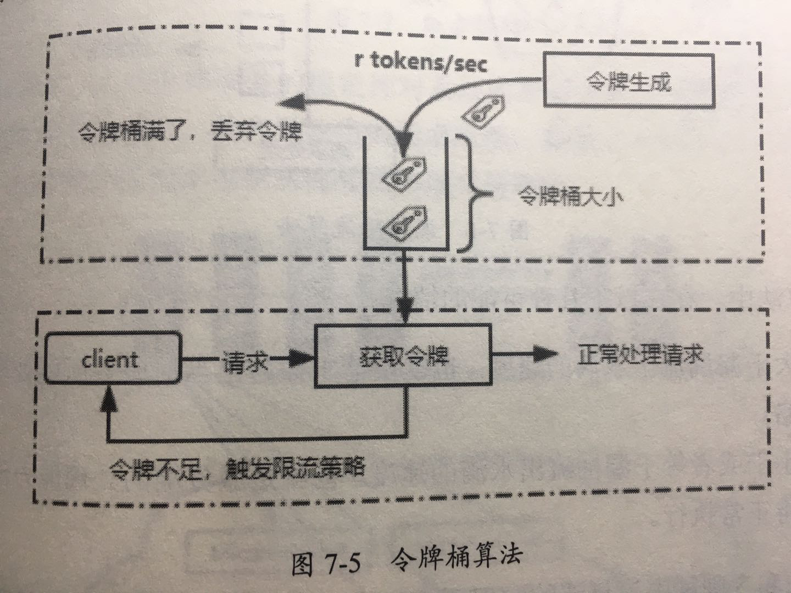

# 令牌桶限流

令牌桶限流是网络流量整形(Traffic Shapping) 和速率限制(Rate Limiting) 中最常使用的一种算法,对于每一个请求,都需要从令牌桶中获取一个令牌,如果没有获得令牌,则需要出发限流策略

## 简介

系统会以一个恒定速度(r tokens/sec) 往固定容器中的令牌桶中放入令牌,如果此时有客户端请求过来,则需要先从令牌桶中拿到令牌以获取访问资格

假设令牌生成速度是每秒 10 个.,那么也就等同于 qps = 10, 此时在请求获取令牌的时候,会出现三种情况

- 请求速度大于令牌生成速度

  > 令牌很快就会被取完,后续再进来的请求就会被限流

- 请求速度等于令牌生成速度

  > 此时流量会出于平衡状态

- 请求速度小于令牌生成速度

  > 说明此时系统的并发数并不高,请求能够正常处理,令牌桶会被填满,所以短时间内突发流量也能正常获取令牌

#### 漏桶算法和令牌桶算法的比较

漏桶算法和令牌桶算法的实现原理不大,最大的去捏是漏桶无法处理短时间内的突发流量,漏桶限流算法是一种恒定速度的算法