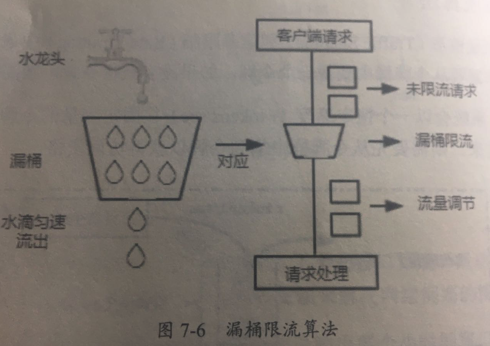

# 05-漏桶限流算法

[TOC]

漏桶限流算法主要作用是控制数据注入网络的速度,平滑网络上突发流量

## 原理

在漏桶算法内部维护了一个容器,这个容器会以恒定的速度出水,不管上面的水流速度有多快,漏桶水滴的速度始终保持不变

> 实际上消息中间件就使用了漏桶限流的思想,不管生产者的请求量有多大,消息的处理能力取决于消费者

- 请求速度大于漏桶流出水滴的速度

  > 也就是请求数超出了当前服务所能处理的极限,就会触发限流策略

- 请求速度小于或者等于漏斗流出的会的速度

  > 也就是服务端的处理能力正好满足客户端的请求量,正常执行

#### 漏桶算法和令牌桶算法的比较

漏桶算法和令牌桶算法的实现原理不大,最大的去捏是漏桶无法处理短时间内的突发流量,漏桶限流算法是一种恒定速度的算法

