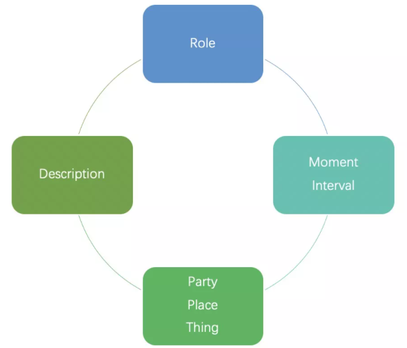
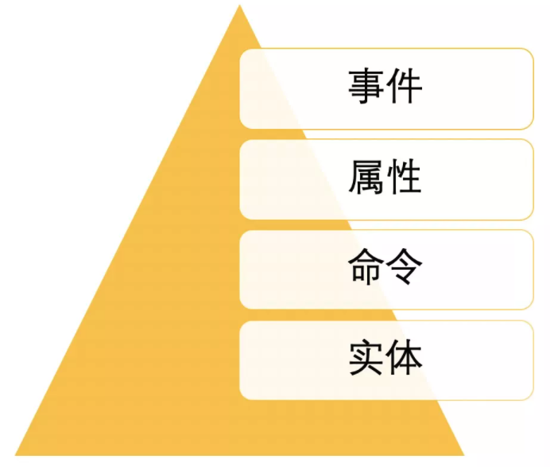

# 建模方法

- [用例分析法](#用例分析法)
- [四色建模法](#四色建模法)
- [事件风暴法](#事件风暴法)

## 用例分析法

用例分析法是领域建模最简单可行的方式。大致可以分为获取用例、收集实体、添加关联、添加属性、模型精化几个步骤。

1. 获取用例：提取领域规则描述
2. 收集实体：定位实体，
3. 添加关联：两个实体间用动词关联起来
4. 添加属性：获取实体属性
5. 模型精化：可选的步骤，可以用UML的泛华和组合来表达模型间的关系，同时可以做子领域的划分

## 四色建模法

四色建模法源于《Java Modeling In Color With UML》，它是一种模型的分析和设计方法，通过把所有模型分为四种类型，帮助模型做到清晰、可追溯。

简单来说，四色关注的是某个人的角色在某个地点的角色用某个东西的角色做了某件事情。

## 事件风暴法

事件风暴法类似头脑风暴，简单来说就是谁在何时基于什么做了什么，产生了什么，影响了什么事情。

