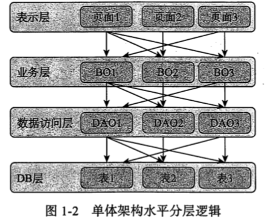
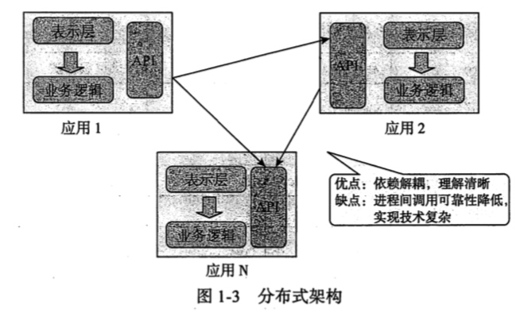
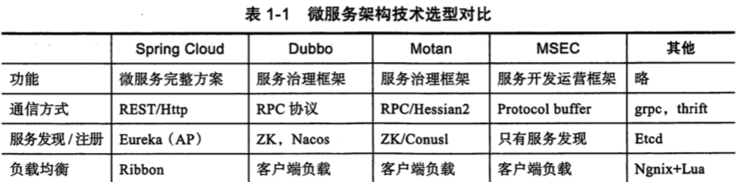
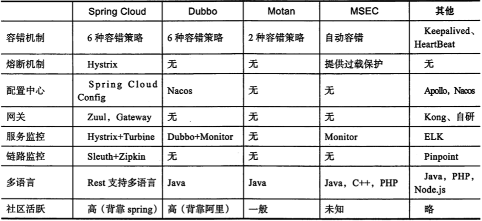

# Microservice Architecture

微服务架构学习笔记 https://microservices.io/

## 微服务架构概述

### 应用架构的发展

应用是可独立运行的程序代码,提供相对完善的业务功能

架构的发展历程是从

- 单体架构
- 分布式架构
- SOA 架构
- 微服务架构

## 单体应用架构

单体架构在 Java 领域可以理解一个包含

- 表现层
- 业务层
- 数据访问层

开发完成后变成一个 War包部署

#### 单体架构的优点

- 易于开发
- 易于测试
- 易于部署

缺点

- 灵活度不高
- 降低系统的性能
- 启动速度慢
- 可拓展性差

## 分布式架构

传统的分布式架构,按照业务垂直切分,每个应用都是单体架构,通过 API 互相调用

## SOA架构

SOA 架构中的两个主要角色:

- 服务提供者 Provider
- 服务消费者 Consumer

#### SOA 的优点

- 把模块拆分,使用接口通讯,降低模块之间的耦合度
- 把项目拆分成若干个子项目,不同的团队负责不同的子项目
- 增加功能时只需要增加一个子项目,调用其他系统的接口即可
- 可以灵活地进行分布式部署

#### SOA缺点

系统之间的交互需要使用远程通讯,接口开发增加工作量

## 微服务架构

微服务架构在某种程度上是 SOA 架构的发展的下一步, 

微服务是一宗架构风格,对于一个大型复杂的业务系统,它的业务功能可以拆分为多个相互独立的微服务,各个微服务之间是松耦合的,可以通过远程协议进行同步/异步通讯

各个服务之间可以被独立部署,扩容,升降级

