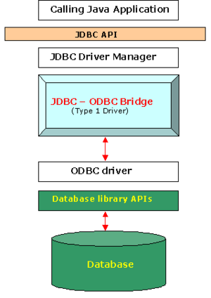
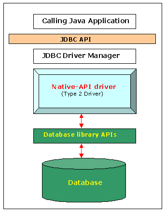
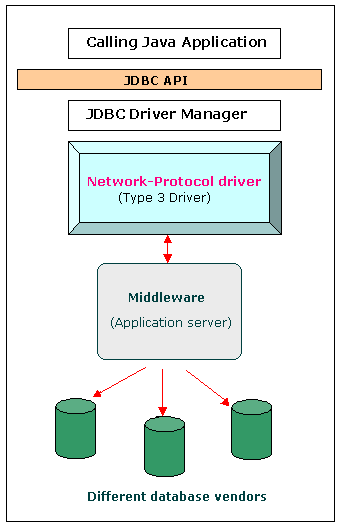
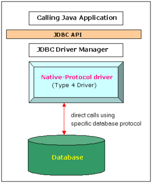

# Type of JDBC Driver Types

> By Lokesh Gupta | Filed Under: [JDBC](https://howtodoinjava.com/java/jdbc/)
>
> [**Java database connectivity (JDBC)**](https://docs.oracle.com/html/A95261_01/jdgjdbc.htm) is JavaSoft specification of a standard application programming interface (API) that allows Java programs to access database management systems. The JDBC API consists of a set of interfaces and classes written in the Java programming language. Using these standard interfaces and classes, programmers can write applications that connect to databases, send queries written in [**structured query language (SQL)**](https://en.wikipedia.org/wiki/SQL), and process the results. JDBC is oriented towards relational databases.
>
> Because JDBC is a standard specification, a Java program that uses the JDBC API can connect to any database management system (DBMS) for which there is a JDBC driver.

Java database connectivity(JDBC)  

- 一个 JavaSoft 标准应用的规范
- 规定了 Java 程序访问数据库的标准
- 通过写 structured query language (SQL) 命令可以访问数据库的资源
- JDBC是一个面向关系型数据库标准

Java 程序可以通过 JDBC规范访问任何提供商(vendor)提供的 JDBC 驱动

> ## JDBC driver
>
> The JDBC API defines the Java interfaces and classes that programmers use to connect to databases and send queries.
>
> A JDBC driver implements these interfaces and classes for a particular DBMS vendor.
>
> A Java program (that uses the JDBC API) loads the specified driver for a particular DBMS before it actually connects to a database. The JDBC’s DriverManager class then sends all JDBC API calls to the loaded driver.

通常情况下, JDBC 提供商会根据自己的数据库产品配套退出 JDBC的驱动

## Types of JDBC Drivers

> There are **4 different types of JDBC drivers**:
>
> 1. Type 1 : JDBC-ODBC bridge driver
> 2. Type 2 : Native-API Driver
> 3. Type 3 : All Java + Middleware translation driver
> 4. Type 4 : Pure Java driver (市面上目前主流)
>
> Let’s look at them one by one.

## Type 1 : JDBC-ODBC bridge driver

> A type 1 JDBC driver consists of a Java part that **translates the JDBC interface calls to ODBC calls**. An ODBC bridge then calls the ODBC driver of the given database i.e. the driver converts JDBC method calls into ODBC function calls. The driver is platform-dependent as it makes use of ODBC which in turn depends on native libraries of the underlying operating system the JVM is running upon. Also, use of this driver leads to other installation dependencies; for example, ODBC must be installed on the computer having the driver and the database must support an ODBC driver. The use of this driver is discouraged if the alternative of a pure-Java driver is available.

这段实际上指出 JDBC-ODBC 桥接驱动的相关信息

## Type 2 : Native-API Driver

> A type 2 JDBC driver is like a type 1 driver, except the **ODBC part is replaced with a native code part** instead. The native code part is targeted at a specific database product i.e. uses the client-side libraries of the database product. The driver converts JDBC method calls into native 
> calls of the database native API.

> This architecture eliminated the need for the ODBC driver and instead directly called the native client libraries shipped by the database vendors. This was quickly adopted by the DB vendors as it was quick and inexpensive to implement since they could reuse the existing C/ 
> C++ based native libraries.

## Type 3 : All Java + Middleware translation driver

> A type 3 JDBC driver is an all Java driver that **sends the JDBC interface calls to an intermediate server**. The intermediate server then connects to the database on behalf of the JDBC driver. The middle-tier (application server) converts JDBC calls directly or indirectly into the vendor-specific database protocol.

> Type 3 drivers sought to be a 100% Java solution but never really gained much traction. Type 3 drivers had a Java client component and a Java server component, where the latter actually talked to the database. Although this was technically a full Java solution, the database vendors did not like this approach as it was costly – they would have to rewrite their native client libraries which were all C/C++. In addition, this didn’t increase the architectural efficiency as we are really still a 3 tier architecture so it is easy to see why this was never a popular choice.

## Type 4 : Pure Java driver

The JDBC type 4 driver, also known as the Direct to Database Pure Java Driver, is a database driver implementation that **converts JDBC calls directly into a vendor-specific database protocol**. It is implemented for a specific database product. Today, **most JDBC drivers are type 4 drivers.**

Written completely in Java, type 4 drivers are thus platform independent. They install inside the Java Virtual Machine of the client. This provides better performance than the type 1 and type 2 drivers as it does not have the overhead of conversion of calls into ODBC or database API calls. Unlike the type 3 drivers, it does not need associated software to work.

This architecture encapsulates the entirety of the JDBC API implementation along with all the logic for communicating directly with the database in a
single driver. This allows for easy deployment and streamlines the development process by having a single tier and a small driver all in a 100% java package.

This type includes, for example, the widely used Oracle thin driver.