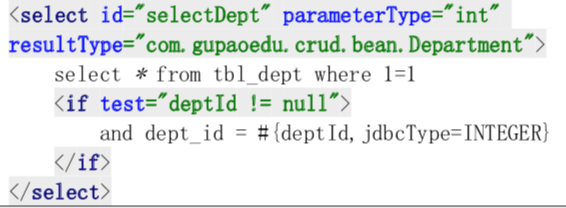

# 为什么要使用 MyBatis

## MyBatis主要解决什么问题

MyBatis主要解决的是 SQL 和对象的映射问题。ORM 对象关系映射
在 MyBatis 里面，SQL 和代码是分离的，所以会写 SQL 基本上就会用 MyBatis，没有额外的学习成本。

MyBatis 的核心特性，或者说它解决的主要问题是什么:

1. 使用连接池对连接进行管理
2. SQL 和代码分离，集中管理
3. 结果集映射
4. 参数映射和动态 SQL
5. 重复 SQL 的提取
6. 缓存管理插件机制
7. 插件机制

## 为什么要有 Mybatis

- 为了将业务逻辑与数据逻辑相分离

- 将 Java 的方法与 SQL语法关联

#### 传统的 JDBC 查询数据库的弊端

```java
/**
 * 传统 JDBC方式查询数据库的弊端很多
 *
 * @throws IOException
 */
@Test
public void testJdbc() throws IOException {
    Connection conn = null;
    Statement stmt = null;
    Blog blog = new Blog();

    try {
        // 注册 JDBC 驱动
        Class.forName("com.mysql.cj.jdbc.Driver");

        // 打开连接
        conn = DriverManager.getConnection("jdbc:mysql://localhost:3306/notes", "root", "root");

        // 执行查询
        stmt = conn.createStatement();
        String sql = "SELECT bid, name, author_id FROM blog";
        ResultSet rs = stmt.executeQuery(sql);

        // 获取结果集
        while (rs.next()) {
            Integer bid = rs.getInt("bid");
            String name = rs.getString("name");
            Integer authorId = rs.getInt("author_id");
            blog.setAuthorId(authorId);
            blog.setBid(bid);
            blog.setName(name);
        }
        System.out.println(blog);

        rs.close();
        stmt.close();
        conn.close();
    } catch (SQLException se) {
        se.printStackTrace();
    } catch (Exception e) {
        e.printStackTrace();
    } finally {
        try {
            if (stmt != null) stmt.close();
        } catch (SQLException se2) {
        }
        try {
            if (conn != null) conn.close();
        } catch (SQLException se) {
            se.printStackTrace();
        }
    }
}
```

- 业务代码与数据库操作代码耦合,不利于维护
- 每一段代码都需要自己去管理数据库的链接,如果忘记关闭链接,可能会造成数据库服务的链接耗尽

#### SpringJDBC

```java
/**
 * <p>
 * SpringJDbc
 * </p>
 *
 * @author EricChen 2020/02/21 20:44
 */
public class SpringJdbcTest {
    private static final String PROPERTY_PATH = "/hikari.properties";
    private static final Logger LOGGER = LoggerFactory.getLogger(DbUtilsTest.class);
    private static HikariDataSource dataSource;
    private static QueryRunner queryRunner;

    static {
        HikariConfig config = new HikariConfig(PROPERTY_PATH);
        dataSource = new HikariDataSource(config);
        queryRunner = new QueryRunner(dataSource);
    }


    @Test
    public void testSpringJdbc() {
        DbUtilsTest.init();
        String sql = "select * from blog";
        JdbcTemplate jdbcTemplate = new JdbcTemplate(dataSource);
        List<Blog> query = jdbcTemplate.query(sql, new BlogMapper());
        System.out.println(query);
    }


}

public class BlogMapper implements RowMapper<Blog> {
    @Override
    public Blog mapRow(ResultSet rs, int rowNum) throws SQLException {
        Blog blog = new Blog();
        blog.setAuthorId(rs.getInt("bid"));
        return blog;
    }
}

```

无论是 DbUtils 还是 SpringJDBC,他们仅仅是在 JDBC 的基础上做了轻量级的封装,但是

- Sql 语句依然需要写死在代码中
- 参数只能按照固定的位置的顺序传入,它是通过占位符去替换的,不能自动映射
- 在方法里面,可以把结果集映射成实体类,但是不能直接把实体类映射成数据库的记录
- 查询没有缓存的功能

#### ORM

ORM 是 Object Relational Mapping , 对象关系映射,实际上就是 Java 对象和关系型数据库进行了互相映射的关系

hibernate 是一种 ORM框架,通过配置对象与数据库的关系,可以做到自动映射,但是也存在一定的问题:

- 比如 get , save, update 对象的方法,操作的是所有字段,没有办法指定部分字段,不够灵活
- 性能比较差,因为是自动生成 SQL,所以需要对框架非常熟悉才能进行优化
- 不支持动态 SQL,比如分表中的表名变化,以及条件和参数

#### 引出 Mybatis

Mybatis 比较 Hibernate 相对来说是"半自动的",封装程度没有 Hibernate 这么高,就像半自动咖啡机,有更多的用户可以进行的操作,从而提高了灵活性

在 Mybatis 中,SQL 与代码是分离的,所以基本上来说会写 SQL 就 会写 Mybatis

#### Mybatis 的核心特性

- 使用连接池对链接进行管理
- SQL 和代码分离,集中管理
- 结果集映射
- 重复 SQL 的提取
- 缓存管理
- 插件机制

Mybatis 也是对 JDBC的封装,到底层,也是使用的 Statement 作为查询, ResultSet 作为结果集

## 最佳实践

#### 动态标签有哪些?

MyBatis 的动态标签主要有四类:

- if
- choose (when, otherwise)
- trim (where, set)
- foreach。

#### IF

> 需要判断的时候，条件写在 test 中
>
> 以下语句可以用<where>改写
>
> 


#### choose (when, otherwise) —— 需要选择一个条件的时候

> ```xml
>     <!-- choose演示 -->
>     <select id="getEmpList_choose" resultMap="empResultMap" parameterType="com.gupaoedu.crud.bean.Employee">
>         SELECT * FROM tbl_emp e
>         <where>
>             <choose>
>                 <when test="empId !=null">
>                     e.emp_id = #{emp_id, jdbcType=INTEGER}
>                 </when>
>                 <when test="empName != null and empName != ''">
>                     AND e.emp_name LIKE CONCAT(CONCAT('%', #{emp_name, jdbcType=VARCHAR}),'%')
>                 </when>
>                 <when test="email != null ">
>                     AND e.email = #{email, jdbcType=VARCHAR}
>                 </when>
>                 <otherwise>
>                 </otherwise>
>             </choose>
>         </where>
>     </select>
> ```
>
> 

#### trim (where, set)——需要去掉 where、and、逗号之类的符号的时候。

> 注意最后一个条件 dId 多了一个逗号，就是用 trim 去掉的:
>
> 
>
> ```xml
>     <update id="updateByPrimaryKeySelective" parameterType="com.gupaoedu.crud.bean.Employee">
>         update tbl_emp
>         <set>
>             <if test="empName != null">
>                 emp_name = #{empName,jdbcType=VARCHAR},
>             </if>
>             <if test="gender != null">
>                 gender = #{gender,jdbcType=CHAR},
>             </if>
>             <if test="email != null">
>                 email = #{email,jdbcType=VARCHAR},
>             </if>
>             <if test="dId != null">
>                 d_id = #{dId,jdbcType=INTEGER},
>             </if>
>         </set>
>         where emp_id = #{empId,jdbcType=INTEGER}
>     </update>
> ```
>
> 
>
> trim 用来指定或者去掉前缀或者后缀:
>
> ```xml
>     <insert id="insertSelective" parameterType="com.gupaoedu.crud.bean.Employee">
>         insert into tbl_emp
>         <trim prefix="(" suffix=")" suffixOverrides=",">
>             <if test="empId != null">
>                 emp_id,
>             </if>
>             <if test="empName != null">
>                 emp_name,
>             </if>
>             <if test="gender != null">
>                 gender,
>             </if>
>             <if test="email != null">
>                 email,
>             </if>
>             <if test="dId != null">
>                 d_id,
>             </if>
>         </trim>
>         <trim prefix="values (" suffix=")" suffixOverrides=",">
>             <if test="empId != null">
>                 #{empId,jdbcType=INTEGER},
>             </if>
>             <if test="empName != null">
>                 #{empName,jdbcType=VARCHAR},
>             </if>
>             <if test="gender != null">
>                 #{gender,jdbcType=CHAR},
>             </if>
>             <if test="email != null">
>                 #{email,jdbcType=VARCHAR},
>             </if>
>             <if test="dId != null">
>                 #{dId,jdbcType=INTEGER},
>             </if>
>         </trim>
>     </insert>
> ```
>
> 
>
> 

#### foreach —— 需要遍历集合的时候:

```xml
    <!-- List 批量删除  -->
    <delete id="deleteByList" parameterType="java.util.List">
        delete from tbl_emp where emp_id in
        <foreach collection="list" item="item" open="(" separator="," close=")">
            #{item.empId,jdbcType=VARCHAR}
        </foreach>
    </delete>
```


动态 SQL 主要是用来解决 SQL 语句生成的问题。

## 批量操作spring-mybatis

批量插入的语法是这样的，只要在 values 后面增加插入的值就可以了。

```xml
insert into tbl_emp (emp_id, emp_name, gender,email, d_id) values ( ?,?,?,?,? ) , ( ?,?,?,?,? ) , ( ?,?,?,?,? ) , ( ?,?,?,?,? ) , ( ?,?,?,?,? ) , ( ?,?,?,?,? ) , ( ?,?,?,?,? ) , ( ?,?,?,?,? ) , ( ?,?,?,?,? ) , ( ?,?,?,?,? )
```

在 Mapper 文件里面，我们使用 foreach 标签拼接 values 部分的语句:

```xml
<!-- 批量插入 -->
<insert id="batchInsert" parameterType="java.util.List" useGeneratedKeys="true">
  <selectKey resultType="long" keyProperty="id" order="AFTER">
    SELECT LAST_INSERT_ID()
  </selectKey>
  insert into tbl_emp (emp_id, emp_name, gender,email, d_id)
  values
  <foreach collection="list" item="emps" index="index" separator=",">
    ( #{emps.empId},#{emps.empName},#{emps.gender},#{emps.email},#{emps.dId} )
  </foreach>
</insert>
```

效率要比循环发送 SQL 执行要高得多。最关键的地方就在于减少 了跟数据库交互的次数，并且避免了开启和结束事务的时间消耗。

## 批量更新

批量更新的语法是这样的，通过 case when，来匹配 id 相关的字段值。

```xml
    <!-- 批量更新 -->
    <!-- 注意separator 和 open -->
    <update id="updateBatch">
        update tbl_emp set
        emp_name =
        <foreach collection="list" item="emps" index="index" separator=" " open="case emp_id" close="end">
            when #{emps.empId} then #{emps.empName}
        </foreach>
        ,gender =
        <foreach collection="list" item="emps" index="index" separator=" " open="case emp_id" close="end">
            when #{emps.empId} then #{emps.gender}
        </foreach>
        ,email =
        <foreach collection="list" item="emps" index="index" separator=" " open="case emp_id" close="end">
            when #{emps.empId} then #{emps.email}
        </foreach>
        where emp_id in
        <foreach collection="list" item="emps" index="index" separator="," open="(" close=")">
            #{emps.empId}
        </foreach>
    </update>
```

所以在 Mapper 文件里面最关键的就是 case when 和 where 的配置。

## Batch Executor

当然 MyBatis 的动态标签的批量操作也是存在一定的缺点的，比如数据量特别大的 时候，拼接出来的 SQL 语句过大。
MySQL 的服务端对于接收的数据包有大小限制，max_allowed_packet 默认是 4M，需要修改默认配置才可以解决这个问题。

```
Caused by: com.mysql.jdbc.PacketTooBigException: Packet for query is too large (7188967 > 4194304). You can change this value on the server by setting the max_allowed_packet' variable.
```

在我们的全局配置文件中，可以配置默认的 Executor 的类型。其中有一种 BatchExecutor。

配置文件中

```
<setting name="defaultExecutorType" value="BATCH"/>
```

  也可以在创建会话的时候指定执行器类型:

```java
SqlSession session = sqlSessionFactory.openSession(ExecutorType.BATCH);
```

`BatchExecutor` 底层是对 `JDBC ps.addBatch()`的封装，原理是攒一批 SQL 以后再发 送(参考` standalone `- 单元测试目录 `JdbcTest.java `– `testJdbcBatch())`。

#### 问题:三种执行器的区别是什么?

- Simple
- Reuse
- Batch

```java
@Test
public void testBatchInsert() {
  long start = System.currentTimeMillis();
  list = new ArrayList<>();
  for (int i=0; i< USER_COUNT; i++){
    Employee employee = new Employee();
    String name = UUID.randomUUID().toString();
    employee.setEmpName(name);
    String gender = i%2 == 0 ? "M" : "F";
    employee.setGender(gender);
    employee.setEmail("better@gupaoedu.com");
    Integer did = i%2 == 0 ? 1 : 2;
    employee.setdId(did);
    list.add(employee);
  }

  save(list);
  long end = System.currentTimeMillis();
  System.out.println("批量插入"+USER_COUNT+"条员工数据完毕，总耗时：" + (end - start) + " 毫秒");

}
```

## 嵌套(关联)查询/ N+1 / 延迟加载

### 一对一的关联查询有两种配置方式:

1. 嵌套结果
2. 嵌套查询

#### 嵌套结果

```xml
<resultMap id="WithDeptResultMap" type="com.gupaoedu.crud.bean.Employee">
  <id column="emp_id" jdbcType="INTEGER" property="empId"/>
  <result column="emp_name" jdbcType="VARCHAR" property="empName"/>
  <result column="gender" jdbcType="CHAR" property="gender"/>
  <result column="email" jdbcType="VARCHAR" property="email"/>
  <result column="d_id" jdbcType="INTEGER" property="dId"/>
  <!-- 联合查询，将Department的属性映射到ResultMap -->
  <association property="department" javaType="com.gupaoedu.crud.bean.Department">
    <id column="dept_id" property="deptId"/>
    <result column="dept_name" property="deptName"/>
  </association>
</resultMap>
```

#### 嵌套查询

```xml
    <!-- 另一种联合查询  (一对一)的实现，但是这种方式有“N+1”的问题 -->
    <resultMap id="empResultMap" type="com.gupaoedu.crud.bean.Employee">
        <id property="empId" column="emp_id"/>
        <result property="empName" column="emp_name"/>
        <result property="gender" column="gender"/>
        <association property="department" javaType="com.gupaoedu.crud.bean.Department"
                     column="dept_id" select="selectDept"/> <!-- selectDept 定义在下面-->
    </resultMap>
```

由于是分两次查询，当我们查询了员工信息之后，会 再发送一条 SQL 到数据库查询部门信息。
我们只执行了一次查询员工信息的 SQL(所谓的 1)，如果返回了 N 条记录，就会 再发送 N 条到数据库查询部门信息(所谓的 N)，这个就是我们所说的 N+1 的问题。 这样会白白地浪费我们的应用和数据库的性能。

如果我们用了嵌套查询的方式，怎么解决这个问题?能不能等到使用部门信息的时 候再去查询?这个就是我们所说的延迟加载，或者叫懒加载。
在 MyBatis 里面可以通过开启延迟加载的开关来解决这个问题。 在 settings 标签里面可以配置:

```xml
<!--全局配置文件-->
<configuration>
    <!-- 参数设置 -->
    <settings>
        <setting name="mapUnderscoreToCamelCase" value="true"/>
        <!-- 打印查询语句 -->
        <setting name="logImpl" value="STDOUT_LOGGING" />

        <!-- 延迟加载的全局开关。当开启时，所有关联对象都会延迟加载。默认 false  -->
        <setting name="lazyLoadingEnabled" value="true"/>
        <!-- 当开启时，任何方法的调用都会加载该对象的所有属性。默认 false，可通过select标签的 fetchType来覆盖-->
        <setting name="aggressiveLazyLoading" value="false"/>
        <!--  Mybatis 创建具有延迟加载能力的对象所用到的代理工具，默认JAVASSIST -->
        <!--<setting name="proxyFactory" value="CGLIB" />-->
    </settings>
  </configuration>
```

- `lazyLoadingEnabled `决定了是否延迟加载。

- `aggressiveLazyLoading `决定了是不是对象的所有方法都会触发查询。

