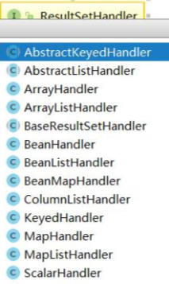

# Apache DbUtils

> https://commons.apache.org/proper/commons-dbutils/

**DbUtils 解决的最核心的问题就是结果集的映射**

可以把 ResultSet 封装成 JavaBean。它是怎么做的呢?

首先 DbUtils 提供了一个 `QueryRunner` 类，它对数据库的增删改查的方法进行了封装，那么我们操作数据库就可以直接使用它提供的方法。

在` QueryRunner` 的构造函数里面，我们又可以传入一个数据源，比如在这里我们 `Hikari`，这样我们就不需要再去写各种创建和释放连接的代码了。

```
queryRunner = new QueryRunner(dataSource);
```

## 处理结果集

DbUtils 里面提供了一系列的支持泛型的 `ResultSetHandler`处理结果集



通过反射封装结果集