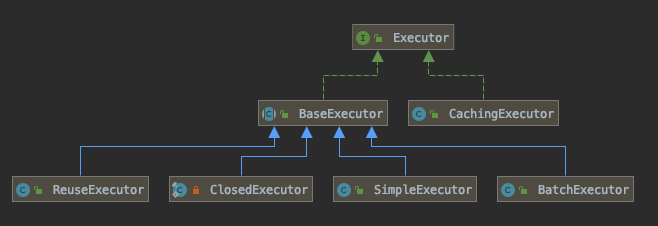

# Executor

建会话的过程，我们获得了一个 DefaultSqlSession，里面包含了一个 Executor，它是 SQL 的执行者。SQL 都由它的执行器完成执行

回答了前面的问题:数据源和事务工厂在哪里会用到——创建执行器的时候。

## Hierarachy



#### 问题:三种类型的区别?(通过 update()方法对比)

-  SimpleExecutor

  > 每执行一次 update 或 select，就开启一个 Statement 对象，用 完立刻关闭 Statement 对象。

- CachingExecutor 作为缓存的包装类
- ReuseExecutor 重复使用 Statement 对象。

> 执行 update 或 select，以 sql 作为 key 查找 Statement 对象， 存在就使用，不存在就创建，用完后，**不关闭 Statement 对象**，而是放置于 Map 内， 供下一次使用。简言之，就是重复使用 Statement 对象。

- ClosedExecutor 
- SimpleExecutor

> 每执行一次 update 或 select，就开启一个 Statement 对象，用 完立刻关闭 Statement 对象。

- BatchExecutor

> 执行 update(没有 select，JDBC 批处理不支持 select)，将所 有 sql 都添加到批处理中(addBatch())，等待统一执行(executeBatch())，它缓存 了多个 Statement 对象，每个 Statement 对象都是 addBatch()完毕后，等待逐一执行 executeBatch()批处理。与 JDBC 批处理相同。

## CachingExecutor 

这个类非常有趣,使用的包装器模式将原来的 Executor 来包装了一下,里面维护了一个 `TransactionalCacheManager` 用来管理事务缓存


这个管理类也非常简单

仅仅是做了一层包装,方便操作


创建 key 的过程,不同的实现类可以有自己的实现,当然,作为通用实现,它封装到`BaseExecutor`中

```java
@Override
public CacheKey createCacheKey(MappedStatement ms, Object parameterObject, RowBounds rowBounds, BoundSql boundSql) {
  if (closed) {
    throw new ExecutorException("Executor was closed.");
  }
  CacheKey cacheKey = new CacheKey();
  cacheKey.update(ms.getId());
  cacheKey.update(rowBounds.getOffset());
  cacheKey.update(rowBounds.getLimit());
  cacheKey.update(boundSql.getSql());
  List<ParameterMapping> parameterMappings = boundSql.getParameterMappings();
  TypeHandlerRegistry typeHandlerRegistry = ms.getConfiguration().getTypeHandlerRegistry();
  // mimic DefaultParameterHandler logic
  for (ParameterMapping parameterMapping : parameterMappings) {
    if (parameterMapping.getMode() != ParameterMode.OUT) {
      Object value;
      String propertyName = parameterMapping.getProperty();
      if (boundSql.hasAdditionalParameter(propertyName)) {
        value = boundSql.getAdditionalParameter(propertyName);
      } else if (parameterObject == null) {
        value = null;
      } else if (typeHandlerRegistry.hasTypeHandler(parameterObject.getClass())) {
        value = parameterObject;
      } else {
        MetaObject metaObject = configuration.newMetaObject(parameterObject);
        value = metaObject.getValue(propertyName);
      }
      cacheKey.update(value);
    }
  }
  if (configuration.getEnvironment() != null) {
    // issue #176
    cacheKey.update(configuration.getEnvironment().getId());
  }
  return cacheKey;
}
```

