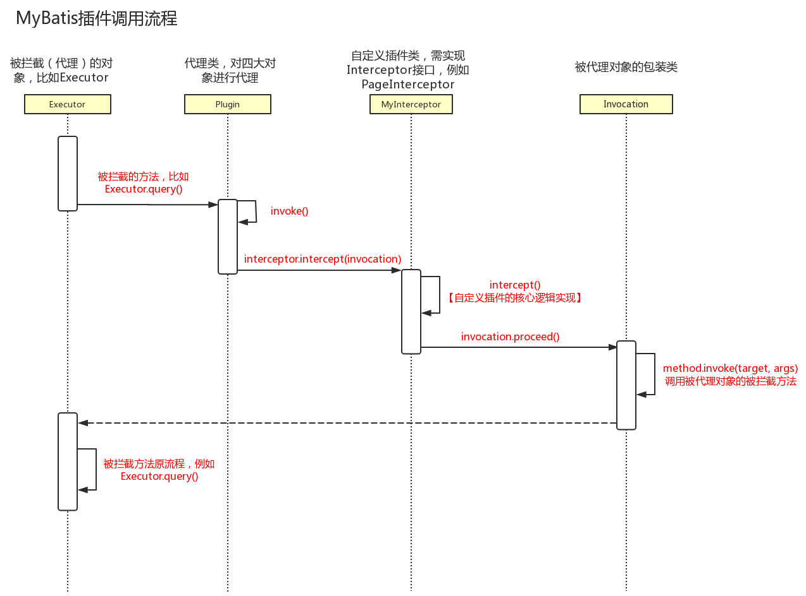

# Mybatis插件（plugins）

## 是什么

插件是 Mybatis 的一个强大的机制,Mybatis 预留了插件的接口,让 Mybatis 更加容易拓展 , MyBatis 通过 JDK 代理的方式通过代理 四大天王

- Executor 执行器,用来执行 sql
- ParameterHandler , SQL语句组装的时候
- ResultSetHandler ,  结果集映射器,用来把查询的结果集转换成 Object
- StatementHandler  , 主要是用来处理 Statement 也就是 xml 中的 select .update 等标签 

对四个对象进行代理

## 核心类

- `Interceptor`接口
  - intercept  
  - plugin
  - setProperties
- 自定义拦截器(实现类)
- `Plugin `工具类用来创建代理对象
- `Invocation` 内的 wrap 方法进行包装,proceed方法执行被拦截方法
- `InterceptorChain` 插件的链

## 四大天王

MyBatis 允许你在已映射语句执行过程中的某一点进行拦截调用。默认情况下，MyBatis 允许使用插件来拦截的方法调用包括：

- `Executor (update, query, flushStatements, commit, rollback, getTransaction, close, isClosed)`
- `ParameterHandler (getParameterObject, setParameters)`
- `ResultSetHandler (handleResultSets, handleOutputParameters)`
- `StatementHandler (prepare, parameterize, batch, update, query)`

## 拦截器接口的介绍

Mybatis 插件可以用来实现拦截器接口 Interceptor


- `Intercept`Mybatis 运行时要执行的拦截方法,通过该方法的参数 Invocation 可以得到很多有用的信息

- `plugin` 这个方法参数 target 即使要拦截器拦截的对象,这个方法会在创建被拦截的接口实现类时被调用,这个方法非常简单,只需要调用 Mybatis 实现的`Plugin(org.apache.ibatis.plugin.plgin)`类的 wrap 静态方法就可以通过 Java 的 JDK 动态代理拦截目标对象

```java
@Override
public Object plugin(Object target) {
  //自动判断拦截器的签名和被拦截对象的接口是否匹配,只有匹配的情况下才会使用动态代理拦截目标对象,因此不必要做额外的逻辑判断
  return Plugin.wrap(target, this);
}
```

- setProperties 用来传递参数改变插件的行为,通常是读取配置文件中 plugins 标签下的属性

## 拦截器签名介绍

```java
@SuppressWarnings({"rawtypes", "unchecked"})
@Intercepts(
        {
                @Signature(type = Executor.class, method = "query", args = {MappedStatement.class, Object.class, RowBounds.class, ResultHandler.class}),
                @Signature(type = Executor.class, method = "query", args = {MappedStatement.class, Object.class, RowBounds.class, ResultHandler.class, CacheKey.class, BoundSql.class}),
        }
)
public class PageInterceptor implements Interceptor {

```

上面是一个拦截器典型的签名 PageHelper 相关的拦截器,

@Signature 注解包含以下三个属性

- type: 设置拦截的接口,可选值是前面提到的 4 个接口
- method : 设置拦截接口中的方法名,可选值是前面 4 个接口对应的方法,需要和接口匹配
- Args : 设置拦截方法的参数类型数组,通过方法名和参数类型可以确定为一个方法

## Question

- 不修改原有的代码,怎么改变和增强对象的行为

动态代理模式

- 插件的拦截链路怎么形成?如何做到层层的拦截

责任连模式

- [有哪些对象允许被代理,哪些方法被拦截](#有哪些对象允许被代理,哪些方法被拦截)
- 四大天王什么时候被代理的,代理对象是什么时候创建的

使用 JDK 的动态代理来实现的,executor 是在 openSession 的时候创建的代理对象,其他三个一旦被创建就会调用 InterceptorChan 来之执行拦截器

- 多个插件的情况下,代理能不能被代理,代理顺序和调用顺序的关系

- 谁来创建代理对象

- 什么时候创建代理对象,启动,创建会话和执行 sql?

- 被代理以后,调用的是设么方法,怎么调用到原被代理对象的方法

  四大天王被代理以后,调用的是 `intercept` 方法, 和 plugin 方法,创建代理类

  使用 

#### 有哪些对象允许被代理,哪些方法被拦截

这些类中方法的细节可以通过查看每个方法的签名来发现，或者直接查看 MyBatis 发行包中的源代码。 如果你想做的不仅仅是监控方法的调用，那么你最好相当了解要重写的方法的行为。 因为如果在试图修改或重写已有方法的行为的时候，你很可能在破坏 MyBatis 的核心模块。 这些都是更低层的类和方法，所以使用插件的时候要特别当心。

通过 MyBatis 提供的强大机制，使用插件是非常简单的，只需实现 Interceptor 接口，并指定想要拦截的方法签名即可。

```java
// ExamplePlugin.java
@Intercepts({@Signature(
  type= Executor.class,
  method = "update",
  args = {MappedStatement.class,Object.class})})
public class ExamplePlugin implements Interceptor {
  private Properties properties = new Properties();
  public Object intercept(Invocation invocation) throws Throwable {
    // implement pre processing if need
    Object returnObject = invocation.proceed();
    // implement post processing if need
    return returnObject;
  }
  public void setProperties(Properties properties) {
    this.properties = properties;
  }
}
<!-- mybatis-config.xml -->
<plugins>
  <plugin interceptor="org.mybatis.example.ExamplePlugin">
    <property name="someProperty" value="100"/>
  </plugin>
</plugins>
```

上面的插件将会拦截在 Executor 实例中所有的 “update” 方法调用， 这里的 Executor 是负责执行低层映射语句的内部对象。

**提示** **覆盖配置类**

除了用插件来修改 MyBatis 核心行为之外，还可以通过完全覆盖配置类来达到目的。只需继承后覆盖其中的每个方法，再把它传递到 SqlSessionFactoryBuilder.build(myConfig) 方法即可。再次重申，这可能会严重影响 MyBatis 的行为，务请慎之又慎。

## Mybatis 插件原理与自定义插件

MyBatis 通过提供插件机制,让我们可以根据自己的需要去增强 Mybatis 的功能, 需要注意的是，如果没有完全理解 MyBatis 的运行原理和插件的工作方式，最好不 要使用插件，因为它会改变系底层的工作逻辑，给系统带来很大的影响。

#### Mybatis 如何做到不修改对象代码,对对象进行修改

代理模式

#### 如何做到多个插件链式调用

责任链模式

#### Mybatis 允许拦截的对象


#### 插件的编写与注册

1. 编写自己的插件类

   1. 实现`Interceptor`接口
   2. 添加`@Intercepts({@Signatture})` 指定拦截的对象和方法,方法参数,方法名称和方法类型,可以构成签名,决定拦截哪个方法
   3. 实现接口的方法

   ```java
   // 用于覆盖被拦截对象的原有方法(在调用代理对象 Plugin 的 invoke()方法时被调用)
   Object intercept(Invocation invocation) throws Throwable;
   // target 是被拦截对象，这个方法的作用是给被拦截对象生成一个代理对象，并返回它
   Object plugin(Object target);
   // 设置参数
   void setProperties(Properties properties);
   ```

2. 插件注册

   ```xml
   <plugins>
   	<plugin interceptor = "com.github.pagehelper.PageInterceptor">
   		<property name="offsetAsPageNum" value="true">
   	</plugin>
   </plugins>
   ```

3. 插件登记

   MyBatis 启动的时候回扫描`<plugins>`标签,注册到 Configuration 对象的 InterceptorChain 中,property 里面的参数会调用 `setProperties()`方法处理

#### 代理和拦截是怎么实现的

- [四大对象是什么时候被代理的,代理对象是什么时候创建的](#四大对象是什么时候被代理的,代理对象是什么时候创建的)

- [多个插件的情况下,代理能不能被代理?代理的调用顺序的关系](#多个插件的情况下,代理能不能被代理?代理的调用顺序的关系)

- [谁来创建代理对象](#谁来创建代理对象)

- [被代理后,调用的是什么方法,怎么调用的原被代理对象的方法](#被代理后,调用的是什么方法,怎么调用的原被代理对象的方法)

## 四大对象是什么时候被代理的,代理对象是什么时候创建的

- Executor 是 openSession() 的 时 候 创 建 的 ; 

- StatementHandler 是 SimpleExecutor.doQuery()创建的;
- 里面包含了处理参数的 ParameterHandler 和处理 结果集的 ResultSetHandler 的创建，创建之后即调用 InterceptorChain.pluginAll()， 返回层层代理后的对象。

## 多个插件的情况下,代理能不能被代理?代理的调用顺序的关系


## 谁来创建代理对象

Plugin 类。在我们重写的 plugin()方法里面可以直接调用 return Plugin.wrap(target, this);返回代理对象。

## 被代理后,调用的是什么方法,怎么调用的原被代理对象的方法

因为代理类是 `Plugin`，所以最后调用的是 Plugin 的 `invoke() `方法。它先调用了定义
的拦截器的` intercept()`方法。可以通过 `invocation.proceed()`调用到被代理对象被拦截 的方法。

## 插件调用流程



| 对象             | 作用                                                        |
| ---------------- | ----------------------------------------------------------- |
| `Interceptor`    | 自定义插件需要实现接口，实现 3 个方法                       |
| `InterceptChain` | 配置的插件解析后会保存在 Configuration 的 InterceptChain 中 |
| `Plugin`         | 用来创建代理对象，包装四大对象                              |
| `Invocation`     | 对被代理类进行包装，可以调用 proceed()调用到被拦截的方法    |

