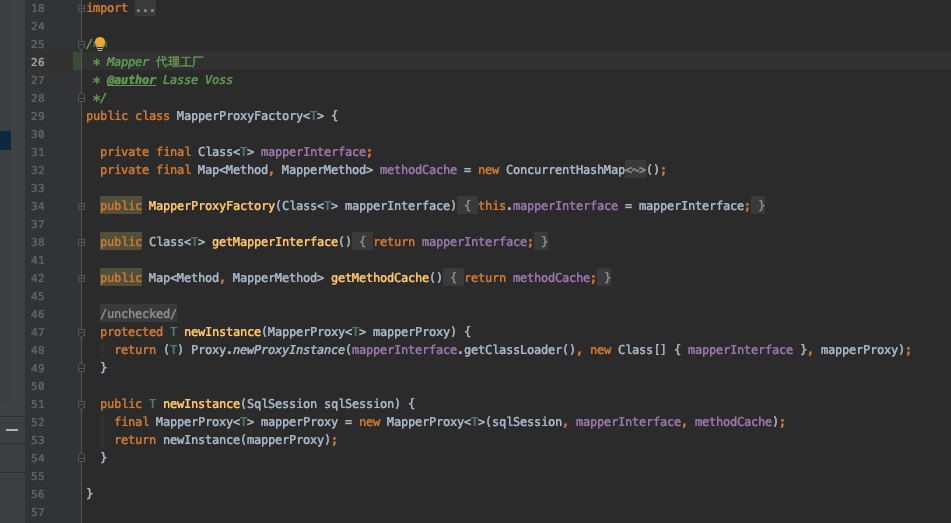

# 映射器（mappers）

## 是什么

映射器里面最主要的是配置了 SQL 语句,也解决了我们参数映射和结果集映射的问题,一共有 8 个标签

#### 配置类型的标签

- cache – 给定命名空间的缓存配置(是否开启二级缓存)。
- cache-ref – 其他命名空间缓存配置的引用。
- resultMap – 是最复杂也是最强大的元素，用来描述如何从数据库结果集中来加载 对象。
- sql – 可被其他语句引用的可重用语句块。

#### 增删改查标签

- insert – 映射插入语句
- update – 映射更新语句
- delete – 映射删除语句
- select – 映射查询语句

既然 MyBatis 的行为已经由上述元素配置完了，我们现在就要定义 SQL 映射语句了。 但是首先我们需要告诉 MyBatis 到哪里去找到这些语句。 Java 在自动查找这方面没有提供一个很好的方法，所以最佳的方式是告诉 MyBatis 到哪里去找映射文件。 你可以使用相对于类路径的资源引用， 或完全限定资源定位符（包括 `file:///` 的 URL），或类名和包名等。例如：

```java
<!-- 使用相对于类路径的资源引用 -->
<mappers>
  <mapper resource="org/mybatis/builder/AuthorMapper.xml"/>
  <mapper resource="org/mybatis/builder/BlogMapper.xml"/>
  <mapper resource="org/mybatis/builder/PostMapper.xml"/>
</mappers>
<!-- 使用完全限定资源定位符（URL） -->
<mappers>
  <mapper url="file:///var/mappers/AuthorMapper.xml"/>
  <mapper url="file:///var/mappers/BlogMapper.xml"/>
  <mapper url="file:///var/mappers/PostMapper.xml"/>
</mappers>
<!-- 使用映射器接口实现类的完全限定类名 -->
<mappers>
  <mapper class="org.mybatis.builder.AuthorMapper"/>
  <mapper class="org.mybatis.builder.BlogMapper"/>
  <mapper class="org.mybatis.builder.PostMapper"/>
</mappers>
<!-- 将包内的映射器接口实现全部注册为映射器 -->
<mappers>
  <package name="org.mybatis.builder"/>
</mappers>
```

这些配置会告诉了 MyBatis 去哪里找映射文件，剩下的细节就应该是每个 SQL 映射文件了，也就是接下来我们要讨论的。

# Mapper xml映射文件

MyBatis 的真正强大在于它的映射语句，这是它的魔力所在。由于它的异常强大，映射器的 XML 文件就显得相对简单。如果拿它跟具有相同功能的 JDBC 代码进行对比，你会立即发现省掉了将近 95% 的代码。MyBatis 为聚焦于 SQL 而构建，以尽可能地为你减少麻烦。

SQL 映射文件只有很少的几个顶级元素（按照应被定义的顺序列出）：

- `cache` – 对给定命名空间的缓存配置。
- `cache-ref` – 对其他命名空间缓存配置的引用。
- `resultMap` – 是最复杂也是最强大的元素，用来描述如何从数据库结果集中来加载对象。
- `parameterMap` – 已被废弃！老式风格的参数映射。更好的办法是使用内联参数，此元素可能在将来被移除。文档中不会介绍此元素。
- `sql` – 可被其他语句引用的可重用语句块。
- `insert` – 映射插入语句
- `update` – 映射更新语句
- `delete` – 映射删除语句
- `select` – 映射查询语句

### select

查询语句是 MyBatis 中最常用的元素之一，光能把数据存到数据库中价值并不大，只有还能重新取出来才有用，多数应用也都是查询比修改要频繁。对每个插入、更新或删除操作，通常间隔多个查询操作。这是 MyBatis 的基本原则之一，也是将焦点和努力放在查询和结果映射的原因。简单查询的 select 元素是非常简单的。比如：

```xml
<select id="selectPerson" parameterType="int" resultType="hashmap">
  SELECT * FROM PERSON WHERE ID = #{id}
</select>
```

这个语句被称作 selectPerson，接受一个 int（或 Integer）类型的参数，并返回一个 HashMap 类型的对象，其中的键是列名，值便是结果行中的对应值。

注意参数符号：

```
#{id}
```

这就告诉 MyBatis 创建一个预处理语句（PreparedStatement）参数，在 JDBC 中，这样的一个参数在 SQL 中会由一个“?”来标识，并被传递到一个新的预处理语句中，就像这样：

```
// 近似的 JDBC 代码，非 MyBatis 代码...
String selectPerson = "SELECT * FROM PERSON WHERE ID=?";
PreparedStatement ps = conn.prepareStatement(selectPerson);
ps.setInt(1,id);
```

当然，使用 JDBC 意味着需要更多的代码来提取结果并将它们映射到对象实例中，而这就是 MyBatis 节省你时间的地方。参数和结果映射还有更深入的细节。这些细节会分别在后面单独的小节中呈现。

select 元素允许你配置很多属性来配置每条语句的作用细节。

```
<select
  id="selectPerson"
  parameterType="int"
  parameterMap="deprecated"
  resultType="hashmap"
  resultMap="personResultMap"
  flushCache="false"
  useCache="true"
  timeout="10"
  fetchSize="256"
  statementType="PREPARED"
  resultSetType="FORWARD_ONLY">
```

| 属性            | 描述                                                         |
| :-------------- | :----------------------------------------------------------- |
| `id`            | 在命名空间中唯一的标识符，可以被用来引用这条语句。           |
| `parameterType` | 将会传入这条语句的参数类的完全限定名或别名。这个属性是可选的，因为 MyBatis 可以通过类型处理器（TypeHandler） 推断出具体传入语句的参数，默认值为未设置（unset）。 |
| parameterMap    | 这是引用外部 parameterMap 的已经被废弃的方法。请使用内联参数映射和 parameterType 属性。 |
| `resultType`    | 从这条语句中返回的期望类型的类的完全限定名或别名。 注意如果返回的是集合，那应该设置为集合包含的类型，而不是集合本身。可以使用 resultType 或 resultMap，但不能同时使用。 |
| `resultMap`     | 外部 resultMap 的命名引用。结果集的映射是 MyBatis 最强大的特性，如果你对其理解透彻，许多复杂映射的情形都能迎刃而解。可以使用 resultMap 或 resultType，但不能同时使用。 |
| `flushCache`    | 将其设置为 true 后，只要语句被调用，都会导致本地缓存和二级缓存被清空，默认值：false。 |
| `useCache`      | 将其设置为 true 后，将会导致本条语句的结果被二级缓存缓存起来，默认值：对 select 元素为 true。 |
| `timeout`       | 这个设置是在抛出异常之前，驱动程序等待数据库返回请求结果的秒数。默认值为未设置（unset）（依赖驱动）。 |
| `fetchSize`     | 这是一个给驱动的提示，尝试让驱动程序每次批量返回的结果行数和这个设置值相等。 默认值为未设置（unset）（依赖驱动）。 |
| `statementType` | STATEMENT，PREPARED 或 CALLABLE 中的一个。这会让 MyBatis 分别使用 Statement，PreparedStatement 或 CallableStatement，默认值：PREPARED。 |
| `resultSetType` | FORWARD_ONLY，SCROLL_SENSITIVE, SCROLL_INSENSITIVE 或 DEFAULT（等价于 unset） 中的一个，默认值为 unset （依赖驱动）。 |
| `databaseId`    | 如果配置了数据库厂商标识（databaseIdProvider），MyBatis 会加载所有的不带 databaseId 或匹配当前 databaseId 的语句；如果带或者不带的语句都有，则不带的会被忽略。 |
| `resultOrdered` | 这个设置仅针对嵌套结果 select 语句适用：如果为 true，就是假设包含了嵌套结果集或是分组，这样的话当返回一个主结果行的时候，就不会发生有对前面结果集的引用的情况。 这就使得在获取嵌套的结果集的时候不至于导致内存不够用。默认值：`false`。 |
| `resultSets`    | 这个设置仅对多结果集的情况适用。它将列出语句执行后返回的结果集并给每个结果集一个名称，名称是逗号分隔的。 |


### insert, update 和 delete

数据变更语句 insert，update 和 delete 的实现非常接近：

```
<insert
  id="insertAuthor"
  parameterType="domain.blog.Author"
  flushCache="true"
  statementType="PREPARED"
  keyProperty=""
  keyColumn=""
  useGeneratedKeys=""
  timeout="20">

<update
  id="updateAuthor"
  parameterType="domain.blog.Author"
  flushCache="true"
  statementType="PREPARED"
  timeout="20">

<delete
  id="deleteAuthor"
  parameterType="domain.blog.Author"
  flushCache="true"
  statementType="PREPARED"
  timeout="20">
```

| 属性               | 描述                                                         |
| :----------------- | :----------------------------------------------------------- |
| `id`               | 命名空间中的唯一标识符，可被用来代表这条语句。               |
| `parameterType`    | 将要传入语句的参数的完全限定类名或别名。这个属性是可选的，因为 MyBatis 可以通过类型处理器推断出具体传入语句的参数，默认值为未设置（unset）。 |
| `parameterMap`     | 这是引用外部 parameterMap 的已经被废弃的方法。请使用内联参数映射和 parameterType 属性。 |
| `flushCache`       | 将其设置为 true 后，只要语句被调用，都会导致本地缓存和二级缓存被清空，默认值：true（对于 insert、update 和 delete 语句）。 |
| `timeout`          | 这个设置是在抛出异常之前，驱动程序等待数据库返回请求结果的秒数。默认值为未设置（unset）（依赖驱动）。 |
| `statementType`    | STATEMENT，PREPARED 或 CALLABLE 的一个。这会让 MyBatis 分别使用 Statement，PreparedStatement 或 CallableStatement，默认值：PREPARED。 |
| `useGeneratedKeys` | （仅对 insert 和 update 有用）这会令 MyBatis 使用 JDBC 的 getGeneratedKeys 方法来取出由数据库内部生成的主键（比如：像 MySQL 和 SQL Server 这样的关系数据库管理系统的自动递增字段），默认值：false。 |
| `keyProperty`      | （仅对 insert 和 update 有用）唯一标记一个属性，MyBatis 会通过 getGeneratedKeys 的返回值或者通过 insert 语句的 selectKey 子元素设置它的键值，默认值：未设置（`unset`）。如果希望得到多个生成的列，也可以是逗号分隔的属性名称列表。 |
| `keyColumn`        | （仅对 insert 和 update 有用）通过生成的键值设置表中的列名，这个设置仅在某些数据库（像 PostgreSQL）是必须的，当主键列不是表中的第一列的时候需要设置。如果希望使用多个生成的列，也可以设置为逗号分隔的属性名称列表。 |
| `databaseId`       | 如果配置了数据库厂商标识（databaseIdProvider），MyBatis 会加载所有的不带 databaseId 或匹配当前 databaseId 的语句；如果带或者不带的语句都有，则不带的会被忽略。 |

下面就是 insert，update 和 delete 语句的示例：

```
<insert id="insertAuthor">
  insert into Author (id,username,password,email,bio)
  values (#{id},#{username},#{password},#{email},#{bio})
</insert>

<update id="updateAuthor">
  update Author set
    username = #{username},
    password = #{password},
    email = #{email},
    bio = #{bio}
  where id = #{id}
</update>

<delete id="deleteAuthor">
  delete from Author where id = #{id}
</delete>
```

如前所述，插入语句的配置规则更加丰富，在插入语句里面有一些额外的属性和子元素用来处理主键的生成，而且有多种生成方式。

首先，如果你的数据库支持自动生成主键的字段（比如 MySQL 和 SQL Server），那么你可以设置 useGeneratedKeys=”true”，然后再把 keyProperty 设置到目标属性上就 OK 了。例如，如果上面的 Author 表已经对 id 使用了自动生成的列类型，那么语句可以修改为：

```
<insert id="insertAuthor" useGeneratedKeys="true"
    keyProperty="id">
  insert into Author (username,password,email,bio)
  values (#{username},#{password},#{email},#{bio})
</insert>
```

如果你的数据库还支持多行插入, 你也可以传入一个 `Author` 数组或集合，并返回自动生成的主键。

```
<insert id="insertAuthor" useGeneratedKeys="true"
    keyProperty="id">
  insert into Author (username, password, email, bio) values
  <foreach item="item" collection="list" separator=",">
    (#{item.username}, #{item.password}, #{item.email}, #{item.bio})
  </foreach>
</insert>
```

对于不支持自动生成类型的数据库或可能不支持自动生成主键的 JDBC 驱动，MyBatis 有另外一种方法来生成主键。

这里有一个简单（甚至很傻）的示例，它可以生成一个随机 ID（你最好不要这么做，但这里展示了 MyBatis 处理问题的灵活性及其所关心的广度）：

```
<insert id="insertAuthor">
  <selectKey keyProperty="id" resultType="int" order="BEFORE">
    select CAST(RANDOM()*1000000 as INTEGER) a from SYSIBM.SYSDUMMY1
  </selectKey>
  insert into Author
    (id, username, password, email,bio, favourite_section)
  values
    (#{id}, #{username}, #{password}, #{email}, #{bio}, #{favouriteSection,jdbcType=VARCHAR})
</insert>
```

在上面的示例中，selectKey 元素中的语句将会首先运行，Author 的 id 会被设置，然后插入语句会被调用。这可以提供给你一个与数据库中自动生成主键类似的行为，同时保持了 Java 代码的简洁。

selectKey 元素描述如下：

```
<selectKey
  keyProperty="id"
  resultType="int"
  order="BEFORE"
  statementType="PREPARED">
```

| 属性            | 描述                                                         |
| :-------------- | :----------------------------------------------------------- |
| `keyProperty`   | selectKey 语句结果应该被设置的目标属性。如果希望得到多个生成的列，也可以是逗号分隔的属性名称列表。 |
| `keyColumn`     | 匹配属性的返回结果集中的列名称。如果希望得到多个生成的列，也可以是逗号分隔的属性名称列表。 |
| `resultType`    | 结果的类型。MyBatis 通常可以推断出来，但是为了更加精确，写上也不会有什么问题。MyBatis 允许将任何简单类型用作主键的类型，包括字符串。如果希望作用于多个生成的列，则可以使用一个包含期望属性的 Object 或一个 Map。 |
| `order`         | 这可以被设置为 BEFORE 或 AFTER。如果设置为 BEFORE，那么它会首先生成主键，设置 keyProperty 然后执行插入语句。如果设置为 AFTER，那么先执行插入语句，然后是 selectKey 中的语句 - 这和 Oracle 数据库的行为相似，在插入语句内部可能有嵌入索引调用。 |
| `statementType` | 与前面相同，MyBatis 支持 STATEMENT，PREPARED 和 CALLABLE 语句的映射类型，分别代表 PreparedStatement 和 CallableStatement 类型。 |

### sql

这个元素可以被用来定义可重用的 SQL 代码段，这些 SQL 代码可以被包含在其他语句中。它可以（在加载的时候）被静态地设置参数。 在不同的包含语句中可以设置不同的值到参数占位符上。比如：

```
<sql id="userColumns"> ${alias}.id,${alias}.username,${alias}.password </sql>
```

这个 SQL 片段可以被包含在其他语句中，例如：

```
<select id="selectUsers" resultType="map">
  select
    <include refid="userColumns"><property name="alias" value="t1"/></include>,
    <include refid="userColumns"><property name="alias" value="t2"/></include>
  from some_table t1
    cross join some_table t2
</select>
```

属性值也可以被用在 include 元素的 refid 属性里或 include 元素的内部语句中，例如：

```
<sql id="sometable">
  ${prefix}Table
</sql>

<sql id="someinclude">
  from
    <include refid="${include_target}"/>
</sql>

<select id="select" resultType="map">
  select
    field1, field2, field3
  <include refid="someinclude">
    <property name="prefix" value="Some"/>
    <property name="include_target" value="sometable"/>
  </include>
</select>
```


### 参数

你之前见到的所有语句中，使用的都是简单参数。实际上参数是 MyBatis 非常强大的元素。对于简单的使用场景，大约 90% 的情况下你都不需要使用复杂的参数，比如：

```
<select id="selectUsers" resultType="User">
  select id, username, password
  from users
  where id = #{id}
</select>
```

上面的这个示例说明了一个非常简单的命名参数映射。参数类型被设置为 `int`，这样这个参数就可以被设置成任何内容。原始类型或简单数据类型（比如 `Integer` 和 `String`）因为没有相关属性，它会完全用参数值来替代。 然而，如果传入一个复杂的对象，行为就会有一点不同了。比如：

```
<insert id="insertUser" parameterType="User">
  insert into users (id, username, password)
  values (#{id}, #{username}, #{password})
</insert>
```

如果 User 类型的参数对象传递到了语句中，id、username 和 password 属性将会被查找，然后将它们的值传入预处理语句的参数中。

对向语句中传递参数来说，这真是既简单又有效。不过参数映射的功能远不止于此。

首先，像 MyBatis 的其他部分一样，参数也可以指定一个特殊的数据类型。

```
#{property,javaType=int,jdbcType=NUMERIC}
```

像 MyBatis 的其它部分一样，javaType 几乎总是可以根据参数对象的类型确定下来，除非该对象是一个 `HashMap`。这个时候，你需要显式指定 `javaType` 来确保正确的类型处理器（`TypeHandler`）被使用。

**提示** JDBC 要求，如果一个列允许 null 值，并且会传递值 null 的参数，就必须要指定 JDBC Type。阅读 `PreparedStatement.setNull()`的 JavaDoc 文档来获取更多信息。

要更进一步地自定义类型处理方式，你也可以指定一个特殊的类型处理器类（或别名），比如：

```
#{age,javaType=int,jdbcType=NUMERIC,typeHandler=MyTypeHandler}
```

尽管看起来配置变得越来越繁琐，但实际上，很少需要如此繁琐的配置。

对于数值类型，还有一个小数保留位数的设置，来指定小数点后保留的位数。

```
#{height,javaType=double,jdbcType=NUMERIC,numericScale=2}
```

最后，mode 属性允许你指定 `IN`，`OUT` 或 `INOUT` 参数。如果参数的 `mode` 为 `OUT` 或 `INOUT`，就像你在指定输出参数时所期望的行为那样，参数对象的属性实际值将会被改变。 如果 `mode` 为 `OUT`（或 `INOUT`），而且 `jdbcType` 为 `CURSOR`（也就是 Oracle 的 REFCURSOR），你必须指定一个 `resultMap` 引用来将结果集 `ResultMap` 映射到参数的类型上。要注意这里的 `javaType` 属性是可选的，如果留空并且 jdbcType 是 `CURSOR`，它会被自动地被设为 `ResultMap`。

```
#{department, mode=OUT, jdbcType=CURSOR, javaType=ResultSet, resultMap=departmentResultMap}
```

MyBatis 也支持很多高级的数据类型，比如结构体（structs），但是当使用 out 参数时，你必须显式设置类型的名称。比如（再次提示，在实际中要像这样不能换行）：

```
#{middleInitial, mode=OUT, jdbcType=STRUCT, jdbcTypeName=MY_TYPE, resultMap=departmentResultMap}
```

尽管所有这些选项很强大，但大多时候你只须简单地指定属性名，其他的事情 MyBatis 会自己去推断，顶多要为可能为空的列指定 `jdbcType`。

```
#{firstName}
#{middleInitial,jdbcType=VARCHAR}
#{lastName}
```

#### 字符串替换

默认情况下,使用 `#{}` 格式的语法会导致 MyBatis 创建 `PreparedStatement` 参数占位符并安全地设置参数（就像使用 ? 一样）。 这样做更安全，更迅速，通常也是首选做法，不过有时你就是想直接在 SQL 语句中插入一个不转义的字符串。 比如，像 ORDER BY，你可以这样来使用：

```
ORDER BY ${columnName}
```

这里 MyBatis 不会修改或转义字符串。

当 SQL 语句中的元数据（如表名或列名）是动态生成的时候，字符串替换将会非常有用。 举个例子，如果你想通过任何一列从表中 `select` 数据时，不需要像下面这样写：

```
@Select("select * from user where id = #{id}")
User findById(@Param("id") long id);

@Select("select * from user where name = #{name}")
User findByName(@Param("name") String name);

@Select("select * from user where email = #{email}")
User findByEmail(@Param("email") String email);

// and more "findByXxx" method
```

可以只写这样一个方法：

```
@Select("select * from user where ${column} = #{value}")
User findByColumn(@Param("column") String column, @Param("value") String value);
```

其中 `${column}` 会被直接替换，而 `#{value}` 会被使用 `?` 预处理。 因此你就可以像下面这样来达到上述功能：

```
User userOfId1 = userMapper.findByColumn("id", 1L);
User userOfNameKid = userMapper.findByColumn("name", "kid");
User userOfEmail = userMapper.findByColumn("email", "noone@nowhere.com");
```

这个想法也同样适用于用来替换表名的情况。

**提示** 用这种方式接受用户的输入，并将其用于语句中的参数是不安全的，会导致潜在的 SQL 注入攻击，因此要么不允许用户输入这些字段，要么自行转义并检验。


### 结果映射

`resultMap` 元素是 MyBatis 中最重要最强大的元素。它可以让你从 90% 的 JDBC `ResultSets` 数据提取代码中解放出来，并在一些情形下允许你进行一些 JDBC 不支持的操作。实际上，在为一些比如连接的复杂语句编写映射代码的时候，一份 `resultMap` 能够代替实现同等功能的长达数千行的代码。ResultMap 的设计思想是，对于简单的语句根本不需要配置显式的结果映射，而对于复杂一点的语句只需要描述它们的关系就行了。

你已经见过简单映射语句的示例了，但并没有显式指定 `resultMap`。比如：

```
<select id="selectUsers" resultType="map">
  select id, username, hashedPassword
  from some_table
  where id = #{id}
</select>
```

上述语句只是简单地将所有的列映射到 `HashMap` 的键上，这由 `resultType` 属性指定。虽然在大部分情况下都够用，但是 HashMap 不是一个很好的领域模型。你的程序更可能会使用 JavaBean 或 POJO（Plain Old Java Objects，普通老式 Java 对象）作为领域模型。MyBatis 对两者都提供了支持。看看下面这个 JavaBean：

```
package com.someapp.model;
public class User {
  private int id;
  private String username;
  private String hashedPassword;

  public int getId() {
    return id;
  }
  public void setId(int id) {
    this.id = id;
  }
  public String getUsername() {
    return username;
  }
  public void setUsername(String username) {
    this.username = username;
  }
  public String getHashedPassword() {
    return hashedPassword;
  }
  public void setHashedPassword(String hashedPassword) {
    this.hashedPassword = hashedPassword;
  }
}
```

基于 JavaBean 的规范，上面这个类有 3 个属性：id，username 和 hashedPassword。这些属性会对应到 select 语句中的列名。

这样的一个 JavaBean 可以被映射到 `ResultSet`，就像映射到 `HashMap` 一样简单。

```
<select id="selectUsers" resultType="com.someapp.model.User">
  select id, username, hashedPassword
  from some_table
  where id = #{id}
</select>
```

类型别名是你的好帮手。使用它们，你就可以不用输入类的完全限定名称了。比如：

```
<!-- mybatis-config.xml 中 -->
<typeAlias type="com.someapp.model.User" alias="User"/>

<!-- SQL 映射 XML 中 -->
<select id="selectUsers" resultType="User">
  select id, username, hashedPassword
  from some_table
  where id = #{id}
</select>
```

这些情况下，MyBatis 会在幕后自动创建一个 `ResultMap`，再基于属性名来映射列到 JavaBean 的属性上。如果列名和属性名没有精确匹配，可以在 SELECT 语句中对列使用别名（这是一个基本的 SQL 特性）来匹配标签。比如：

```
<select id="selectUsers" resultType="User">
  select
    user_id             as "id",
    user_name           as "userName",
    hashed_password     as "hashedPassword"
  from some_table
  where id = #{id}
</select>
```

`ResultMap` 最优秀的地方在于，虽然你已经对它相当了解了，但是根本就不需要显式地用到他们。 上面这些简单的示例根本不需要下面这些繁琐的配置。 但出于示范的原因，让我们来看看最后一个示例中，如果使用外部的 `resultMap` 会怎样，这也是解决列名不匹配的另外一种方式。

```
<resultMap id="userResultMap" type="User">
  <id property="id" column="user_id" />
  <result property="username" column="user_name"/>
  <result property="password" column="hashed_password"/>
</resultMap>
```

而在引用它的语句中使用 `resultMap` 属性就行了（注意我们去掉了 `resultType` 属性）。比如:

```
<select id="selectUsers" resultMap="userResultMap">
  select user_id, user_name, hashed_password
  from some_table
  where id = #{id}
</select>
```

如果世界总是这么简单就好了。

#### 高级结果映射

MyBatis 创建时的一个思想是：数据库不可能永远是你所想或所需的那个样子。 我们希望每个数据库都具备良好的第三范式或 BCNF 范式，可惜它们不总都是这样。 如果能有一种完美的数据库映射模式，所有应用程序都可以使用它，那就太好了，但可惜也没有。 而 ResultMap 就是 MyBatis 对这个问题的答案。

比如，我们如何映射下面这个语句？

```
<!-- 非常复杂的语句 -->
<select id="selectBlogDetails" resultMap="detailedBlogResultMap">
  select
       B.id as blog_id,
       B.title as blog_title,
       B.author_id as blog_author_id,
       A.id as author_id,
       A.username as author_username,
       A.password as author_password,
       A.email as author_email,
       A.bio as author_bio,
       A.favourite_section as author_favourite_section,
       P.id as post_id,
       P.blog_id as post_blog_id,
       P.author_id as post_author_id,
       P.created_on as post_created_on,
       P.section as post_section,
       P.subject as post_subject,
       P.draft as draft,
       P.body as post_body,
       C.id as comment_id,
       C.post_id as comment_post_id,
       C.name as comment_name,
       C.comment as comment_text,
       T.id as tag_id,
       T.name as tag_name
  from Blog B
       left outer join Author A on B.author_id = A.id
       left outer join Post P on B.id = P.blog_id
       left outer join Comment C on P.id = C.post_id
       left outer join Post_Tag PT on PT.post_id = P.id
       left outer join Tag T on PT.tag_id = T.id
  where B.id = #{id}
</select>
```

你可能想把它映射到一个智能的对象模型，这个对象表示了一篇博客，它由某位作者所写，有很多的博文，每篇博文有零或多条的评论和标签。 我们来看看下面这个完整的例子，它是一个非常复杂的结果映射（假设作者，博客，博文，评论和标签都是类型别名）。 不用紧张，我们会一步一步来说明。虽然它看起来令人望而生畏，但其实非常简单。

```
<!-- 非常复杂的结果映射 -->
<resultMap id="detailedBlogResultMap" type="Blog">
  <constructor>
    <idArg column="blog_id" javaType="int"/>
  </constructor>
  <result property="title" column="blog_title"/>
  <association property="author" javaType="Author">
    <id property="id" column="author_id"/>
    <result property="username" column="author_username"/>
    <result property="password" column="author_password"/>
    <result property="email" column="author_email"/>
    <result property="bio" column="author_bio"/>
    <result property="favouriteSection" column="author_favourite_section"/>
  </association>
  <collection property="posts" ofType="Post">
    <id property="id" column="post_id"/>
    <result property="subject" column="post_subject"/>
    <association property="author" javaType="Author"/>
    <collection property="comments" ofType="Comment">
      <id property="id" column="comment_id"/>
    </collection>
    <collection property="tags" ofType="Tag" >
      <id property="id" column="tag_id"/>
    </collection>
    <discriminator javaType="int" column="draft">
      <case value="1" resultType="DraftPost"/>
    </discriminator>
  </collection>
</resultMap>
```

`resultMap` 元素有很多子元素和一个值得深入探讨的结构。 下面是`resultMap` 元素的概念视图。

#### 结果映射（resultMap）

- constructor

   

  \- 用于在实例化类时，注入结果到构造方法中

  - `idArg` - ID 参数；标记出作为 ID 的结果可以帮助提高整体性能
  - `arg` - 将被注入到构造方法的一个普通结果

- `id` – 一个 ID 结果；标记出作为 ID 的结果可以帮助提高整体性能

- `result` – 注入到字段或 JavaBean 属性的普通结果

- association

   

  – 一个复杂类型的关联；许多结果将包装成这种类型

  - 嵌套结果映射 – 关联本身可以是一个 `resultMap` 元素，或者从别处引用一个

- collection

   

  – 一个复杂类型的集合

  - 嵌套结果映射 – 集合本身可以是一个 `resultMap` 元素，或者从别处引用一个

- discriminator

   

  – 使用结果值来决定使用哪个

   

  resultMap

  - case

     

    – 基于某些值的结果映射

    - 嵌套结果映射 – `case` 本身可以是一个 `resultMap` 元素，因此可以具有相同的结构和元素，或者从别处引用一个

| 属性          | 描述                                                         |
| :------------ | :----------------------------------------------------------- |
| `id`          | 当前命名空间中的一个唯一标识，用于标识一个结果映射。         |
| `type`        | 类的完全限定名, 或者一个类型别名（关于内置的类型别名，可以参考上面的表格）。 |
| `autoMapping` | 如果设置这个属性，MyBatis将会为本结果映射开启或者关闭自动映射。 这个属性会覆盖全局的属性 autoMappingBehavior。默认值：未设置（unset）。 |

**最佳实践** 最好一步步地建立结果映射。单元测试可以在这个过程中起到很大帮助。 如果你尝试一次创建一个像上面示例那样的巨大的结果映射，那么很可能会出现错误而且很难去使用它来完成工作。 从最简单的形态开始，逐步迭代。而且别忘了单元测试！ 使用框架的缺点是有时候它们看上去像黑盒子（无论源代码是否可见）。 为了确保你实现的行为和想要的一致，最好的选择是编写单元测试。提交 bug 的时候它也能起到很大的作用。

下一部分将详细说明每个元素。

#### id & result

```
<id property="id" column="post_id"/>
<result property="subject" column="post_subject"/>
```

这些是结果映射最基本的内容。*id* 和 *result* 元素都将一个列的值映射到一个简单数据类型（String, int, double, Date 等）的属性或字段。

这两者之间的唯一不同是，*id* 元素表示的结果将是对象的标识属性，这会在比较对象实例时用到。 这样可以提高整体的性能，尤其是进行缓存和嵌套结果映射（也就是连接映射）的时候。

两个元素都有一些属性：

| 属性          | 描述                                                         |
| :------------ | :----------------------------------------------------------- |
| `property`    | 映射到列结果的字段或属性。如果用来匹配的 JavaBean 存在给定名字的属性，那么它将会被使用。否则 MyBatis 将会寻找给定名称的字段。 无论是哪一种情形，你都可以使用通常的点式分隔形式进行复杂属性导航。 比如，你可以这样映射一些简单的东西：“username”，或者映射到一些复杂的东西上：“address.street.number”。 |
| `column`      | 数据库中的列名，或者是列的别名。一般情况下，这和传递给 `resultSet.getString(columnName)` 方法的参数一样。 |
| `javaType`    | 一个 Java 类的完全限定名，或一个类型别名（关于内置的类型别名，可以参考上面的表格）。 如果你映射到一个 JavaBean，MyBatis 通常可以推断类型。然而，如果你映射到的是 HashMap，那么你应该明确地指定 javaType 来保证行为与期望的相一致。 |
| `jdbcType`    | JDBC 类型，所支持的 JDBC 类型参见这个表格之后的“支持的 JDBC 类型”。 只需要在可能执行插入、更新和删除的且允许空值的列上指定 JDBC 类型。这是 JDBC 的要求而非 MyBatis 的要求。如果你直接面向 JDBC 编程，你需要对可能存在空值的列指定这个类型。 |
| `typeHandler` | 我们在前面讨论过默认的类型处理器。使用这个属性，你可以覆盖默认的类型处理器。 这个属性值是一个类型处理器实现类的完全限定名，或者是类型别名。 |

#### 支持的 JDBC 类型

为了以后可能的使用场景，MyBatis 通过内置的 jdbcType 枚举类型支持下面的 JDBC 类型。

| `BIT`      | `FLOAT`   | `CHAR`        | `TIMESTAMP`     | `OTHER`   | `UNDEFINED` |
| ---------- | --------- | ------------- | --------------- | --------- | ----------- |
| `TINYINT`  | `REAL`    | `VARCHAR`     | `BINARY`        | `BLOB`    | `NVARCHAR`  |
| `SMALLINT` | `DOUBLE`  | `LONGVARCHAR` | `VARBINARY`     | `CLOB`    | `NCHAR`     |
| `INTEGER`  | `NUMERIC` | `DATE`        | `LONGVARBINARY` | `BOOLEAN` | `NCLOB`     |
| `BIGINT`   | `DECIMAL` | `TIME`        | `NULL`          | `CURSOR`  | `ARRAY`     |

#### 构造方法

通过修改对象属性的方式，可以满足大多数的数据传输对象（Data Transfer Object, DTO）以及绝大部分领域模型的要求。但有些情况下你想使用不可变类。 一般来说，很少改变或基本不变的包含引用或数据的表，很适合使用不可变类。 构造方法注入允许你在初始化时为类设置属性的值，而不用暴露出公有方法。MyBatis 也支持私有属性和私有 JavaBean 属性来完成注入，但有一些人更青睐于通过构造方法进行注入。 *constructor* 元素就是为此而生的。

看看下面这个构造方法:

```
public class User {
   //...
   public User(Integer id, String username, int age) {
     //...
  }
//...
}
```

为了将结果注入构造方法，MyBatis 需要通过某种方式定位相应的构造方法。 在下面的例子中，MyBatis 搜索一个声明了三个形参的的构造方法，参数类型以 `java.lang.Integer`, `java.lang.String` 和 `int` 的顺序给出。

```
<constructor>
   <idArg column="id" javaType="int"/>
   <arg column="username" javaType="String"/>
   <arg column="age" javaType="_int"/>
</constructor>
```

当你在处理一个带有多个形参的构造方法时，很容易搞乱 arg 元素的顺序。 从版本 3.4.3 开始，可以在指定参数名称的前提下，以任意顺序编写 arg 元素。 为了通过名称来引用构造方法参数，你可以添加 `@Param` 注解，或者使用 '-parameters' 编译选项并启用 `useActualParamName` 选项（默认开启）来编译项目。下面是一个等价的例子，尽管函数签名中第二和第三个形参的顺序与 constructor 元素中参数声明的顺序不匹配。

```
<constructor>
   <idArg column="id" javaType="int" name="id" />
   <arg column="age" javaType="_int" name="age" />
   <arg column="username" javaType="String" name="username" />
</constructor>
```

如果存在名称和类型相同的属性，那么可以省略 `javaType` 。

剩余的属性和规则和普通的 id 和 result 元素是一样的。

| 属性          | 描述                                                         |
| :------------ | :----------------------------------------------------------- |
| `column`      | 数据库中的列名，或者是列的别名。一般情况下，这和传递给 `resultSet.getString(columnName)` 方法的参数一样。 |
| `javaType`    | 一个 Java 类的完全限定名，或一个类型别名（关于内置的类型别名，可以参考上面的表格）。 如果你映射到一个 JavaBean，MyBatis 通常可以推断类型。然而，如果你映射到的是 HashMap，那么你应该明确地指定 javaType 来保证行为与期望的相一致。 |
| `jdbcType`    | JDBC 类型，所支持的 JDBC 类型参见这个表格之前的“支持的 JDBC 类型”。 只需要在可能执行插入、更新和删除的且允许空值的列上指定 JDBC 类型。这是 JDBC 的要求而非 MyBatis 的要求。如果你直接面向 JDBC 编程，你需要对可能存在空值的列指定这个类型。 |
| `typeHandler` | 我们在前面讨论过默认的类型处理器。使用这个属性，你可以覆盖默认的类型处理器。 这个属性值是一个类型处理器实现类的完全限定名，或者是类型别名。 |
| `select`      | 用于加载复杂类型属性的映射语句的 ID，它会从 column 属性中指定的列检索数据，作为参数传递给此 select 语句。具体请参考关联元素。 |
| `resultMap`   | 结果映射的 ID，可以将嵌套的结果集映射到一个合适的对象树中。 它可以作为使用额外 select 语句的替代方案。它可以将多表连接操作的结果映射成一个单一的 `ResultSet`。这样的 `ResultSet` 将会将包含重复或部分数据重复的结果集。为了将结果集正确地映射到嵌套的对象树中，MyBatis 允许你 “串联”结果映射，以便解决嵌套结果集的问题。想了解更多内容，请参考下面的关联元素。 |
| `name`        | 构造方法形参的名字。从 3.4.3 版本开始，通过指定具体的参数名，你可以以任意顺序写入 arg 元素。参看上面的解释。 |

#### 关联

```
<association property="author" column="blog_author_id" javaType="Author">
  <id property="id" column="author_id"/>
  <result property="username" column="author_username"/>
</association>
```

关联（association）元素处理“有一个”类型的关系。 比如，在我们的示例中，一个博客有一个用户。关联结果映射和其它类型的映射工作方式差不多。 你需要指定目标属性名以及属性的`javaType`（很多时候 MyBatis 可以自己推断出来），在必要的情况下你还可以设置 JDBC 类型，如果你想覆盖获取结果值的过程，还可以设置类型处理器。

关联的不同之处是，你需要告诉 MyBatis 如何加载关联。MyBatis 有两种不同的方式加载关联：

- 嵌套 Select 查询：通过执行另外一个 SQL 映射语句来加载期望的复杂类型。
- 嵌套结果映射：使用嵌套的结果映射来处理连接结果的重复子集。

首先，先让我们来看看这个元素的属性。你将会发现，和普通的结果映射相比，它只在 select 和 resultMap 属性上有所不同。

| 属性          | 描述                                                         |
| :------------ | :----------------------------------------------------------- |
| `property`    | 映射到列结果的字段或属性。如果用来匹配的 JavaBean 存在给定名字的属性，那么它将会被使用。否则 MyBatis 将会寻找给定名称的字段。 无论是哪一种情形，你都可以使用通常的点式分隔形式进行复杂属性导航。 比如，你可以这样映射一些简单的东西：“username”，或者映射到一些复杂的东西上：“address.street.number”。 |
| `javaType`    | 一个 Java 类的完全限定名，或一个类型别名（关于内置的类型别名，可以参考上面的表格）。 如果你映射到一个 JavaBean，MyBatis 通常可以推断类型。然而，如果你映射到的是 HashMap，那么你应该明确地指定 javaType 来保证行为与期望的相一致。 |
| `jdbcType`    | JDBC 类型，所支持的 JDBC 类型参见这个表格之前的“支持的 JDBC 类型”。 只需要在可能执行插入、更新和删除的且允许空值的列上指定 JDBC 类型。这是 JDBC 的要求而非 MyBatis 的要求。如果你直接面向 JDBC 编程，你需要对可能存在空值的列指定这个类型。 |
| `typeHandler` | 我们在前面讨论过默认的类型处理器。使用这个属性，你可以覆盖默认的类型处理器。 这个属性值是一个类型处理器实现类的完全限定名，或者是类型别名。 |

#### 关联的嵌套 Select 查询

| 属性        | 描述                                                         |
| :---------- | :----------------------------------------------------------- |
| `column`    | 数据库中的列名，或者是列的别名。一般情况下，这和传递给 `resultSet.getString(columnName)` 方法的参数一样。 注意：在使用复合主键的时候，你可以使用 `column="{prop1=col1,prop2=col2}"` 这样的语法来指定多个传递给嵌套 Select 查询语句的列名。这会使得 `prop1` 和 `prop2` 作为参数对象，被设置为对应嵌套 Select 语句的参数。 |
| `select`    | 用于加载复杂类型属性的映射语句的 ID，它会从 column 属性指定的列中检索数据，作为参数传递给目标 select 语句。 具体请参考下面的例子。注意：在使用复合主键的时候，你可以使用 `column="{prop1=col1,prop2=col2}"` 这样的语法来指定多个传递给嵌套 Select 查询语句的列名。这会使得 `prop1` 和 `prop2` 作为参数对象，被设置为对应嵌套 Select 语句的参数。 |
| `fetchType` | 可选的。有效值为 `lazy` 和 `eager`。 指定属性后，将在映射中忽略全局配置参数 `lazyLoadingEnabled`，使用属性的值。 |

示例：

```
<resultMap id="blogResult" type="Blog">
  <association property="author" column="author_id" javaType="Author" select="selectAuthor"/>
</resultMap>

<select id="selectBlog" resultMap="blogResult">
  SELECT * FROM BLOG WHERE ID = #{id}
</select>

<select id="selectAuthor" resultType="Author">
  SELECT * FROM AUTHOR WHERE ID = #{id}
</select>
```

就是这么简单。我们有两个 select 查询语句：一个用来加载博客（Blog），另外一个用来加载作者（Author），而且博客的结果映射描述了应该使用 `selectAuthor` 语句加载它的 author 属性。

其它所有的属性将会被自动加载，只要它们的列名和属性名相匹配。

这种方式虽然很简单，但在大型数据集或大型数据表上表现不佳。这个问题被称为“N+1 查询问题”。 概括地讲，N+1 查询问题是这样子的：

- 你执行了一个单独的 SQL 语句来获取结果的一个列表（就是“+1”）。
- 对列表返回的每条记录，你执行一个 select 查询语句来为每条记录加载详细信息（就是“N”）。

这个问题会导致成百上千的 SQL 语句被执行。有时候，我们不希望产生这样的后果。

好消息是，MyBatis 能够对这样的查询进行延迟加载，因此可以将大量语句同时运行的开销分散开来。 然而，如果你加载记录列表之后立刻就遍历列表以获取嵌套的数据，就会触发所有的延迟加载查询，性能可能会变得很糟糕。

所以还有另外一种方法。

#### 关联的嵌套结果映射

| 属性            | 描述                                                         |
| :-------------- | :----------------------------------------------------------- |
| `resultMap`     | 结果映射的 ID，可以将此关联的嵌套结果集映射到一个合适的对象树中。 它可以作为使用额外 select 语句的替代方案。它可以将多表连接操作的结果映射成一个单一的 `ResultSet`。这样的 `ResultSet` 有部分数据是重复的。 为了将结果集正确地映射到嵌套的对象树中, MyBatis 允许你“串联”结果映射，以便解决嵌套结果集的问题。使用嵌套结果映射的一个例子在表格以后。 |
| `columnPrefix`  | 当连接多个表时，你可能会不得不使用列别名来避免在 `ResultSet` 中产生重复的列名。指定 columnPrefix 列名前缀允许你将带有这些前缀的列映射到一个外部的结果映射中。 详细说明请参考后面的例子。 |
| `notNullColumn` | 默认情况下，在至少一个被映射到属性的列不为空时，子对象才会被创建。 你可以在这个属性上指定非空的列来改变默认行为，指定后，Mybatis 将只在这些列非空时才创建一个子对象。可以使用逗号分隔来指定多个列。默认值：未设置（unset）。 |
| `autoMapping`   | 如果设置这个属性，MyBatis 将会为本结果映射开启或者关闭自动映射。 这个属性会覆盖全局的属性 autoMappingBehavior。注意，本属性对外部的结果映射无效，所以不能搭配 `select` 或 `resultMap` 元素使用。默认值：未设置（unset）。 |

之前，你已经看到了一个非常复杂的嵌套关联的例子。 下面的例子则是一个非常简单的例子，用于演示嵌套结果映射如何工作。 现在我们将博客表和作者表连接在一起，而不是执行一个独立的查询语句，就像这样：

```
<select id="selectBlog" resultMap="blogResult">
  select
    B.id            as blog_id,
    B.title         as blog_title,
    B.author_id     as blog_author_id,
    A.id            as author_id,
    A.username      as author_username,
    A.password      as author_password,
    A.email         as author_email,
    A.bio           as author_bio
  from Blog B left outer join Author A on B.author_id = A.id
  where B.id = #{id}
</select>
```

注意查询中的连接，以及为确保结果能够拥有唯一且清晰的名字，我们设置的别名。 这使得进行映射非常简单。现在我们可以映射这个结果：

```
<resultMap id="blogResult" type="Blog">
  <id property="id" column="blog_id" />
  <result property="title" column="blog_title"/>
  <association property="author" column="blog_author_id" javaType="Author" resultMap="authorResult"/>
</resultMap>

<resultMap id="authorResult" type="Author">
  <id property="id" column="author_id"/>
  <result property="username" column="author_username"/>
  <result property="password" column="author_password"/>
  <result property="email" column="author_email"/>
  <result property="bio" column="author_bio"/>
</resultMap>
```

在上面的例子中，你可以看到，博客（Blog）作者（author）的关联元素委托名为 “authorResult” 的结果映射来加载作者对象的实例。

非常重要： id 元素在嵌套结果映射中扮演着非常重要的角色。你应该总是指定一个或多个可以唯一标识结果的属性。 虽然，即使不指定这个属性，MyBatis 仍然可以工作，但是会产生严重的性能问题。 只需要指定可以唯一标识结果的最少属性。显然，你可以选择主键（复合主键也可以）。

现在，上面的示例使用了外部的结果映射元素来映射关联。这使得 Author 的结果映射可以被重用。 然而，如果你不打算重用它，或者你更喜欢将你所有的结果映射放在一个具有描述性的结果映射元素中。 你可以直接将结果映射作为子元素嵌套在内。这里给出使用这种方式的等效例子：

```
<resultMap id="blogResult" type="Blog">
  <id property="id" column="blog_id" />
  <result property="title" column="blog_title"/>
  <association property="author" javaType="Author">
    <id property="id" column="author_id"/>
    <result property="username" column="author_username"/>
    <result property="password" column="author_password"/>
    <result property="email" column="author_email"/>
    <result property="bio" column="author_bio"/>
  </association>
</resultMap>
```

那如果博客（blog）有一个共同作者（co-author）该怎么办？select 语句看起来会是这样的：

```
<select id="selectBlog" resultMap="blogResult">
  select
    B.id            as blog_id,
    B.title         as blog_title,
    A.id            as author_id,
    A.username      as author_username,
    A.password      as author_password,
    A.email         as author_email,
    A.bio           as author_bio,
    CA.id           as co_author_id,
    CA.username     as co_author_username,
    CA.password     as co_author_password,
    CA.email        as co_author_email,
    CA.bio          as co_author_bio
  from Blog B
  left outer join Author A on B.author_id = A.id
  left outer join Author CA on B.co_author_id = CA.id
  where B.id = #{id}
</select>
```

回忆一下，Author 的结果映射定义如下：

```
<resultMap id="authorResult" type="Author">
  <id property="id" column="author_id"/>
  <result property="username" column="author_username"/>
  <result property="password" column="author_password"/>
  <result property="email" column="author_email"/>
  <result property="bio" column="author_bio"/>
</resultMap>
```

由于结果中的列名与结果映射中的列名不同。你需要指定 `columnPrefix` 以便重复使用该结果映射来映射 co-author 的结果。

```
<resultMap id="blogResult" type="Blog">
  <id property="id" column="blog_id" />
  <result property="title" column="blog_title"/>
  <association property="author"
    resultMap="authorResult" />
  <association property="coAuthor"
    resultMap="authorResult"
    columnPrefix="co_" />
</resultMap>
```

#### 关联的多结果集（ResultSet）

| 属性            | 描述                                                         |
| :-------------- | :----------------------------------------------------------- |
| `column`        | 当使用多个结果集时，该属性指定结果集中用于与 `foreignColumn` 匹配的列（多个列名以逗号隔开），以识别关系中的父类型与子类型。 |
| `foreignColumn` | 指定外键对应的列名，指定的列将与父类型中 `column` 的给出的列进行匹配。 |
| `resultSet`     | 指定用于加载复杂类型的结果集名字。                           |

从版本 3.2.3 开始，MyBatis 提供了另一种解决 N+1 查询问题的方法。

某些数据库允许存储过程返回多个结果集，或一次性执行多个语句，每个语句返回一个结果集。 我们可以利用这个特性，在不使用连接的情况下，只访问数据库一次就能获得相关数据。

在例子中，存储过程执行下面的查询并返回两个结果集。第一个结果集会返回博客（Blog）的结果，第二个则返回作者（Author）的结果。

```
SELECT * FROM BLOG WHERE ID = #{id}

SELECT * FROM AUTHOR WHERE ID = #{id}
```

在映射语句中，必须通过 `resultSets` 属性为每个结果集指定一个名字，多个名字使用逗号隔开。

```xml
<select id="selectBlog" resultSets="blogs,authors" resultMap="blogResult" statementType="CALLABLE">
  {call getBlogsAndAuthors(#{id,jdbcType=INTEGER,mode=IN})}
</select>
```

现在我们可以指定使用 “authors” 结果集的数据来填充 “author” 关联：

```xml
<resultMap id="blogResult" type="Blog">
  <id property="id" column="id" />
  <result property="title" column="title"/>
  <association property="author" javaType="Author" resultSet="authors" column="author_id" foreignColumn="id">
    <id property="id" column="id"/>
    <result property="username" column="username"/>
    <result property="password" column="password"/>
    <result property="email" column="email"/>
    <result property="bio" column="bio"/>
  </association>
</resultMap>
```

你已经在上面看到了如何处理“有一个”类型的关联。但是该怎么处理“有很多个”类型的关联呢？这就是我们接下来要介绍的。

#### 集合

```
<collection property="posts" ofType="domain.blog.Post">
  <id property="id" column="post_id"/>
  <result property="subject" column="post_subject"/>
  <result property="body" column="post_body"/>
</collection>
```

集合元素和关联元素几乎是一样的，它们相似的程度之高，以致于没有必要再介绍集合元素的相似部分。 所以让我们来关注它们的不同之处吧。

我们来继续上面的示例，一个博客（Blog）只有一个作者（Author)。但一个博客有很多文章（Post)。 在博客类中，这可以用下面的写法来表示：

```
private List<Post> posts;
```

要像上面这样，映射嵌套结果集合到一个 List 中，可以使用集合元素。 和关联元素一样，我们可以使用嵌套 Select 查询，或基于连接的嵌套结果映射集合。

#### 集合的嵌套 Select 查询

首先，让我们看看如何使用嵌套 Select 查询来为博客加载文章。

```xml
<resultMap id="blogResult" type="Blog">
  <collection property="posts" javaType="ArrayList" column="id" ofType="Post" select="selectPostsForBlog"/>
</resultMap>

<select id="selectBlog" resultMap="blogResult">
  SELECT * FROM BLOG WHERE ID = #{id}
</select>

<select id="selectPostsForBlog" resultType="Post">
  SELECT * FROM POST WHERE BLOG_ID = #{id}
</select>
```

你可能会立刻注意到几个不同，但大部分都和我们上面学习过的关联元素非常相似。 首先，你会注意到我们使用的是集合元素。 接下来你会注意到有一个新的 “ofType” 属性。这个属性非常重要，它用来将 JavaBean（或字段）属性的类型和集合存储的类型区分开来。 所以你可以按照下面这样来阅读映射：

```
<collection property="posts" javaType="ArrayList" column="id" ofType="Post" select="selectPostsForBlog"/>
```

读作： “posts 是一个存储 Post 的 ArrayList 集合”

在一般情况下，MyBatis 可以推断 javaType 属性，因此并不需要填写。所以很多时候你可以简略成：

```
<collection property="posts" column="id" ofType="Post" select="selectPostsForBlog"/>
```

#### 集合的嵌套结果映射

现在你可能已经猜到了集合的嵌套结果映射是怎样工作的——除了新增的 “ofType” 属性，它和关联的完全相同。

首先, 让我们看看对应的 SQL 语句：

```
<select id="selectBlog" resultMap="blogResult">
  select
  B.id as blog_id,
  B.title as blog_title,
  B.author_id as blog_author_id,
  P.id as post_id,
  P.subject as post_subject,
  P.body as post_body,
  from Blog B
  left outer join Post P on B.id = P.blog_id
  where B.id = #{id}
</select>
```

我们再次连接了博客表和文章表，并且为每一列都赋予了一个有意义的别名，以便映射保持简单。 要映射博客里面的文章集合，就这么简单：

```
<resultMap id="blogResult" type="Blog">
  <id property="id" column="blog_id" />
  <result property="title" column="blog_title"/>
  <collection property="posts" ofType="Post">
    <id property="id" column="post_id"/>
    <result property="subject" column="post_subject"/>
    <result property="body" column="post_body"/>
  </collection>
</resultMap>
```

再提醒一次，要记得上面 id 元素的重要性，如果你不记得了，请阅读关联部分的相关部分。

如果你喜欢更详略的、可重用的结果映射，你可以使用下面的等价形式：

```xml
<resultMap id="blogResult" type="Blog">
  <id property="id" column="blog_id" />
  <result property="title" column="blog_title"/>
  <collection property="posts" ofType="Post" resultMap="blogPostResult" columnPrefix="post_"/>
</resultMap>

<resultMap id="blogPostResult" type="Post">
  <id property="id" column="id"/>
  <result property="subject" column="subject"/>
  <result property="body" column="body"/>
</resultMap>
```

#### 集合的多结果集（ResultSet）

像关联元素那样，我们可以通过执行存储过程实现，它会执行两个查询并返回两个结果集，一个是博客的结果集，另一个是文章的结果集：

```xml
SELECT * FROM BLOG WHERE ID = #{id}

SELECT * FROM POST WHERE BLOG_ID = #{id}
```

在映射语句中，必须通过 `resultSets` 属性为每个结果集指定一个名字，多个名字使用逗号隔开。

```
<select id="selectBlog" resultSets="blogs,posts" resultMap="blogResult">
  {call getBlogsAndPosts(#{id,jdbcType=INTEGER,mode=IN})}
</select>
```

我们指定 “posts” 集合将会使用存储在 “posts” 结果集中的数据进行填充：

```xml
<resultMap id="blogResult" type="Blog">
  <id property="id" column="id" />
  <result property="title" column="title"/>
  <collection property="posts" ofType="Post" resultSet="posts" column="id" foreignColumn="blog_id">
    <id property="id" column="id"/>
    <result property="subject" column="subject"/>
    <result property="body" column="body"/>
  </collection>
</resultMap>
```

**注意** 对关联或集合的映射，并没有深度、广度或组合上的要求。但在映射时要留意性能问题。 在探索最佳实践的过程中，应用的单元测试和性能测试会是你的好帮手。 而 MyBatis 的好处在于，可以在不对你的代码引入重大变更（如果有）的情况下，允许你之后改变你的想法。

高级关联和集合映射是一个深度话题。文档的介绍只能到此为止。配合少许的实践，你会很快了解全部的用法。

#### 鉴别器

```xml
<discriminator javaType="int" column="draft">
  <case value="1" resultType="DraftPost"/>
</discriminator>
```

有时候，一个数据库查询可能会返回多个不同的结果集（但总体上还是有一定的联系的）。 鉴别器（discriminator）元素就是被设计来应对这种情况的，另外也能处理其它情况，例如类的继承层次结构。 鉴别器的概念很好理解——它很像 Java 语言中的 switch 语句。

一个鉴别器的定义需要指定 column 和 javaType 属性。column 指定了 MyBatis 查询被比较值的地方。 而 javaType 用来确保使用正确的相等测试（虽然很多情况下字符串的相等测试都可以工作）。例如：

```xml
<resultMap id="vehicleResult" type="Vehicle">
  <id property="id" column="id" />
  <result property="vin" column="vin"/>
  <result property="year" column="year"/>
  <result property="make" column="make"/>
  <result property="model" column="model"/>
  <result property="color" column="color"/>
  <discriminator javaType="int" column="vehicle_type">
    <case value="1" resultMap="carResult"/>
    <case value="2" resultMap="truckResult"/>
    <case value="3" resultMap="vanResult"/>
    <case value="4" resultMap="suvResult"/>
  </discriminator>
</resultMap>
```

在这个示例中，MyBatis 会从结果集中得到每条记录，然后比较它的 vehicle type 值。 如果它匹配任意一个鉴别器的 case，就会使用这个 case 指定的结果映射。 这个过程是互斥的，也就是说，剩余的结果映射将被忽略（除非它是扩展的，我们将在稍后讨论它）。 如果不能匹配任何一个 case，MyBatis 就只会使用鉴别器块外定义的结果映射。 所以，如果 carResult 的声明如下：

```xml
<resultMap id="carResult" type="Car">
  <result property="doorCount" column="door_count" />
</resultMap>
```

那么只有 doorCount 属性会被加载。这是为了即使鉴别器的 case 之间都能分为完全独立的一组，尽管和父结果映射可能没有什么关系。在上面的例子中，我们当然知道 cars 和 vehicles 之间有关系，也就是 Car 是一个 Vehicle。因此，我们希望剩余的属性也能被加载。而这只需要一个小修改。

```xml
<resultMap id="carResult" type="Car" extends="vehicleResult">
  <result property="doorCount" column="door_count" />
</resultMap>
```

现在 vehicleResult 和 carResult 的属性都会被加载了。

可能有人又会觉得映射的外部定义有点太冗长了。 因此，对于那些更喜欢简洁的映射风格的人来说，还有另一种语法可以选择。例如：

```xml
<resultMap id="vehicleResult" type="Vehicle">
  <id property="id" column="id" />
  <result property="vin" column="vin"/>
  <result property="year" column="year"/>
  <result property="make" column="make"/>
  <result property="model" column="model"/>
  <result property="color" column="color"/>
  <discriminator javaType="int" column="vehicle_type">
    <case value="1" resultType="carResult">
      <result property="doorCount" column="door_count" />
    </case>
    <case value="2" resultType="truckResult">
      <result property="boxSize" column="box_size" />
      <result property="extendedCab" column="extended_cab" />
    </case>
    <case value="3" resultType="vanResult">
      <result property="powerSlidingDoor" column="power_sliding_door" />
    </case>
    <case value="4" resultType="suvResult">
      <result property="allWheelDrive" column="all_wheel_drive" />
    </case>
  </discriminator>
</resultMap>
```

**提示** 请注意，这些都是结果映射，如果你完全不设置任何的 result 元素，MyBatis 将为你自动匹配列和属性。所以上面的例子大多都要比实际的更复杂。 这也表明，大多数数据库的复杂度都比较高，我们不太可能一直依赖于这种机制。


### 自动映射

正如你在前面一节看到的，在简单的场景下，MyBatis 可以为你自动映射查询结果。但如果遇到复杂的场景，你需要构建一个结果映射。 但是在本节中，你将看到，你可以混合使用这两种策略。让我们深入了解一下自动映射是怎样工作的。

当自动映射查询结果时，MyBatis 会获取结果中返回的列名并在 Java 类中查找相同名字的属性（忽略大小写）。 这意味着如果发现了 *ID* 列和 *id* 属性，MyBatis 会将列 *ID* 的值赋给 *id* 属性。

通常数据库列使用大写字母组成的单词命名，单词间用下划线分隔；而 Java 属性一般遵循驼峰命名法约定。为了在这两种命名方式之间启用自动映射，需要将 `mapUnderscoreToCamelCase` 设置为 true。

甚至在提供了结果映射后，自动映射也能工作。在这种情况下，对于每一个结果映射，在 ResultSet 出现的列，如果没有设置手动映射，将被自动映射。在自动映射处理完毕后，再处理手动映射。 在下面的例子中，*id* 和 *userName* 列将被自动映射，*hashed_password* 列将根据配置进行映射。

```xml
<select id="selectUsers" resultMap="userResultMap">
  select
    user_id             as "id",
    user_name           as "userName",
    hashed_password
  from some_table
  where id = #{id}
</select>
<resultMap id="userResultMap" type="User">
  <result property="password" column="hashed_password"/>
</resultMap>
```

有三种自动映射等级：

- `NONE` - 禁用自动映射。仅对手动映射的属性进行映射。
- `PARTIAL` - 对除在内部定义了嵌套结果映射（也就是连接的属性）以外的属性进行映射
- `FULL` - 自动映射所有属性。

默认值是 `PARTIAL`，这是有原因的。当对连接查询的结果使用 `FULL` 时，连接查询会在同一行中获取多个不同实体的数据，因此可能导致非预期的映射。 下面的例子将展示这种风险：

```xml
<select id="selectBlog" resultMap="blogResult">
  select
    B.id,
    B.title,
    A.username,
  from Blog B left outer join Author A on B.author_id = A.id
  where B.id = #{id}
</select>
<resultMap id="blogResult" type="Blog">
  <association property="author" resultMap="authorResult"/>
</resultMap>

<resultMap id="authorResult" type="Author">
  <result property="username" column="author_username"/>
</resultMap>
```

在该结果映射中，*Blog* 和 *Author* 均将被自动映射。但是注意 *Author* 有一个 *id* 属性，在 ResultSet 中也有一个名为 *id* 的列，所以 Author 的 id 将填入 Blog 的 id，这可不是你期望的行为。 所以，要谨慎使用 `FULL`。

无论设置的自动映射等级是哪种，你都可以通过在结果映射上设置 `autoMapping` 属性来为指定的结果映射设置启用/禁用自动映射。

```
<resultMap id="userResultMap" type="User" autoMapping="false">
  <result property="password" column="hashed_password"/>
</resultMap>
```

```

```

## Mapper 相关源码

- 为什么要引入 Mapper 对象
- Mapper 对象是什么对象
- 为什么要从 SqlSession 里面去获取
- 为什么要传进去一个接口,然后还要用接口类型来接受

#### 为什么要引入 Mapper 对象

在没有 Mapper 对象之前,使用硬编码的方式使用 Statement Id 进项查询

#### Mapper 对象是什么对象

一个接口,没有实现类

#### 为什么要从 SqlSession 里面去获取

SqlSession 里面维护了一个 Configuration 对象,调用 Configuration 对象的 getMapper,从 MapperRegistry 中获取 Mapper, 此类是一个 Mapper 的注册中心

MapperRegistry 存的是<Mapper 类型,MapperProxyFactory>的映射关系

MapperProxyFactory 是接口对应的工厂类,实际上就创建了 MapperProxy (Mapper 的代理类),使用的是 JDK 动态代理类



#### 为什么要传进去一个接口,然后还要用接口类型来接受


## Mapepr 的继承

- 子 Mapper 可以继承父 Mapper 的 Statement
- 子 Mapper 不能继承 sql, resultMap等标签
- 在parent xml 和child xml 的 statement id相同的情况下，会使用child xml 的statement id

```
<?xml version="1.0" encoding="UTF-8" ?>
<!DOCTYPE mapper PUBLIC "-//mybatis.org//DTD Mapper 3.0//EN" "http://mybatis.org/dtd/mybatis-3-mapper.dtd" >
<mapper namespace="vip.ericchen.study.mybatis.BlogMapperExt">
    <!-- 只能继承statement，不能继承sql、resultMap等标签 -->
    <resultMap id="BaseResultMap" type="blog">
        <id column="bid" property="bid" jdbcType="INTEGER"/>
        <result column="name" property="name" jdbcType="VARCHAR"/>
        <result column="author_id" property="authorId" jdbcType="INTEGER"/>
    </resultMap>

    <!-- 在parent xml 和child xml 的 statement id相同的情况下，会使用child xml 的statement id -->
    <select id="selectBlogByName" resultMap="BaseResultMap" statementType="PREPARED">
        select * from blog where name = #{name}
    </select>

</mapper>
```

