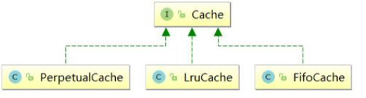
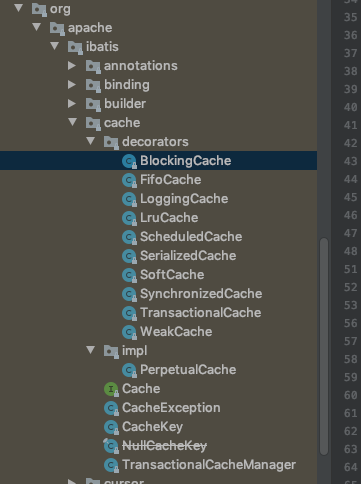
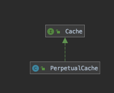
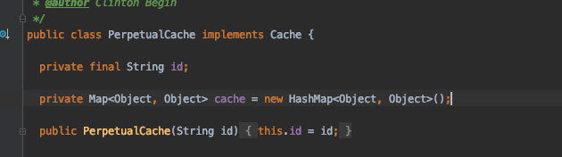
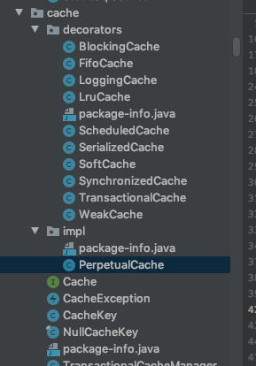

# Cache 缓存

- 一级缓存 ,SqlSession 级别的,会话级别的
- 二级缓存

MyBatis 跟缓存相关的类都在 cache 包里面，其中有一个 Cache 接口，只有一个默 认的实现类 PerpetualCache，它是用 HashMap 实现的。

除此之外，还有很多的装饰器，通过这些装饰器可以额外实现很多的功能:回收策 略、日志记录、定时刷新等等。

所有的缓存实现类总体上可分为三类:

- 基本缓存
- 淘汰算法缓存
- 装饰器缓存


### 缓存

MyBatis 内置了一个强大的事务性查询缓存机制，它可以非常方便地配置和定制。 为了使它更加强大而且易于配置，我们对 MyBatis 3 中的缓存实现进行了许多改进。

默认情况下，只启用了本地的会话缓存，它仅仅对一个会话中的数据进行缓存。 要启用全局的二级缓存，只需要在你的 SQL 映射文件中添加一行：

```
<cache/>
```

基本上就是这样。这个简单语句的效果如下:

- 映射语句文件中的所有 select 语句的结果将会被缓存。
- 映射语句文件中的所有 insert、update 和 delete 语句会刷新缓存。
- 缓存会使用最近最少使用算法（LRU, Least Recently Used）算法来清除不需要的缓存。
- 缓存不会定时进行刷新（也就是说，没有刷新间隔）。
- 缓存会保存列表或对象（无论查询方法返回哪种）的 1024 个引用。
- 缓存会被视为读/写缓存，这意味着获取到的对象并不是共享的，可以安全地被调用者修改，而不干扰其他调用者或线程所做的潜在修改。

**提示** 缓存只作用于 cache 标签所在的映射文件中的语句。如果你混合使用 Java API 和 XML 映射文件，在共用接口中的语句将不会被默认缓存。你需要使用 @CacheNamespaceRef 注解指定缓存作用域。

这些属性可以通过 cache 元素的属性来修改。比如：

```xml
<cache
  eviction="FIFO"
  flushInterval="60000"
  size="512"
  readOnly="true"/>
```

这个更高级的配置创建了一个 FIFO 缓存，每隔 60 秒刷新，最多可以存储结果对象或列表的 512 个引用，而且返回的对象被认为是只读的，因此对它们进行修改可能会在不同线程中的调用者产生冲突。

可用的清除策略有：

- `LRU` – 最近最少使用：移除最长时间不被使用的对象。
- `FIFO` – 先进先出：按对象进入缓存的顺序来移除它们。
- `SOFT` – 软引用：基于垃圾回收器状态和软引用规则移除对象。
- `WEAK` – 弱引用：更积极地基于垃圾收集器状态和弱引用规则移除对象。

默认的清除策略是 LRU。

- flushInterval（刷新间隔）属性可以被设置为任意的正整数，设置的值应该是一个以毫秒为单位的合理时间量。 默认情况是不设置，也就是没有刷新间隔，缓存仅仅会在调用语句时刷新。

- size（引用数目）属性可以被设置为任意正整数，要注意欲缓存对象的大小和运行环境中可用的内存资源。默认值是 1024。

- readOnly（只读）属性可以被设置为 true 或 false。只读的缓存会给所有调用者返回缓存对象的相同实例。 因此这些对象不能被修改。这就提供了可观的性能提升。而可读写的缓存会（通过序列化）返回缓存对象的拷贝。 速度上会慢一些，但是更安全，因此默认值是 false。

**提示** 二级缓存是事务性的。这意味着，当 SqlSession 完成并提交时，或是完成并回滚，但没有执行 flushCache=true 的 insert/delete/update 语句时，缓存会获得更新。



#### 缓存的分类



- 基本缓存
- 淘汰算法缓存
- 装饰器缓存

通过使用配置属性

| 缓存实现类          | 描述                                           | 作用                                                         | 装饰条件                                           |
| ------------------- | ---------------------------------------------- | ------------------------------------------------------------ | -------------------------------------------------- |
| PerpetualCache      | 缓存的基本实现                                 | 默认是 `PerpetualCache`,也可以自定义比如 `RedisCache`,`EhCache` 等具备基本功能的缓存类 | 无                                                 |
| LruCache            | LRU 策略的缓存,last recently use ,最近最少使用 | 当缓存到达上限的时候,删除最少使用的缓存                      | `eviction="LRU"(默 认)`                            |
| FifoCache           | FIFO 策略的缓存                                | 当缓存达到上限的时候,删除最先入列的缓存                      | `eviction="FIFO"`                                  |
| SoftCache/WeakCache | 带清理策略的缓存                               | 通过 JVM 的软引用和弱引用来实现缓存，当 JVM 内存不足时，会自动清理掉这些缓存，基于 SoftReference 和 WeakReference | `eviction="SOFT"/eviction="WEAK"`                  |
| LoggingCache        | 带日志功能的缓存                               | 比如:输出缓存命中率                                          | 基本                                               |
| BlockingCache       | 阻塞缓存                                       | 通过在 get/put 方式中加锁，保证只有一个线程操 作缓存，基于 Java 重入锁实现 | `blocking=true`                                    |
| SerializedCache     | 支持序列化的缓存                               | 将对象序列化以后存到缓存中，取出时反序列化                   | `readOnly=false`(默 认)                            |
| ScheduledCache      | 定时调度的缓存                                 | 在进行 get/put/remove/getSize 等操作前，判断 缓存时间是否超过了设置的最长缓存时间(默认是 一小时)，如果是则清空缓存--即每隔一段时间清 空一次缓存 | `flushInterval` 不为 空                            |
| TransactionalCache  | 事务缓存                                       | 在二级缓存中使用，可一次存入多个缓存，移除多 个缓存          | 在 TransactionalCacheManager 中用 Map 维护对应关系 |

#### 使用自定义缓存

除了上述自定义缓存的方式，你也可以通过实现你自己的缓存，或为其他第三方缓存方案创建适配器，来完全覆盖缓存行为。

```
<cache type="com.domain.something.MyCustomCache"/>
```

这个示例展示了如何使用一个自定义的缓存实现。type 属性指定的类必须实现 org.apache.ibatis.cache.Cache 接口，且提供一个接受 String 参数作为 id 的构造器。 这个接口是 MyBatis 框架中许多复杂的接口之一，但是行为却非常简单。

```java
public interface Cache {
  String getId();
  int getSize();
  void putObject(Object key, Object value);
  Object getObject(Object key);
  boolean hasKey(Object key);
  Object removeObject(Object key);
  void clear();
}
```

为了对你的缓存进行配置，只需要简单地在你的缓存实现中添加公有的 JavaBean 属性，然后通过 cache 元素传递属性值，例如，下面的例子将在你的缓存实现上调用一个名为 `setCacheFile(String file)` 的方法：

```
<cache type="com.domain.something.MyCustomCache">
  <property name="cacheFile" value="/tmp/my-custom-cache.tmp"/>
</cache>
```

你可以使用所有简单类型作为 JavaBean 属性的类型，MyBatis 会进行转换。 你也可以使用占位符（如 `${cache.file}`），以便替换成在[配置文件属性](https://mybatis.org/mybatis-3/zh/configuration.html#properties)中定义的值。

从版本 3.4.2 开始，MyBatis 已经支持在所有属性设置完毕之后，调用一个初始化方法。 如果想要使用这个特性，请在你的自定义缓存类里实现 `org.apache.ibatis.builder.InitializingObject` 接口。

```
public interface InitializingObject {
  void initialize() throws Exception;
}
```

**提示** 上一节中对缓存的配置（如清除策略、可读或可读写等），不能应用于自定义缓存。

请注意，缓存的配置和缓存实例会被绑定到 SQL 映射文件的命名空间中。 因此，同一命名空间中的所有语句和缓存将通过命名空间绑定在一起。 每条语句可以自定义与缓存交互的方式，或将它们完全排除于缓存之外，这可以通过在每条语句上使用两个简单属性来达成。 默认情况下，语句会这样来配置：

```
<select ... flushCache="false" useCache="true"/>
<insert ... flushCache="true"/>
<update ... flushCache="true"/>
<delete ... flushCache="true"/>
```

鉴于这是默认行为，显然你永远不应该以这样的方式显式配置一条语句。但如果你想改变默认的行为，只需要设置 flushCache 和 useCache 属性。比如，某些情况下你可能希望特定 select 语句的结果排除于缓存之外，或希望一条 select 语句清空缓存。类似地，你可能希望某些 update 语句执行时不要刷新缓存。

#### cache-ref

回想一下上一节的内容，对某一命名空间的语句，只会使用该命名空间的缓存进行缓存或刷新。 但你可能会想要在多个命名空间中共享相同的缓存配置和实例。要实现这种需求，你可以使用 cache-ref 元素来引用另一个缓存。

```
<cache-ref namespace="com.someone.application.data.SomeMapper"/>
```

## 一级缓存

 [笔记](17-first-level-cache.md) 

## 二级缓存

 [笔记](17-second-level-cache.md) 

## Cache 相关源码

### 核心接口

Cache 接口是 MyBatis 中的核心接口,实际上


值得注意的是`TransactionalCacheManager` 事务缓存管理器,实际上维护了一个 HashMap,支持同事添加或者修改多个缓存,只有调用了 Commit 方法以后,缓存的方法才会被写入


#### 默认的实现类

`PerpetualCache`是默认的实现类,主要是对 Cache 进行了简单的封装



其中仅仅只维护了一个 HashMap 



#### 装饰类

实现 Cache 接口的不光光有默认的实现类`perpetualCache`,还有一系列的装饰类,这里使用的是装饰器模式 [04-decorator-pattern.md](../../01-design-patterns/03-structural-patterns/04-decorator-pattern.md) 



#### SynchronizedCache 

这是一个非常简单的装饰器,主要是用`synchronized`关键字封装了所有的方法来做到对 Cache 访问的同步

