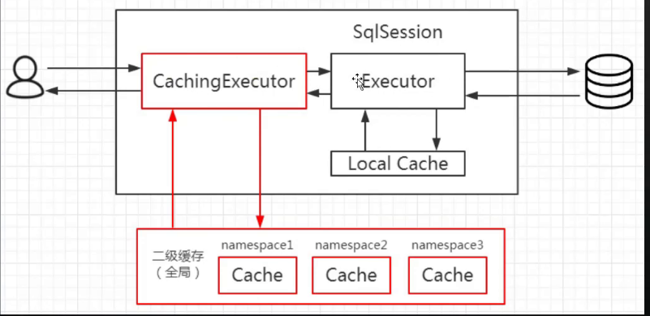

# Second Level Cache 二级缓存

> 作用域: namespace

二级缓存是用来解决一级缓存不能跨会话共享的问题的，范围是 namespace 级别 的，可以被多个 SqlSession 共享(只要是同一个接口里面的相同方法，都可以共享)， 生命周期和应用同步。

思考一个问题:如果开启了二级缓存，二级缓存应该是工作在一级缓存之前，还是 在一级缓存之后呢?二级缓存是在哪里维护的呢?

作为一个作用范围更广的缓存，它肯定是在 SqlSession 的外层，否则不可能被多个 SqlSession 共享。而一级缓存是在 SqlSession 内部的，所以第一个问题，肯定是工作 在一级缓存之前，也就是只有取不到二级缓存的情况下才到一个会话中去取一级缓存。

第二个问题，二级缓存放在哪个对象中维护呢? 要跨会话共享的话，SqlSession 本 身和它里面的 BaseExecutor 已经满足不了需求了，那我们应该在 BaseExecutor 之外创 建一个对象。

实际上 MyBatis 用了一个装饰器的类来维护，就是 `CachingExecutor`。如果启用了 二级缓存，MyBatis 在创建 Executor 对象的时候会对 Executor 进行装饰。

CachingExecutor 对于查询请求，会判断二级缓存是否有缓存结果，如果有就直接 返回，如果没有委派交给真正的查询器 Executor 实现类，比如 SimpleExecutor 来执行 查询，再走到一级缓存的流程。最后会把结果缓存起来，并且返回给用户。



#### 开启二级缓存的方法

第一步:在 mybatis-config.xml 中配置了(可以不配置，默认是 true):

```xml
//在 mybatis-config.xml 中配置了(可以不配置，默认是 true)
<setting name="cacheEnabled" value="true"/>
```

第二步:在 Mapper.xml 中配置`<cache/>`标签:

```
<cache type="org.apache.ibatis.cache.impl.PerpetualCache"
               size="1024"
               eviction="LRU"
               flushInterval="120000"//自动刷新事件
               readOnly="false"/>
```


| 属性          | 含义                                    | 取值                                                         |
| ------------- | --------------------------------------- | ------------------------------------------------------------ |
| type          | 缓存的实现类                            | 需要实现 Cache 接口,默认是`PerpetualCache`                   |
| size          | 最多缓存对象的大小                      | 默认 1024                                                    |
| eviction      | 回收策略                                | LRU – 最近最少使用的:移除最长时间不被使用的对象(默认)<br/>FIFO – 先进先出:按对象进入缓存的顺序来移除它们。<br/>SOFT – 软引用:移除基于垃圾回收器状态和软引用规则的对象。<br/>WEAK – 弱引用:更积极地移除基于垃圾收集器状态和弱引用规则的对象。 |
| flushInterval | 定时自动清空缓存间隔                    | 自动刷新时间，单位 ms，未配置时只有调用时刷新                |
| readOnly      | 是否只读                                | true:只读缓存;会给所有调用者返回缓存对象的相同实例。因此这些对象 不能被修改。这提供了很重要的性能优势。<br/>false:读写缓存;会返回缓存对象的拷贝(通过序列化)，不会共享。这 会慢一些，但是安全，因此默认是 false。<br/>改为 false 可读写时，对象必须支持序列化。 |
| blocking      | 是否使用可重入锁实现<br/>缓存的并发控制 | true，会使用 BlockingCache 对 Cache 进行装饰 默认 false      |

Mapper.xml 配置了<cache>之后，select()会被缓存。update()、delete()、insert() 会刷新缓存。
思考:如果 cacheEnabled=true，Mapper.xml 没有配置标签，还有二级缓存吗? 还会出现 CachingExecutor 包装对象吗?

只要 cacheEnabled=true 基本执行器就会被装饰。有没有配置<cache>，决定了在 启动的时候会不会创建这个 mapper 的 Cache 对象，最终会影响到 CachingExecutor query 方法里面的判断:

```
if (cache != null) {
```

如果某些查询方法对数据的实时性要求很高，不需要二级缓存，怎么办? 我们可以在单个 Statement ID 上显式关闭二级缓存(默认是 true):

```
 <select
id="selectBlog"
resultMap="BaseResultMap"
useCache="false">
```

## 二级缓存的验证

#### 测试二级缓存在 SqlSession 之间的共享机制

```java
    /**
     * 测试二级缓存一定要打开二级缓存开关
     *
     * @throws IOException
     */
    @Test
    public void testCache() throws IOException {
        String resource = "mybatis-config.xml";
        InputStream inputStream = Resources.getResourceAsStream(resource);
        SqlSessionFactory sqlSessionFactory = new SqlSessionFactoryBuilder().build(inputStream);

        SqlSession session1 = sqlSessionFactory.openSession();
        SqlSession session2 = sqlSessionFactory.openSession();
        try {
            BlogMapper mapper1 = session1.getMapper(BlogMapper.class);
            System.out.println(mapper1.selectBlogById(1));
            // 事务不提交的情况下，二级缓存会写入吗？
            session1.commit();

            System.out.println("第二次查询");
            BlogMapper mapper2 = session2.getMapper(BlogMapper.class);
            System.out.println(mapper2.selectBlogById(1));
        } finally {
            session1.close();
        }
    }
```

#### 测试二级缓存在更新后是否会缓存失效

```
   /**
     * 测试二级缓存在更新操作下是否会同步使缓存失效
     * 测试二级缓存一定要打开二级缓存开关
     * @throws IOException
     */
    @Test
    public void testCacheInvalid() throws IOException {
        String resource = "mybatis-config.xml";
        InputStream inputStream = Resources.getResourceAsStream(resource);
        SqlSessionFactory sqlSessionFactory = new SqlSessionFactoryBuilder().build(inputStream);

        SqlSession session1 = sqlSessionFactory.openSession();
        SqlSession session2 = sqlSessionFactory.openSession();
        SqlSession session3 = sqlSessionFactory.openSession();
        try {
            BlogMapper mapper1 = session1.getMapper(BlogMapper.class);
            BlogMapper mapper2 = session2.getMapper(BlogMapper.class);
            BlogMapper mapper3 = session3.getMapper(BlogMapper.class);
            System.out.println(mapper1.selectBlogById(1));
            session1.commit();

            // 是否命中二级缓存
            System.out.println("是否命中二级缓存？");
            System.out.println(mapper2.selectBlogById(1));

            Blog blog = new Blog();
            blog.setBid(1);
            blog.setName("2019年1月6日15:03:38");
            mapper3.updateByPrimaryKey(blog);
            session3.commit();

            System.out.println("更新后再次查询，是否命中二级缓存？");
            // 在其他会话中执行了更新操作，二级缓存是否被清空？
            System.out.println(mapper2.selectBlogById(1));

        } finally {
            session1.close();
            session2.close();
            session3.close();
        }
    }
```


## 值得注意的是

使用 CacheingExecutor 类来包装 Executor 来实现二级缓存


实际上二级缓存是一个跨 sqlSession 的缓存,当 sqlSession.commit 以后,就会提交缓存,这个时候另外一个 sqlSession 就可以获取当刚刚的缓存

#### 什么时候需要开启二级缓存?

一级缓存默认是打开的，二级缓存需要配置才可以开启。那么我们必须思考一个问 题，在什么情况下才有必要去开启二级缓存?

- 因为所有的增删改都会刷新二级缓存，导致二级缓存失效，所以适合在查询为主 的应用中使用，比如历史交易、历史订单的查询。否则缓存就失去了意义。
- 如果多个 namespace 中有针对于同一个表的操作，比如 Blog 表，如果在一个 namespace 中刷新了缓存，另一个 namespace 中没有刷新，就会出现读到脏数据的情 况。所以，推荐在一个 Mapper 里面只操作单表的情况使用。

#### 如果要让多个 namespace 共享一个二级缓存，应该怎么做?

跨 namespace 的缓存共享的问题，可以使用`<cache-ref>`来解决:

```
<
cache-ref
namespace="com.gupaoedu.crud.dao.DepartmentMapper"/>
```

cache-ref 代表引用别的命名空间的 Cache 配置，两个命名空间的操作使用的是同 一个 Cache。在关联的表比较少，或者按照业务可以对表进行分组的时候可以使用。
注意:在这种情况下，多个 Mapper 的操作都会引起缓存刷新，缓存的意义已经不 大了。

#### 二级缓存维护的 TransactionalCacheManager 

CachingExecutor 实际上是一个包装器,用于包装 Executor,就拥有了二级缓存的机制


支持对二级缓存的批量操作,也就是在一个事务内添加或者删除二级缓存


