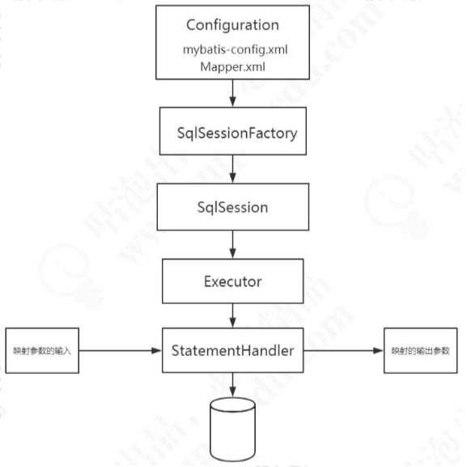
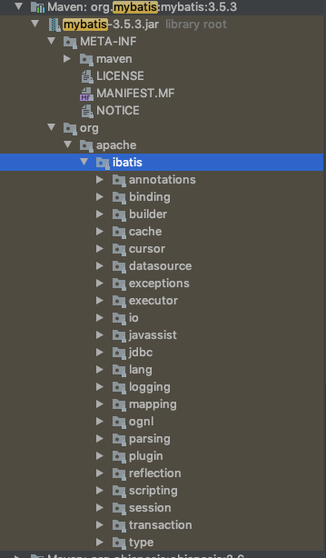
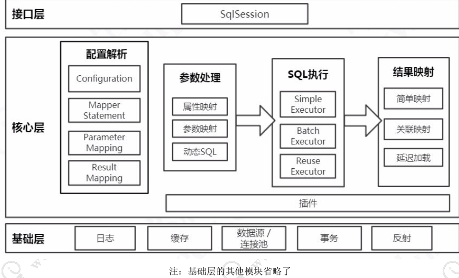

# 152-Mybatis执行流程

## 目录

[TOC]

## 执行流程图示



## 

#### 加载 Configuration 对象

首先在 MyBatis 启动的时候我们要去解析配置文件，包括全局配置文件和映射器 配置文件，这里面包含了我们怎么控制 MyBatis 的行为，和我们要对数据库下达的指令， 也就是我们的 SQL 信息。我们会把它们解析成一个 `Configuration` 对象。

#### 创建 SqlSession 对象

接下来就是我们操作数据库的接口，它在应用程序和数据库中间，代表我们跟数据库之间的一次连接:这个就是 SqlSession 对象。

- **创建一个会话工厂`SqlSessionFactory`**

我们要获得一个会话，必须有一个会话工厂 SqlSessionFactory。
SqlSessionFactory 里面又必须包含我们的所有的配置信息，所以我们会通过一个 Builder 来创建工厂类。

我们知道，MyBatis 是对 JDBC 的封装，也就是意味着底层一定会出现 JDBC 的一 些核心对象，比如执行 SQL 的 Statement，结果集 ResultSet。在 Mybatis 里面， SqlSession 只是提供给应用的一个接口，还不是 SQL 的真正的执行对象。

SqlSession 持有了一个 Executor 对象，用来封装对数据库的 操作。

在执行器 Executor 执行 query 或者 update 操作的时候我们创建一系列的对象， 来处理参数、执行 SQL、处理结果集，这里我们把它简化成一个对象:`StatementHandler`


## Mybatis 源码层级 Hierarchy



实际上代码可以分成三个层次结构

- 接口层, 主要负责对外 API 的汇总与开放,外观模式

- 核心层, 主要包含配置解析, 参数处理, SQL 执行, 结果映射等步骤
- 基础层, 日志, 缓存, 数据源, 连接池, 事务, 反射工具类等核心层所需要的通用模块

```
第一个是跟客户打交道的服务员，它是用来接收程序的工作指令的，我们把它叫做 接口层。
第二个是后台的厨师，他们根据客户的点菜单，把原材料加工成成品，然后传到窗 口。这一层是真正去操作数据的，我们把它叫做核心层。
最后就是餐厅也需要有人做后勤(比如清洁、采购、财务)，来支持厨师的工作和 整个餐厅的运营。我们把它叫做基础层。
```




#### 接口层

首先接口层是我们打交道最多的。核心对象是 SqlSession，它是上层应用和 MyBatis 打交道的桥梁，SqlSession 上定义了非常多的对数据库的操作方法。接口层在接收到调 用请求的时候，会调用核心处理层的相应模块来完成具体的数据库操作。

#### 核心处理层

接下来是核心处理层。既然叫核心处理层，也就是跟数据库操作相关的动作都是在 这一层完成的。
  核心处理层主要做了这几件事:

1. 把接口中传入的参数解析并且映射成JDBC类型;

2. 解析xml文件中的SQL语句，包括插入参数，和动态SQL的生成;

3. 执行SQL语句;

4. 处理结果集，并映射成Java对象。
   插件也属于核心层，这是由它的工作方式和拦截的对象决定的。

   插件也属于核心层，这是由它的工作方式和拦截的对象决定的。

基础支持层

最后一个就是基础支持层。基础支持层主要是一些抽取出来的通用的功能(实现复 用)，用来支持核心处理层的功能。比如数据源、缓存、日志、xml 解析、反射、IO、 事务等等这些功能。

