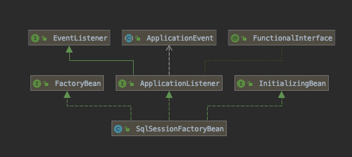
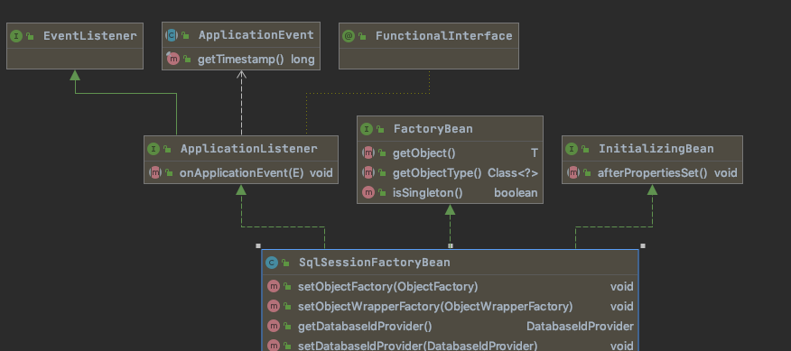
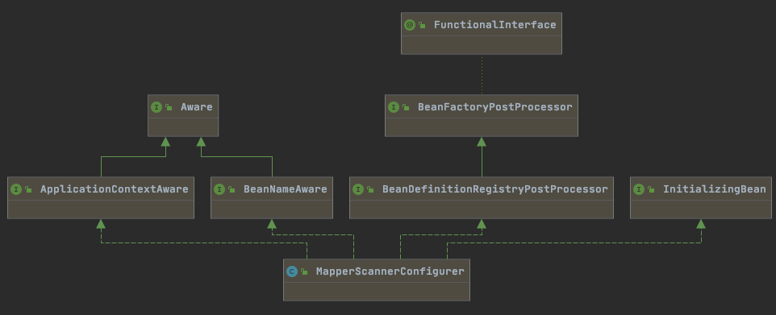
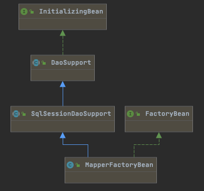

# mybatis-spring 桥接包核心原理

[TOC]

## 1.SqlSessionFactory是什么时候创建的

当需要引入 Mybatis 的时候,我们要引入 `org.mybatis.spring.SqlSessionFactoryBean` ,用来创建 SqlSessionFactory ,我们可以看到 property 属性配置了

- mybatis-config.xml 配置文件,
- 配置了 mapperLocations 扫描路径
- 配置了 dataSource 数据源

```xml
    <!-- 在Spring启动时创建 sqlSessionFactory -->
    <bean id="sqlSessionFactory" class="org.mybatis.spring.SqlSessionFactoryBean">
        <property name="configLocation" value="classpath:mybatis-config.xml"></property>
        <property name="mapperLocations" value="classpath:mapper/*.xml"></property>
        <property name="dataSource" ref="dataSource"/>
    </bean>
```



SqlSessionFactoryBean 用于创建 SqlSessionFactory, 总共实现了三个接口,如上图



- InitializingBean , 里面只有一个 afterPropertiesSet 方法, 当 Bean 初始化完成后,设置完属性以后会回调
- ApplicationListener 用于监听应用回调
- `FactoryBean<SqlSessionFactory>` 标注这个类是工厂类 ,用于产生 SqlSessionFactory
  - getObject 获取要生产的 SqlSessionFactory 对象 
  - getObjectType 
  - isSingleton 是否单例

####  getObject 方法调用了 afterPropertiesSet

```java
  @Override
  public void afterPropertiesSet() throws Exception {
			//..省略入参检查, 实际上调用的是 buildSqlSessionFactory
    this.sqlSessionFactory = buildSqlSessionFactory();
  }
```

buildSqlSessionFactory 实际上就构建了 SqlSessionFactory

 其解析流程基本和 standalone 使用的[SqlSessionFactoryBuilder 源码](061-SqlSessionFactoryBuilder.md) 一致

## SqlSession怎么获取

MyBatis 默认的 DefaultSqlSession 是线程不安全的 , 替代品是 SqlSessionTemplate  

```java
  public SqlSessionTemplate(SqlSessionFactory sqlSessionFactory, ExecutorType executorType,
      PersistenceExceptionTranslator exceptionTranslator) {

    notNull(sqlSessionFactory, "Property 'sqlSessionFactory' is required");
    notNull(executorType, "Property 'executorType' is required");

    this.sqlSessionFactory = sqlSessionFactory;
    this.executorType = executorType;
    this.exceptionTranslator = exceptionTranslator;
    // 使用JDK动态代理模式
    this.sqlSessionProxy = (SqlSession) newProxyInstance(
        SqlSessionFactory.class.getClassLoader(),
        new Class[] { SqlSession.class },
        new SqlSessionInterceptor());
  }
```

可以看出使用的是 SqlSessionInterceptor 这个 InvocationHandler 实现类

```java
  private class SqlSessionInterceptor implements InvocationHandler {
    @Override
    public Object invoke(Object proxy, Method method, Object[] args) throws Throwable {
              //①  获取一个 SqlSession
      SqlSession sqlSession = getSqlSession(
          SqlSessionTemplate.this.sqlSessionFactory,
          SqlSessionTemplate.this.executorType,
          SqlSessionTemplate.this.exceptionTranslator);
      try {
              //② 调用被代理类
        Object result = method.invoke(sqlSession, args);
        if (!isSqlSessionTransactional(sqlSession, SqlSessionTemplate.this.sqlSessionFactory)) {
          // force commit even on non-dirty sessions because some databases require
          // a commit/rollback before calling close()
          //提交
          sqlSession.commit(true);
        }
        return result;
      } catch (Throwable t) {
     		//....
      } finally {
        if (sqlSession != null) {
          //关闭 sqlSession 
          closeSqlSession(sqlSession, SqlSessionTemplate.this.sqlSessionFactory);
        }
      }
    }
  }

```

- ① 获取一个 SqlSession ,  这里是获取的确保线程安全 
- ② 调用 SqlSession
- ③ 关闭 SqlSession

```java
  public static SqlSession getSqlSession(
    SqlSessionFactory sessionFactory, 
    ExecutorType executorType,
    PersistenceExceptionTranslator exceptionTranslator) {

    SqlSessionHolder holder = (SqlSessionHolder) TransactionSynchronizationManager.getResource(sessionFactory);

  SqlSession session = sessionHolder(executorType, holder);
    if (session != null) {
      return session;
    }

    LOGGER.debug(() -> "Creating a new SqlSession");
    session = sessionFactory.openSession(executorType);

    registerSessionHolder(sessionFactory, executorType, exceptionTranslator, session);

    return session;
  }
```

关闭一个 Session

```java
  public static void closeSqlSession(SqlSession session, SqlSessionFactory sessionFactory) {
    notNull(session, NO_SQL_SESSION_SPECIFIED);
    notNull(sessionFactory, NO_SQL_SESSION_FACTORY_SPECIFIED);

    SqlSessionHolder holder = (SqlSessionHolder) TransactionSynchronizationManager.getResource(sessionFactory);
    if ((holder != null) && (holder.getSqlSession() == session)) {
      LOGGER.debug(() -> "Releasing transactional SqlSession [" + session + "]");
      holder.released();
    } else {
      LOGGER.debug(() -> "Closing non transactional SqlSession [" + session + "]");
      session.close();
    }
  }
```

#### 为什么SqlSessionTemplate是线程安全的


## 什么时候扫描

在配置文件中我们可以看到配置的一个 Bean MapperScannerConfigurer (是一个mybatis.spring 项目的类),  这个类就用来扫描的

```xml
    <!--配置扫描器，将mybatis的接口实现加入到  IOC容器中  -->
    <bean id="mapperScanner" class="org.mybatis.spring.mapper.MapperScannerConfigurer">
        <property name="basePackage" value="com.gupaoedu.crud.dao"/>
    </bean>
```



```java
public interface BeanDefinitionRegistryPostProcessor extends BeanFactoryPostProcessor {

	/**
	 * 在注册 ProcessBeanDefinition 注册后回调
	 */
	void postProcessBeanDefinitionRegistry(BeanDefinitionRegistry registry) throws BeansException;

}

```

org.mybatis.spring.mapper.MapperScannerConfigurer#postProcessBeanDefinitionRegistry

```java
  @Override
  public void postProcessBeanDefinitionRegistry(BeanDefinitionRegistry registry) {
    if (this.processPropertyPlaceHolders) {
      processPropertyPlaceHolders();
    }

    ClassPathMapperScanner scanner = new ClassPathMapperScanner(registry);
    scanner.setAddToConfig(this.addToConfig);
    scanner.setAnnotationClass(this.annotationClass);
    scanner.setMarkerInterface(this.markerInterface);
    scanner.setSqlSessionFactory(this.sqlSessionFactory);
    scanner.setSqlSessionTemplate(this.sqlSessionTemplate);
    scanner.setSqlSessionFactoryBeanName(this.sqlSessionFactoryBeanName);
    scanner.setSqlSessionTemplateBeanName(this.sqlSessionTemplateBeanName);
    scanner.setResourceLoader(this.applicationContext);
    scanner.setBeanNameGenerator(this.nameGenerator);
    scanner.registerFilters();
    scanner.scan(StringUtils.tokenizeToStringArray(this.basePackage, ConfigurableApplicationContext.CONFIG_LOCATION_DELIMITERS));
  }

```

新建了一个 ClassPathMapperScanner 类, 去扫描, 

```java
  @Override
  public Set<BeanDefinitionHolder> doScan(String... basePackages) {
    Set<BeanDefinitionHolder> beanDefinitions = super.doScan(basePackages);

    if (beanDefinitions.isEmpty()) {
      logger.warn("No MyBatis mapper was found in '" + Arrays.toString(basePackages) + "' package. Please check your configuration.");
    } else {
      //
      processBeanDefinitions(beanDefinitions);
    }

    return beanDefinitions;
  }
```

```java
  private void processBeanDefinitions(Set<BeanDefinitionHolder> beanDefinitions) {
    GenericBeanDefinition definition;
    for (BeanDefinitionHolder holder : beanDefinitions) {
      definition = (GenericBeanDefinition) holder.getBeanDefinition();

      if (logger.isDebugEnabled()) {
        logger.debug("Creating MapperFactoryBean with name '" + holder.getBeanName() 
          + "' and '" + definition.getBeanClassName() + "' mapperInterface");
      }

      // the mapper interface is the original class of the bean
      // but, the actual class of the bean is MapperFactoryBean
      definition.getConstructorArgumentValues().addGenericArgumentValue(definition.getBeanClassName()); // issue #59		// 设置 BeanDefination 的类型为 mapperFactoryBean 类型
      definition.setBeanClass(this.mapperFactoryBean.getClass());

      definition.getPropertyValues().add("addToConfig", this.addToConfig);

      boolean explicitFactoryUsed = false;
      if (StringUtils.hasText(this.sqlSessionFactoryBeanName)) {
        definition.getPropertyValues().add("sqlSessionFactory", new RuntimeBeanReference(this.sqlSessionFactoryBeanName));
        explicitFactoryUsed = true;
      } else if (this.sqlSessionFactory != null) {
        definition.getPropertyValues().add("sqlSessionFactory", this.sqlSessionFactory);
        explicitFactoryUsed = true;
      }
    }
  }
```

设置 BeanDefination 的类型为 mapperFactoryBean 类型 

所以扫描到的所有的 Bean 都会变为 mapperFactoryBean 类型 ,继承了SqlSessionDaoSupport , SqlSessionDaoSupport 里维护了 sqlSession , 



它的 getObject 方法 

```java
@Override
public T getObject() throws Exception {
  return getSqlSession().getMapper(this.mapperInterface);
}
```

实际上就是从 getSqlSession 中获取 Mapper, 这里的 SqlSession 实际上就是 SqlSessionTemplate (线程安全版本的 SqlSession) , 当Mapper 被注入时,调用这个方法,从而调用这里 ,实际上就走到 Mybatis 的 MapperRegistry 里去获取 MapperProxy

