# mybatis-spring 桥接包核心原理

## Mybais 中的核心对象

- SqlSessionFactory
- SqlSession
- MapperProxy

我们在编写测试类的时候,总是用到这三个对象,我们直接注入一个Mapper接口,调用它的方法

## 集成的简要步骤

除了 MyBatis 的依赖之外，我们还需要在 pom 文件中引入 MyBatis 和 Spring 整合
的 jar 包

```xml
        <!--mybatis 和Spring整合 -->
        <dependency>
            <groupId>org.mybatis</groupId>
            <artifactId>mybatis-spring</artifactId>
            <version>${mybatis-spring.version}</version>
        </dependency>

        <!-- mybatis -->
        <dependency>
            <groupId>org.mybatis</groupId>
            <artifactId>mybatis</artifactId>
            <version>${mybatis.version}</version>
        </dependency>
```

#### 配置一些整合 bean

```xml
    <!--配置一个可以执行批量的sqlSession，全局唯一，单例 -->
    <bean id="sqlSessionTemplate" class="org.mybatis.spring.SqlSessionTemplate">
        <constructor-arg ref="sqlSessionFactory"></constructor-arg>
        <constructor-arg value="BATCH"></constructor-arg>
    </bean>


    <!-- 在Spring启动时创建 sqlSessionFactory -->
    <bean id="sqlSessionFactory" class="org.mybatis.spring.SqlSessionFactoryBean">
        <property name="configLocation" value="classpath:mybatis-config.xml"></property>
        <property name="mapperLocations" value="classpath:mapper/*.xml"></property>
        <property name="dataSource" ref="dataSource"/>
    </bean>

    <bean id="mapperScanner" class="org.mybatis.spring.mapper.MapperScannerConfigurer">
        <property name="basePackage" value="vip.ericchen.study.mybatis.mapper"/>
    </bean>
```


## 集成到 Spring核心类

从上面整合的时候的 bean 可以看到,注册成 bean的类有

- `SqlSessionFactoryBean` 用于创建 SqlSessionFactory
- `MapperScannerConfigurer` 自动扫描类
- `SqlSessionTemplate`

### `SqlSessionFactoryBean`

可以看到 `SqlSessionFactoryBean` 的`Hierarchy`


#### 实现 `InitializingBean`

主要是实现接口中的方法

```java
  @Override
  public void afterPropertiesSet() throws Exception {
    notNull(dataSource, "Property 'dataSource' is required");
    notNull(sqlSessionFactoryBuilder, "Property 'sqlSessionFactoryBuilder' is required");
    state((configuration == null && configLocation == null) || !(configuration != null && configLocation != null),
              "Property 'configuration' and 'configLocation' can not specified with together");
		//调用buildSqlSessionFactory
    this.sqlSessionFactory = buildSqlSessionFactory();
  }
```

可以看到调用的是`buildSqlSessionFactory`方法

- 创建了解析器`XMLConfigBuilder`和`XMLMapperBuilder`并调用了 Mybatis 里面的解析方法
- 最终创建了`SqlSessionFactory`方法

### 实现`FactoryBean`

主要是实现了接口中的三个方法

```
  /**
   * {@inheritDoc} 获取对象
   */
  @Override
  public SqlSessionFactory getObject() throws Exception {
    if (this.sqlSessionFactory == null) {
      afterPropertiesSet();
    }

    return this.sqlSessionFactory;
  }

  /**
   * {@inheritDoc} 获取对象类型
   */
  @Override
  public Class<? extends SqlSessionFactory> getObjectType() {
    return this.sqlSessionFactory == null ? SqlSessionFactory.class : this.sqlSessionFactory.getClass();
  }

  /**
   * {@inheritDoc}是否是单例
   */
  @Override
  public boolean isSingleton() {
    return true;
  }

```

事实上,实现`FactoryBean`接口是常见的 Spring拓展自己工厂 Bean 的方式

#### 实现`ApplicationListener`接口

主要是为了实现Java 方法.在上下文刷新的时候重新获取 `MapperSatatemnt` 的名称,这是一个快速失败的过程,实际上是检查所有的 statements 是否都完成

```java
  @Override
  public void onApplicationEvent(ApplicationEvent event) {
    if (failFast && event instanceof ContextRefreshedEvent) {
      // fail-fast -> check all statements are completed
      this.sqlSessionFactory.getConfiguration().getMappedStatementNames();
    }
  }

```

## MapperScannerConfigurer

自动扫描 Mapper 接口

#### Hierarchy 


从类注释上可以看出这个类是用来扫描` Mapper `对象的

实现了四个直接的接口

- `BeanDefinitionRegistryPostProcessor`:在`BeanFactoryPostProcessor`执行之前,进行相关的操作

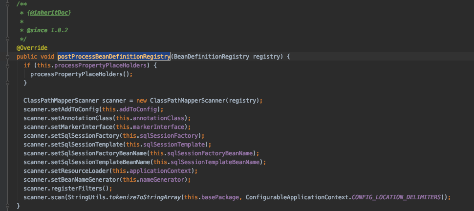

这里主要实现了扫描器的加载与扫描,首先,会调用 Spring 的 Bean 扫描机制

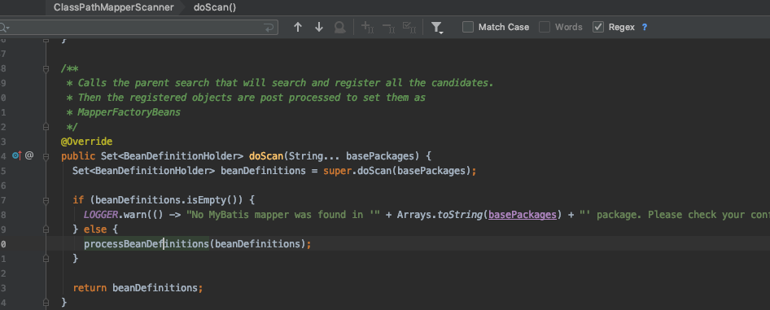


我们可以看到这个 执行 BeanDefinitions 的方法中,实际的 接口对应的实现类是一个 `MapperFactoryBean`


从这里可以知道实际上 Spring 容器中的接口对应的实现类实际上是一个 `MapperfactoryBean`,

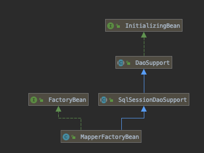

可以看到 MapperFactoryBean 通过适配器模式适配上了 SqlSessionDaoSupport,这个类中维护了一个 SqlSessionTemplate(一个通过事务管理而线程安全的 SqlSession).通过这个 SqlSession,就可以获取 Mapper

当调用`MapperfactoryBean`获取对象的时候


所以实际上`MapperfactoryBean`中直接可以获取到 Mapper 的 MapperProxy 代理对象,从而能够执行 Mybatis 的操作


- `InitializingBean`: 主要是为了在该 bean 属性被初始化完后的回调,这里用来检测基础包是否正常


## SqlSessionTemplate

由于` DefaultSqlSession `是线程非安全的,所以我们在Spring 中配置Bean 的时候就不能使用,因为它可能会在不同的 Service 里共享

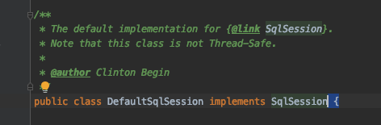

所以,在和 Spring 集成的时候,要新建一个类,也就是 SqlSessionTemplate,这个类第一句话就说明了这个类是线程安全的

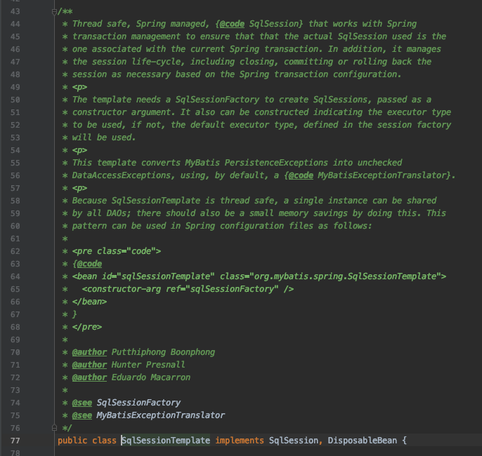

#### 为什么 SqlSessionTemplate 是线程安全的呢

> 原文地址http://www.programmersought.com/article/2056143395/

### How does SqlSessionTemplate guarantee the thread safety of SqlSession in MyBatis?

#### First, the thread of the DefaultSqlSession is not safe.

The SqlSession in MyBatis's architecture is the top-level interface provided to the outer call. The implementation classes are: DefaultSqlSession, SqlSessionManager, and MyBatis Springs. The default implementation of the SqlSessionTemplate implementation class is DefaultSqlSession. The class diagram structure is as follows:


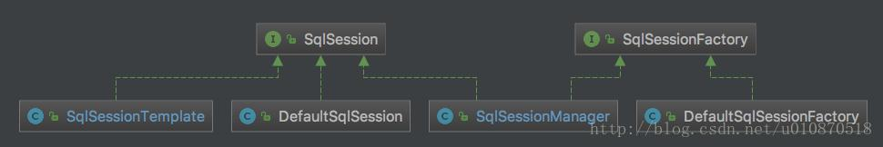

For the native implementation class provided by MyBatis, the most used is DefaultSqlSession, but we know that the DefaultSqlSession class is not thread safe as follows!


#### Second, how does SqlSessionTemplate use DefaultSqlSession?

In our development, we will definitely use spring, and will also use MyBatis's spring framework. When using MyBatis and spring integration, we will use the SqlSessionTemplate class. For example, the following configuration, inject a singleton SqlSessionTemplate object. :

```
 <!-- Create a SqlSessionFactory for Mybatis, and specify the data source -->
    <bean id="sqlSessionFactory" class="org.mybatis.spring.SqlSessionFactoryBean">
        <property name="dataSource" ref="dataSource"/>
        <!--<property name="configLocation" value="classpath:META-INF/spring/mybatis-config.xml"/>-->
        <property name="mapperLocations" value="classpath*:com/store/user/rpc/service/dao/mapper/*Mapper.xml"/>
    </bean>

         <!-- Without SqlSession will not close -->
    <bean id="sessionTemplate" class="org.mybatis.spring.SqlSessionTemplate"
          destroy-method="close" scope="prototype">
        <constructor-arg index="0" ref="sqlSessionFactory" />
    </bean>
```

The source code comments for SqlSessionTemplate are as follows:


Through the source code, we can see that the SqlSessionTemplate implements the SqlSession interface, which means that we can use the SqlSessionTemplate to proxy the previous DefaultSqlSession to complete the operation on the database, but the DefaultSqlSession class is not thread-safe. So the DefaultSqlSession class can't be set to singleton mode.

f it is a regular development mode, we can get one from the SqlSessionFactory object every time we use DefaultSqlSession. But after integrating with the spring, the spring provides a globally unique SqlSessionTemplate object. To complete the function of DefaultSqlSession, the problem is: whether multiple channels use a SqlSessionTemplate, or a path uses a SqlSessionTemplate, SqlSessionTemplate is a SQLSESSION object, when multiple network threads call the same island, they use the same SqlSessionTemplate, which is the same SqlSession, then it? How to ensure thread safety? Let us analyze it together:

#### Third, how does SqlSessionTemplate guarantee that the DefaultSqlSession is thread safe?

- First, create a proxy class by the following code, representing an instance of the proxy class of the created SqlSessionFactory, the SqlSession interface implemented by the proxy class, defining a method interceptor, if calling the method defined by the SqlSession interface implemented in the proxy class instance, The call is directed to the invoke method of the SqlSessionInterceptor (the InvocationHandler of the proxy object is the SqlSessionInterceptor, if you name it SqlSessionInvocationHandler it is better understood!) Core


>  这里其实是核心,使用了一个 SqlSessionInterceptor 去代理了SqlSession 

The code is in the invoke method of the SqlSessionInterceptor.


> 实际上我们可以看到,这里直接使用了 SqlSessionManager 中的 Threadloacl 变量 localSqlSession

The two tool methods used in the above calling methods are:

- getSqlSession
- closeSqlSession 

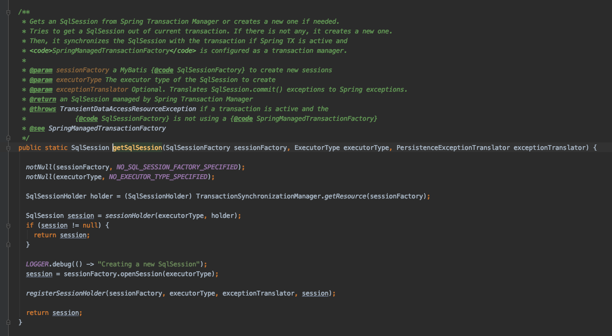

我们可以看到是通过`SqlSessionHolder`拿到的的 ,当然也是通过`TransactionSynchronizationManager`的`getResource`方法获取,我们可以看到,这是一个ThreadLocal的变量


The rough analysis is so far, it may not be smooth enough. However, the paper has a long-lasting sensation. I know that I have to do it and hope that my partner can open my own compiler, find the code here, and go through the process carefully!
In fact, through the above code we can see that MyBatis uses the proxy mode in many places. The proxy mode can be said to be a classic mode. In fact, it is not used in this place. Patterns, spring things, AOP, MyBatis database connection pool technology, MyBatis's core principles (how to complete database operations in the case of only interfaces without implementation classes!) and other technologies use proxy technology.

#### Fourth, what is the SqlSessionManager?

The above said that a SqlSession implementation also has a SqlSessionManager, then what is the SqlSessionManager and what is defined as follows:

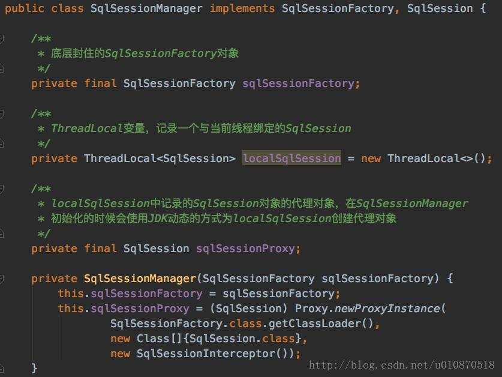

You may find that the constructor of SqlSessionManager is private, so how do we create this object? Actually, the SqlSessionManager creates the object through the newInstance method, but it needs to be noted that he Although there is a private constructor and it gives us a public newInstance method, it is not a singleton mode! newInstance has a lot of overloaded methods, as shown below:

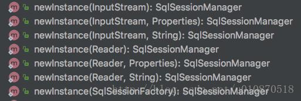

The SqlSessionManager's openSession method and its overloaded method directly create the SqlSession object by calling the openSession method of the underlying packaged SqlSessionFactory object. The overloaded method is as follows:

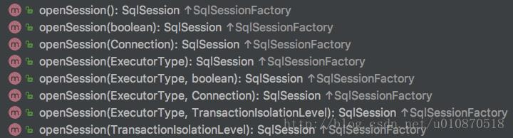

SqlSessionManager implements the methods in the SqlSession interface, such as: select, update, etc., are directly called SqlSessionProxy proxy object corresponding method in the creation of the proxy object used in the InvocationHandler The object is the SqlSessionInterceptor, which is an internal class defined in the SqlSessionManager, which is defined as follows:

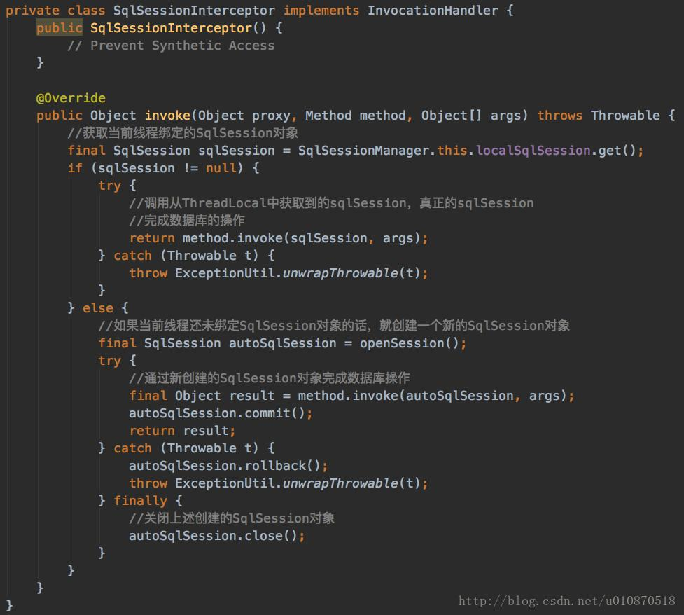

In summary, we should have a general understanding of the difference between DefaultSqlSession and SqlSessionManager:

1. `DefaultSqlSession` does not provide the same way as SqlSessionManager through ThreadLocal to ensure thread security;
2.  SqlSessionManager is through the localSqlSession ThreadLocal variable, record the SqlSession object bound to the current thread, for the current thread to cycle, thus avoiding the SqlSession object created multiple times in the same thread Performance loss;
3.  DefaultSqlSession is not thread-safe. When we are doing native development, we need to create a SqlSession object for each operation, and its performance can be imagined;

实际上就是通过`TransactionSynchronizationManager`一个事务持有一个`SqlSessionHolder`,一个`SqlSessionHolder`也就是持有一个`SqlSession`从而确保在一个事务冲使用同一个 SqlSession

