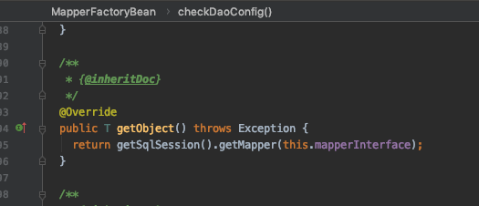
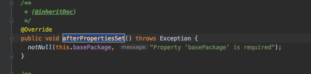

# 集成的简要步骤

除了 MyBatis 的依赖之外，我们还需要在 pom 文件中引入 MyBatis 和 Spring 整合
的 jar 包

```xml
        <!--mybatis 和Spring整合 -->
        <dependency>
            <groupId>org.mybatis</groupId>
            <artifactId>mybatis-spring</artifactId>
            <version>${mybatis-spring.version}</version>
        </dependency>

        <!-- mybatis -->
        <dependency>
            <groupId>org.mybatis</groupId>
            <artifactId>mybatis</artifactId>
            <version>${mybatis.version}</version>
        </dependency>
```

#### 配置一些整合 bean

```xml
    <!--配置一个可以执行批量的sqlSession，全局唯一，单例 -->
    <bean id="sqlSessionTemplate" class="org.mybatis.spring.SqlSessionTemplate">
        <constructor-arg ref="sqlSessionFactory"></constructor-arg>
        <constructor-arg value="BATCH"></constructor-arg>
    </bean>


    <!-- 在Spring启动时创建 sqlSessionFactory -->
    <bean id="sqlSessionFactory" class="org.mybatis.spring.SqlSessionFactoryBean">
        <property name="configLocation" value="classpath:mybatis-config.xml"></property>
        <property name="mapperLocations" value="classpath:mapper/*.xml"></property>
        <property name="dataSource" ref="dataSource"/>
    </bean>

    <bean id="mapperScanner" class="org.mybatis.spring.mapper.MapperScannerConfigurer">
        <property name="basePackage" value="vip.ericchen.study.mybatis.mapper"/>
    </bean>
```

### 实现`FactoryBean`

主要是实现了接口中的三个方法

```java
  /**
   * {@inheritDoc} 获取对象
   */
  @Override
  public SqlSessionFactory getObject() throws Exception {
    if (this.sqlSessionFactory == null) {
      afterPropertiesSet();
    }

    return this.sqlSessionFactory;
  }

  /**
   * {@inheritDoc} 获取对象类型
   */
  @Override
  public Class<? extends SqlSessionFactory> getObjectType() {
    return this.sqlSessionFactory == null ? SqlSessionFactory.class : this.sqlSessionFactory.getClass();
  }

  /**
   * {@inheritDoc}是否是单例
   */
  @Override
  public boolean isSingleton() {
    return true;
  }

```

事实上,实现`FactoryBean`接口是常见的 Spring拓展自己工厂 Bean 的方式

#### 实现`ApplicationListener`接口

主要是为了实现Java 方法.在上下文刷新的时候重新获取 `MapperSatatemnt` 的名称,这是一个快速失败的过程,实际上是检查所有的 statements 是否都完成

```java
  @Override
  public void onApplicationEvent(ApplicationEvent event) {
    if (failFast && event instanceof ContextRefreshedEvent) {
      // fail-fast -> check all statements are completed
      this.sqlSessionFactory.getConfiguration().getMappedStatementNames();
    }
  }
```


MapperScannerConfigurer

自动扫描 Mapper 接口


这里主要实现了扫描器的加载与扫描,首先,会调用 Spring 的 Bean 扫描机制


从这里可以知道实际上 Spring 容器中的接口对应的实现类实际上是一个 `MapperfactoryBean`,


可以看到 MapperFactoryBean 通过适配器模式适配上了 SqlSessionDaoSupport,这个类中维护了一个 SqlSessionTemplate(一个通过事务管理而线程安全的 SqlSession).通过这个 SqlSession,就可以获取 Mapper

当调用`MapperfactoryBean`获取对象的时候



所以实际上`MapperfactoryBean`中直接可以获取到 Mapper 的 MapperProxy 代理对象,从而能够执行 Mybatis 的操作


- `InitializingBean`: 主要是为了在该 bean 属性被初始化完后的回调,这里用来检测基础包是否正常



## SqlSessionTemplate

由于` DefaultSqlSession `是线程非安全的,所以我们在Spring 中配置Bean 的时候就不能使用,因为它可能会在不同的 Service 里共享


所以,在和 Spring 集成的时候,要新建一个类,也就是 SqlSessionTemplate,这个类第一句话就说明了这个类是线程安全的


## 为什么 SqlSessionTemplate 是线程安全的呢

> 原文地址http://www.programmersought.com/article/2056143395/


