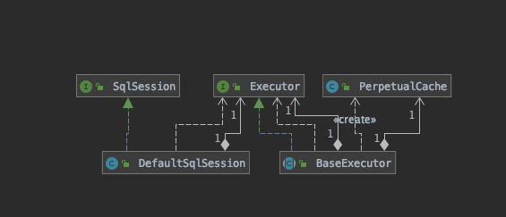
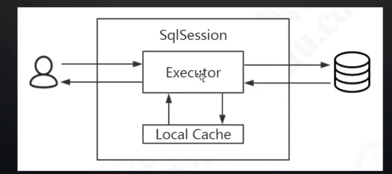
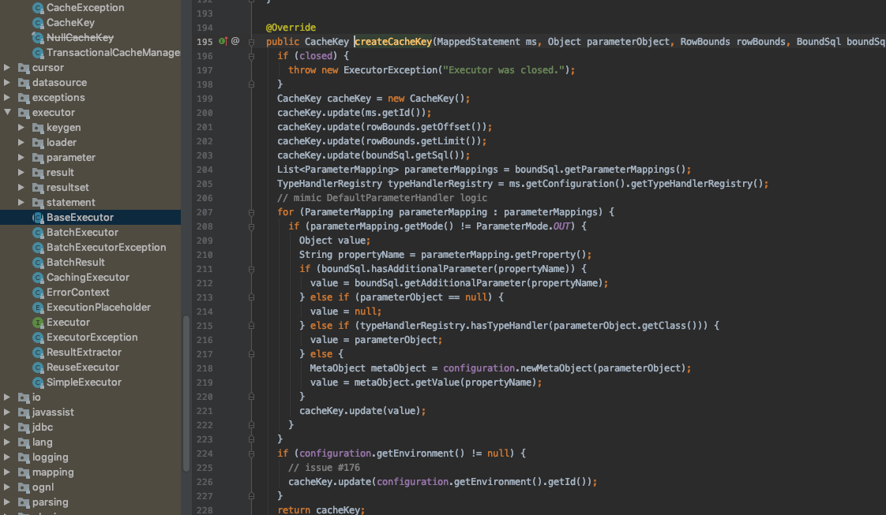

# FirstLevel Cache 一级缓存

## 一级缓存

一级缓存也叫本地缓存,Mybatis 的一级缓存,是在会话(SqlSession)层面上进行缓存的,Mybtais 的以及缓存是默认开启的,不需要任何的配置



在 MyBatis 执行的流程里面，涉及到这么多的对 象，那么缓存 PerpetualCache 应该放在哪个对象里面去维护?如果要在同一个会话里面 共享一级缓存，这个对象肯定是在 SqlSession 里面创建的，作为 SqlSession 的一个属 性。

`DefaultSqlSession `里面只有两个属性，Configuration 是全局的，所以缓存只可能 放在 Executor 里面维护——`SimpleExecutor/ReuseExecutor/BatchExecutor `的父类`BaseExecutor `的构造函数中持有了` PerpetualCache`。这个即使一级缓存,也叫本地缓存



用户操作的是 SqlSession , 接口层的核心, 它始终会操作 Executor 执行器中的 LocalCache

所以 一级缓存的作用域是 SqlSession 会话级别的,当会话结束,一级缓存就会消失

## 测试

值得注意的是一级缓存测试需要关闭二级缓存`localCacheScope 设置为 SESSION`

```xml
        <!-- STATEMENT级别的缓存，使一级缓存，只针对当前执行的这一statement有效 -->
<!--                <setting name="localCacheScope" value="STATEMENT"/>-->
        <setting name="localCacheScope" value="SESSION"/>
```


#### 在同一个 session 中共享/不同 session 不能共享

```java
    /**
     * First level Cache can be shared in the same SqlSession instance
     */
    @Test
    public void testShareInOneSqlSession() throws Exception{
        String resource = "mybatis-config.xml";
        InputStream inputStream = Resources.getResourceAsStream(resource);
        SqlSessionFactory sqlSessionFactory = new SqlSessionFactoryBuilder().build(inputStream);

        SqlSession session1 = sqlSessionFactory.openSession();
        SqlSession session2 = sqlSessionFactory.openSession();
        try {
            BlogMapper mapper0 = session1.getMapper(BlogMapper.class);
            BlogMapper mapper1 = session1.getMapper(BlogMapper.class);
            Blog blog = mapper0.selectBlogById(1);
            System.out.println(blog);

            System.out.println("第二次查询，相同会话，获取到缓存了吗？");
            System.out.println(mapper1.selectBlogById(1));

            System.out.println("第三次查询，不同会话，获取到缓存了吗？");
            BlogMapper mapper2 = session2.getMapper(BlogMapper.class);
            System.out.println(mapper2.selectBlogById(1));

        } finally {
            session1.close();
        }
    }
```

#### 同一个会话中，update(包括 delete)会导致一级缓存被清空

```java
    /**
     * 一级缓存失效
     * @throws IOException
     */
    @Test
    public void testCacheInvalid() throws IOException {
        String resource = "mybatis-config.xml";
        InputStream inputStream = Resources.getResourceAsStream(resource);
        SqlSessionFactory sqlSessionFactory = new SqlSessionFactoryBuilder().build(inputStream);

        SqlSession session = sqlSessionFactory.openSession();
        try {
            BlogMapper mapper = session.getMapper(BlogMapper.class);
            System.out.println(mapper.selectBlogById(1));

            Blog blog = new Blog();
            blog.setBid(1);
            blog.setName("2019年1月6日14:39:58");
            mapper.updateByPrimaryKey(blog);
            session.commit();

            // 相同会话执行了更新操作，缓存是否被清空？
            System.out.println("在执行更新操作之后，是否命中缓存？");
            System.out.println(mapper.selectBlogById(1));

        } finally {
            session.close();
        }
    }
```

#### 其他会话更新了数据，导致读取到脏数据(一级缓存不能跨会话共享)

```java
    /**
     * 因为缓存不能跨会话共享，导致脏数据出现
     * @throws IOException
     */
    @Test
    public void testDirtyRead() throws IOException {
        String resource = "mybatis-config.xml";
        InputStream inputStream = Resources.getResourceAsStream(resource);
        SqlSessionFactory sqlSessionFactory = new SqlSessionFactoryBuilder().build(inputStream);

        SqlSession session1 = sqlSessionFactory.openSession();
        SqlSession session2 = sqlSessionFactory.openSession();
        try {
            BlogMapper mapper1 = session1.getMapper(BlogMapper.class);
            System.out.println(mapper1.selectBlogById(1));

            // 会话2更新了数据，会话2的一级缓存更新
            Blog blog = new Blog();
            blog.setBid(1);
            blog.setName("after modified 112233445566");
            BlogMapper mapper2 = session2.getMapper(BlogMapper.class);
            mapper2.updateByPrimaryKey(blog);
            session2.commit();

            // 其他会话更新了数据，本会话的一级缓存还在么？
            System.out.println("会话1查到最新的数据了吗？");
            System.out.println(mapper1.selectBlogById(1));
        } finally {
            session1.close();
            session2.close();
        }
```

## 一级缓存的不足

使用一级缓存的时候，因为缓存不能跨会话共享，不同的会话之间对于相同的数据 可能有不一样的缓存。在有多个会话或者分布式环境下，会存在脏数据的问题。如果要 解决这个问题，就要用到二级缓存。

## 值得注意的是

#### 一级缓存的命中方式,CacheKey 怎么构成

```
    cacheKey.update(ms.getId());
    cacheKey.update(rowBounds.getOffset());
    cacheKey.update(rowBounds.getLimit());
    cacheKey.update(boundSql.getSql());
```

会根据 StatementId , 分页参数和 sql 数据



#### 一级缓存是默认开启的，怎么关闭一级缓存?

- `localCacheScope` 设置为 `statement`

MyBatis 利用本地缓存机制（Local Cache）防止循环引用（circular references）和加速重复嵌套查询。 默认值为 SESSION，这种情况下会缓存一个会话中执行的所有查询。 若设置值为 STATEMENT，本地会话仅用在语句执行上，对相同 SqlSession 的不同调用将不会共享数据。