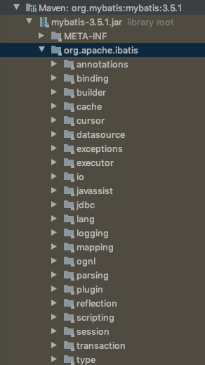
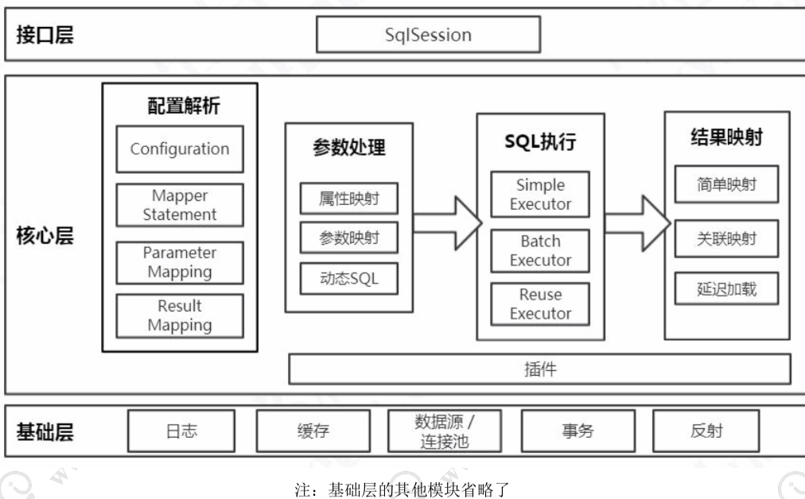

# MyBatis 架构分层与模块划分

> 在 MyBatis 的主要工作流程里面，不同的功能是由很多不同的类协作完成的，它们 分布在 MyBatis jar 包的不同的 package 里面。

总体来说

### 接口层

首先接口层是我们打交道最多的。**核心对象是 SqlSession**，它是上层应用和 MyBatis 打交道的桥梁，SqlSession 上定义了非常多的对数据库的操作方法。接口层在接收到调用请求的时候 ，会调用核心处理层的相应模块来完成具体的数据库操作。

### 核心处理层

既然叫核心处理层，也就是跟数据库操作相关的动作都是在 这一层完成的。

核心处理层主要做了这几件事:

- 把接口中传入的参数解析并且映射成JDBC类型;
- 解析xml文件中的SQL语句，包括插入参数，和动态SQL的生成;
- 执行SQL语句;
- 处理结果集，并映射成Java对象。

插件也属于核心层，这是由它的工作方式和拦截的对象决定的。

### 基础支持层

基础支持层主要是一些抽取出来的通用的功能(实现复 用)，用来支持核心处理层的功能。比如数据源、缓存、日志、xml 解析、反射、IO、 事务等等这些功能。

这个就是 MyBatis 的主要工作流程和架构分层。接下来我们来学习一下基础层里面 的一个主要模块，缓存。我们一起来了解一下 MyBatis 一级缓存和二级缓存的区别，和 它们的工作方式，以及使用过程里面有什么注意事项。