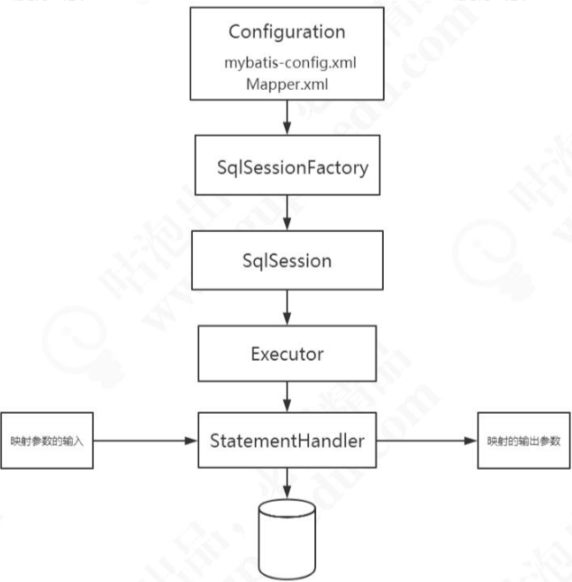

# MyBatis 工作流程

#### 解析配置文件和映射器 Mapper 文件

MyBatis 启动的时候我们要去解析配置文件，包括全局配置文件和映射器 配置文件，这里面包含了我们怎么控制 MyBatis 的行为，和我们要对数据库下达的指令， 也就是我们的 SQL 信息。我们会把它们解析成一个 Configuration 对象。

#### 创建 SqlSession 对象

接下来就是我们操作数据库的接口，它在应用程序和数据库中间，代表我们跟数据库之间的一次连接:这个就是 SqlSession 对象。

- 要获得一个会话，必须有一个会话工厂 SqlSessionFactory

  > SqlSessionFactory 里面又必须包含我们的所有的配置信息，所以我们会通过一个 Builder 来创建工厂类。

- MyBatis 是对 JDBC 的封装，也就是意味着底层一定会出现 JDBC 的一 些核心对象，比如执行 SQL 的 Statement，结果集 ResultSet。

  > 在 Mybatis 里面， SqlSession 只是提供给应用的一个接口，还不是 SQL 的真正的执行对象。
  >
  > SqlSession 持有了一个 Executor 对象，用来封装对数据库的 操作。

- 在执行器 Executor 执行 query 或者 update 操作的时候我们创建一系列的对象， 来处理参数、执行 SQL、处理结果集，这里我们把它简化成一个对象:StatementHandler， 在阅读源码的时候我们再去了解还有什么其他的对象。

