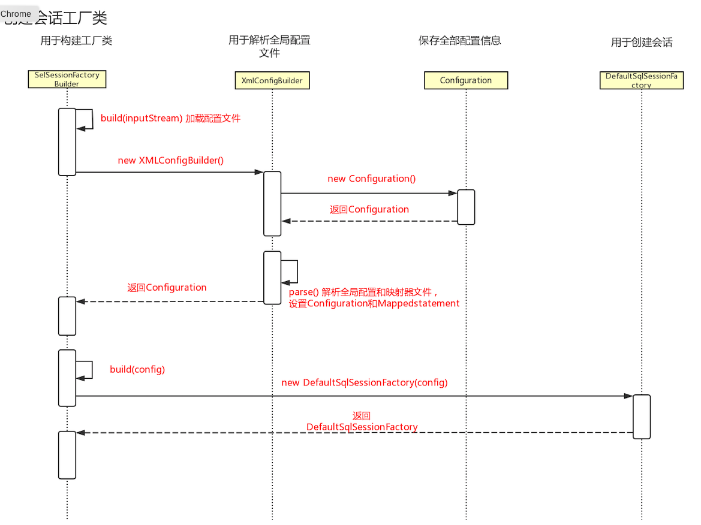
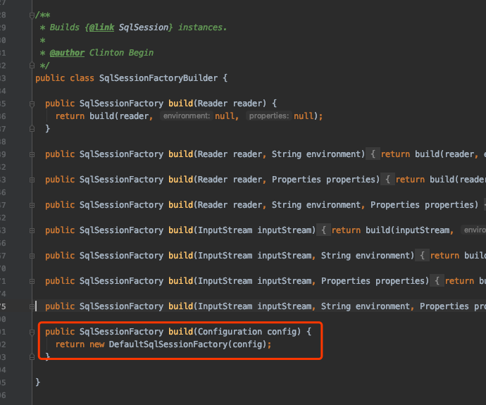
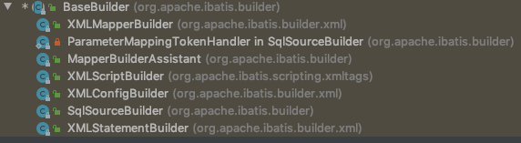
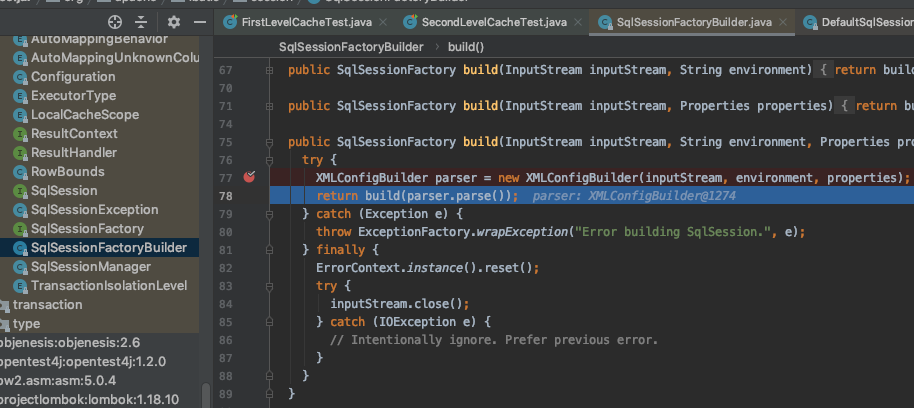
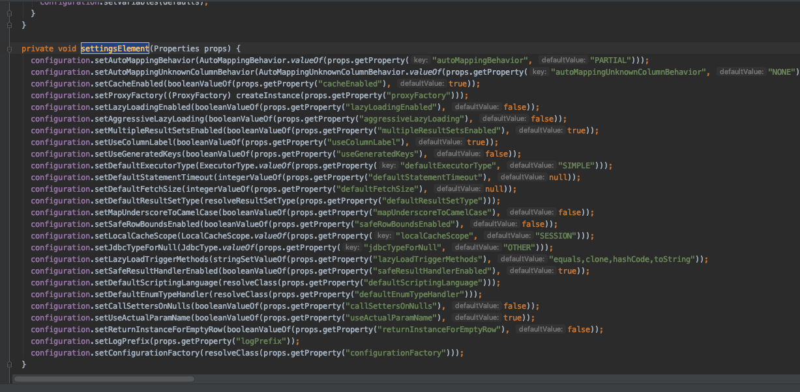
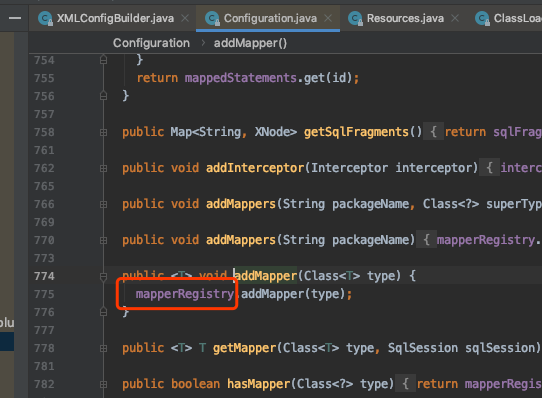
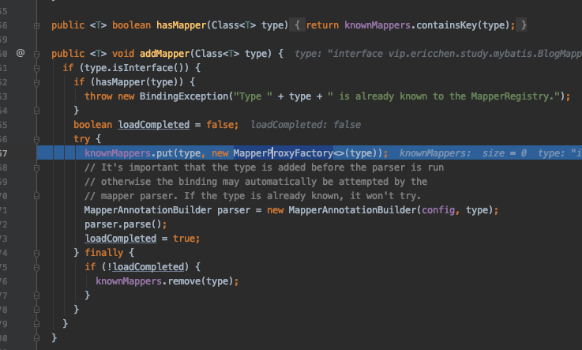
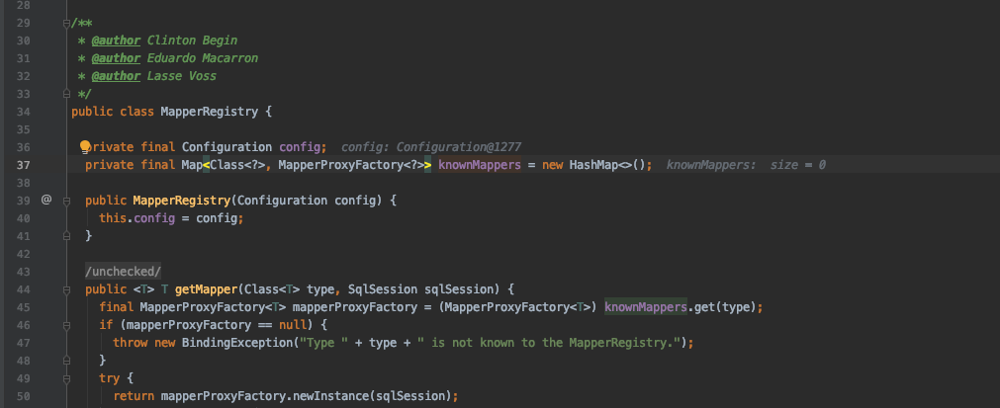

# 源码分析-配置解析过程

## 用例

```
    @Test
    public void testStatement() throws IOException {
        String resource = "mybatis-config.xml";
        InputStream inputStream = Resources.getResourceAsStream(resource);
        SqlSessionFactory sqlSessionFactory = new SqlSessionFactoryBuilder().build(inputStream);
        //创建会话过程
        try (SqlSession session = sqlSessionFactory.openSession()) {
            User user = session.selectOne("vip.ericchen.study.mybatis.UserMapper.selectUser", 1);
            System.out.println(user);
        }
    }
```

## 时序图




## 配置解析过程

解析`mybatis-config.xml`

```java
//建造者模式
SqlSessionFactory sqlSessionFactory = new SqlSessionFactoryBuilder().build(inputStream);
```



`build`通过`XMLConfigBuilder`这个默认实现类

返回的默认实现类`DefaultSqlSessionFactory`,可以看出这个构建器将输入的资源构建成了一个 `Configuration`类传入构造器的参数中

### XMLConfigBuilder

`XMLConfigBuilder` 是抽象类 `BaseBuilder` 的一个子类，专门用来解析全局配置文 件，针对不同的构建目标还有其他的一些子类，比如:
`XMLMapperBuilder`:解析` Mapper `映射器 `XMLStatementBuilder`:解析增删改查标签



- XMLMapperBuilder:解析 Mapper 映射器
- XMLStatementBuilder: 解析增删改查标签



`SqlSessionBuilder`中的 `build `方法创建了 `XMLConfigBuilder`


在解析的方法中,可以看到每一个` XMLConfigBuilder `只能使用一次,这里使用了一个变量存储了是否解析过,下面就到了`propertiesElement`方法,


#### propertiesElement方法

第一个是解析`<properties>`标签，读取我们引入的外部配置文件。这里面又有两种 类型，一种是放在 `resource` 目录下的，是相对路径，一种是写的绝对路径的。解析的最 终结果就是我们会把所有的配置信息放到名为 `defaults` 的 `Properties` 对象里面，最后把 `XPathParser` 和 `Configuration` 的 `Properties` 属性都设置成我们填充后的 `Properties` 对象。

#### settingsAsProperties()

第二个，我们把`<settings>`标签也解析成了一个 `Properties` 对象，对于`<settings>` 标签的子标签的处理在后面。
在早期的版本里面解析和设置都是在后面一起的，这里先解析成 Properties 对象是 因为下面的两个方法要用到。

#### loadCustomVfs(settings)

`loadCustomVfs` 是获取 `Vitual File System` 的自定义实现类，比如我们要读取本地 文件，或者 FTP 远程文件的时候，就可以用到自定义的 VFS 类。我们根据`<settings>`标 签里面的`<vfsImpl>`标签，生成了一个抽象类 VFS 的子类，并且赋值到` Configuration `中。

#### typeAliasesElement()

接下来，我们解析`<typeAliases>`标签，我们在讲配置的时候也讲过，它有两种定义 方式，一种是直接定义一个类的别名，一种就是指定一个包，那么这个 package 下面所 有的类的名字就会成为这个类全路径的别名。
类的别名和类的关系，我们放在一个 `TypeAliasRegistry` 对象里面。

#### pluginElement()

接下来就是解析`<plugins>`标签，比如 Pagehelper 的翻页插件，或者我们自定义的 插件。`<plugins>`标签里面只有`<plugin>`标签，`<plugin>`标签里面只有`<property>`标 签。
标签解析完以后，会生成一个 `Interceptor` 对象，并且添加到 `Configuration` 的 `InterceptorChain` 属性里面，它是一个 List。

#### objectFactoryElement()、objectWrapperFactoryElement()

接 下 来 的 两 个 标 签 是 用 来 实 例 化 对 象 用 的 ， `<objectFactory>` 和 `<objectWrapperFactory> `这 两 个 标 签 ， 分 别 生 成 `ObjectFactory `、 `ObjectWrapperFactory` 对象，同样设置到 `Configuration `的属性里面。

#### reflectorFactoryElement()

解析 reflectorFactory 标签，生成 ReflectorFactory 对象

#### settingsElement(settings)

这里就是对`<settings>`标签里面所有子标签的处理了，前面我们已经把子标签全部 转换成了 Properties 对象，所以在这里处理 Properties 对象就可以了。
二级标签里面有很多的配置，比如二级缓存，延迟加载，自动生成主键这些。需要 注意的是，我们之前提到的所有的默认值，都是在这里赋值的。



#### environmentsElement()

这一步是解析`<environments>`标签。

我们前面讲过，一个 environment 就是对应一个数据源，所以在这里我们会根据配 置的`<transactionManager>`创建一个事务工厂，根据`<dataSource>`标签创建一个数据 源，最后把这两个对象设置成` Environment` 对象的属性，放到 `Configuration `里面。

#### databaseIdProviderElement()

解析 databaseIdProvider 标签，生成 DatabaseIdProvider 对象

#### typeHandlerElement()

跟` TypeAlias `一样，`TypeHandler` 有两种配置方式，一种是单独配置一个类，一种 是指定一个 package。最后我们得到的是` JavaType` 和` JdbcType`，以及用来做相互映射 的 `TypeHandler` 之间的映射关系。

最后存放在` TypeHandlerRegistry` 对象里面。

#### mapperElement()

主要用于解析`mappers`标签,这个标签里标注了 Mapper

```java
  private void mapperElement(XNode parent) throws Exception {
    if (parent != null) {
      for (XNode child : parent.getChildren()) {
        if ("package".equals(child.getName())) {
          String mapperPackage = child.getStringAttribute("name");
          //直接添加 Mapper 的包
          configuration.addMappers(mapperPackage);
        } else {
          String resource = child.getStringAttribute("resource");
          String url = child.getStringAttribute("url");
          String mapperClass = child.getStringAttribute("class");
          if (resource != null && url == null && mapperClass == null) {
            //如果配置了 resource
            ErrorContext.instance().resource(resource);
            InputStream inputStream = Resources.getResourceAsStream(resource);
            //
            XMLMapperBuilder mapperParser = new XMLMapperBuilder(inputStream, configuration, resource, configuration.getSqlFragments());
            mapperParser.parse();
          } else if (resource == null && url != null && mapperClass == null) {
            //如果配置了 URL
            ErrorContext.instance().resource(url);
            InputStream inputStream = Resources.getUrlAsStream(url);
            //
            XMLMapperBuilder mapperParser = new XMLMapperBuilder(inputStream, configuration, url, configuration.getSqlFragments());
            mapperParser.parse();
          } else if (resource == null && url == null && mapperClass != null) {
            //根据配置的 Mapper 类解析 Mapper 接口的类
            Class<?> mapperInterface = Resources.classForName(mapperClass);
            //在配置文件中添加 Mapper 的接口
            configuration.addMapper(mapperInterface);
          } else {
            throw new BuilderException("A mapper element may only specify a url, resource or class, but not more than one.");
          }
        }
      }
    }
  }
```

首先可以看到 if 判断的逻辑,判断了`<mappers>`标签的属性

##### 第一步,判断

| 扫描类型 | 含义     |
| -------- | -------- |
| resource | 相对路径 |
| url      | 绝对路径 |
| package  | 包       |
| class    | 单个接口 |

##### 第二步,注册

XMLMapperBuilder.parse()方法，是对 Mapper 映射器的解析。里面有两个方法:

- configurationElement()` -解 析 所 有 的 子 标 签 ， 其 中 `buildStatementFromContext()` 最终获得 MappedStatement 对象。
- `bindMapperForNamespace()`——把 `namespace` (接口类型)和工厂类绑定起来。

无论是 package 扫描还是根据接口扫描,最后都会调用到 `MapperRegistry` 的 `addMapper` 方法



##### 第三步,处理注解


除了映射器文件，在这里也会去解析 Mapper 接口方法上的注解。在 `addMapper()` 方法里面创建了一个 `MapperAnnotationBuilder`，我们点进去看一下 `parse()`方法。

`- parseCache()` 和 `parseCacheRef()` 方 法 其 实 是 对 `@CacheNamespace` 和 `@CacheNamespaceRef` 这两个注解的处理。
`parseStatement()`方法里面的各种 `getAnnotation()`，都是对注解的解析，比如 `@Options`，`@SelectKey`，`@ResultMap` 等等。
最后同样会解析成 `MappedStatement` 对象，也就是说在 XML 中配置，和使用注 解配置，最后起到一样的效果。

##### 第四步

如果注册没有完成,还要从 `Map`里面`remove`掉

```java
// MapperRegistry.java
finally {
  if (!loadCompleted) {
    knownMappers.remove(type);
  }
```

最后，`MapperRegistry `也会放到 `Configuration` 里面去。

第二步是调用另一个 `build()`方法，返回` DefaultSqlSessionFactory`。

#### 总结

在这一步，我们主要完成了 config 配置文件、Mapper 文件、Mapper 接口上的注 解的解析。
我们得到了一个最重要的对象 Configuration，这里面存放了全部的配置信息，它在属性里面还有各种各样的容器。
最后，返回了一个` DefaultSqlSessionFactory`，里面持有了` Configuration` 的实例

## 值得注意的是



在 MapperResgistry 里维护了一个 接口类和`MapperProxyFactory`的映射关系:



实际上 `MapperProxyFactory `创建的就是我们的Mapper 接口类的代理,通过 JDK 动态代理的方式,将 interface 和 对应的 xml Statement 进行了一一关联