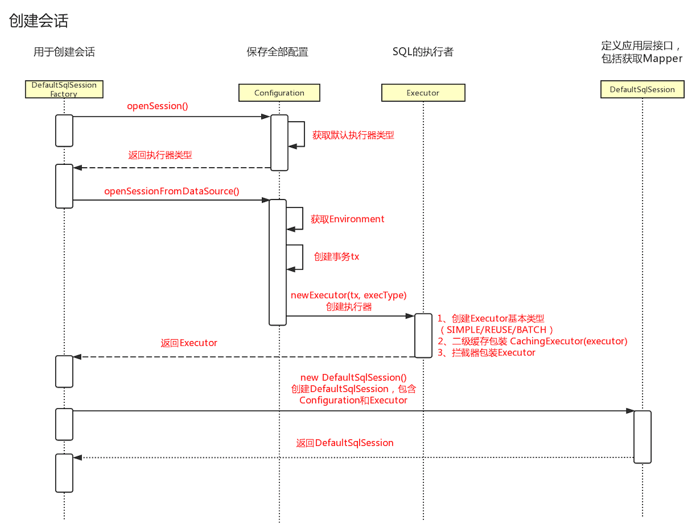
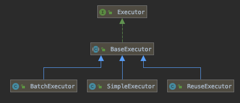

# 源码分析-创建会话过程

## 用例

```java
    @Test
    public void testStatement() throws IOException {
        String resource = "mybatis-config.xml";
        InputStream inputStream = Resources.getResourceAsStream(resource);
        SqlSessionFactory sqlSessionFactory = new SqlSessionFactoryBuilder().build(inputStream);
        //创建会话过程
        try (SqlSession session = sqlSessionFactory.openSession()) {
            User user = session.selectOne("vip.ericchen.study.mybatis.UserMapper.selectUser", 1);
            System.out.println(user);
        }
    }
```

## 时序图



## 创建会话过程

核心就是以下面这个语句

```java
 SqlSession session = sqlSessionFactory.openSession()
```

上个笔记分析了解析,解析后返回的是`DefaultSqlSessionFactory`类,筒仓情况下这个类是单例的,应用级别


```
ExecutorType execType, TransactionIsolationLevel level, boolean autoCommit
```

```java
  private SqlSession openSessionFromDataSource(ExecutorType execType, TransactionIsolationLevel level, boolean autoCommit) {
    Transaction tx = null;
    try {
      //根据解析的 Configuration 去拿到事务工厂,
      final Environment environment = configuration.getEnvironment();
      final TransactionFactory transactionFactory = getTransactionFactoryFromEnvironment(environment);
      //事务工厂可以创建新的事务实例
      tx = transactionFactory.newTransaction(environment.getDataSource(), level, autoCommit);
      //配置里可以根据刚刚获取的事务管理器和执行类型获取一个 Executor ,也就是真正的 SQL执行器
      final Executor executor = configuration.newExecutor(tx, execType);
      //返回的是默认DefaultSqlSession
      return new DefaultSqlSession(configuration, executor, autoCommit);
    } catch (Exception e) {
      	closeTransaction(tx); // may have fetched a connection so lets call close()
      throw ExceptionFactory.wrapException("Error opening session.  Cause: " + e, e);
    } finally {
      ErrorContext.instance().reset();
    }
  }
```

### 创建 Transaction

| 属性    | 产生工具类                | 生产事务           |
| ------- | ------------------------- | ------------------ |
| JDBC    | JdbcTransactionFactory    | JdbcTransaction    |
| MANAGED | ManagedTransactionFactory | ManagedTransaction |

这里就包含两种事务

- JDBC 会使用 Connection对象的 `commited`/`rollback()` /`close()` 管理事务
- MANAGED 会把事务交给容器管理,比如 JBOSS ,Weblogic 或者其他,例如 Spring

## 创建Executor

Executor 的基本类型有三种:


- SIMPLE 对应的实现类是`SimpleExecutor`

每次执行一次` update` 或者是` select` 方法, 就会开启一个` Statement`对象,用完就会立刻关闭 `Statement `对象

- BATCH 对应的实现类是 `BatchExecutor`

执行 update(没有 select，JDBC 批处理不支持 select)，将所 有 sql 都添加到批处理中(`addBatch()`)，等待统一执行(`executeBatch()`)，它缓存 了多个 Statement 对象，每个 `Statement` 对象都是 `addBatch()`完毕后，等待逐一执行 `executeBatch()`批处理。与 JDBC 批处理相同。

- REUSE 对应的实现类是`ReuseExecutor`

每次执行一次` update` 或者是` select` 方法,以 sql 作为 key 查询的 Statement 对象,存在就不使用,不存在就创建,

他们都继承了`BaseExecutor`





如果配置了 cacheEnabled=ture，会用装饰器模式对 executor 进行包装:new CachingExecutor(executor)。

数据源和事务工厂在哪里会用到——创建执行器的时候。

创建会话的过程，我们获得了一个 DefaultSqlSession，里面包含了一个 Executor，它是 SQL 的执行者。


- 用户权限同步机制,outh2 登录

- 越权

  Voter 锁定,踢掉改造

- 数据越权

防篡改机制

- 整体替换 token ,时间戳的问题,通过时间戳的延迟


