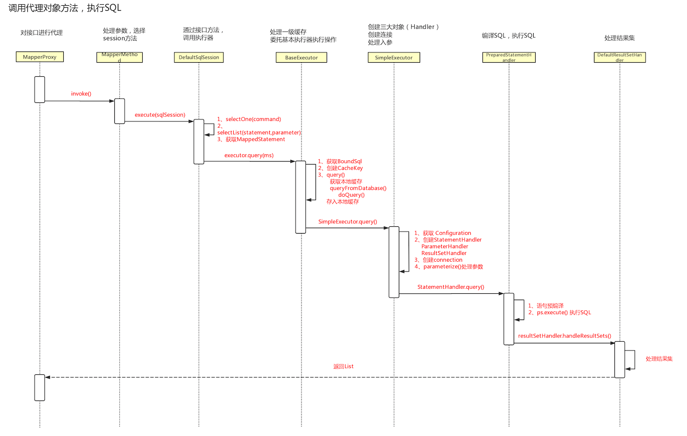
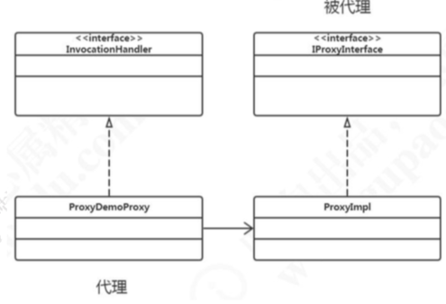
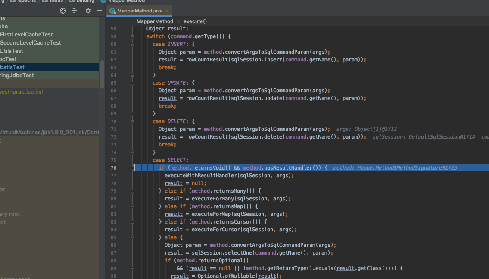
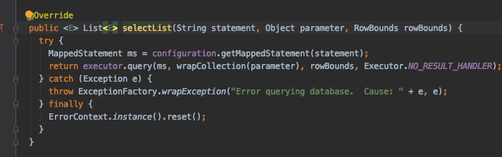

# 源码-sql 执行

## 用例

```
    @Test
    public void testSelect() throws IOException  {
        String resource = "mybatis-config.xml";
        InputStream inputStream = Resources.getResourceAsStream(resource);
        SqlSessionFactory sqlSessionFactory = new SqlSessionFactoryBuilder().build(inputStream);
        try (SqlSession session = sqlSessionFactory.openSession()) {
            UserMapper mapper = session.getMapper(UserMapper.class);
            User user = mapper.selectUser(1);
            System.out.println(user);
        }
    }
```

## 时序图



## sql执行

核心其实就是这个句话

```
 User user = mapper.selectUser(1);
```

由于所有的 Mapper 都是 `MapperProxy` 代理对象，所以任意的方法都是执行 `MapperProxy` 的 `invoke()`方法。

## 核心问题

- 我们引入 MapperProxy 为了解决什么问题?硬编码和编译时检查问题。它 需要做的事情是:根据方法查找 Statement ID 的问题。
- 这里没有实现类，进入到 invoke 方法的时候做了什么事情?它是怎么找到 我们要执行的 SQL 的?

### 源码

由于`UserMapper`是一个代理的`MapperProxy`对象,所以它一定会调用`MapperProxy`的 invoke 方法

```
  @Override
  public Object invoke(Object proxy, Method method, Object[] args) throws Throwable {
    try {
    //如果有实现类,直接执行实现类
      if (Object.class.equals(method.getDeclaringClass())) {
        return method.invoke(this, args);
      } else if (method.isDefault()) {
      //如果是 java8 的 default 方法直接执行
        if (privateLookupInMethod == null) {
          return invokeDefaultMethodJava8(proxy, method, args);
        } else {
          return invokeDefaultMethodJava9(proxy, method, args);
        }
      }
    } catch (Throwable t) {
      throw ExceptionUtil.unwrapThrowable(t);
    }
    //获取缓存，保存了方法签名和接口方法的关系
    final MapperMethod mapperMethod = cachedMapperMethod(method);
    return mapperMethod.execute(sqlSession, args);
  }
```

### 动态代理

[07-proxy-pattern.md](../../01-design-patterns/03-structural-patterns/07-proxy-pattern.md) 

JDK 的动态代理



JDK 动态代理代理，在实现了 InvocationHandler 的代理类里面，需要传入一个被 代理对象的实现类。


不需要实现类的原因:我们只需要根据接口类型+方法的名称，就可以找到 Statement ID 了，而唯一要做的一件事情也是这件，所以不需要实现类。在 MapperProxy 里面直接执行逻辑(也就是执行 SQL)就可以。

##### 总结: 

获得 Mapper 对象的过程，实质上是获取了一个 MapperProxy 的代理对象。 MapperProxy 中有 sqlSession、mapperInterface、methodCache。

#### MapperMethod.execute()

```
mapperMethod.execute(sqlSession, args);
```



在这一步，根据不同的 type 和返回类型:
调用 convertArgsToSqlCommandParam()将参数转换为 SQL 的参数。
调用 sqlSession 的 insert()、update()、delete()、selectOne ()方法，我们以查询
为例，会走到 selectOne()方法。

#### DefaultSqlSession.selectOne()

selectOne()最终也是调用了 selectList()。
在 SelectList()中，我们先根据 command name(Statement ID)从 Configuration 中拿到 MappedStatement，这个 ms 上面有我们在 xml 中配置的所有属性，包括 id、 statementType、sqlSource、useCache、入参、出参等等。



然后执行了 Executor 的 query()方法。
前面我们说到了 Executor 有三种基本类型，同学们还记得是哪几种么? `SIMPLE/REUSE/BATCH`，还有一种包装类型，CachingExecutor。 那么在这里到底会选择哪一种执行器呢?
我们要回过头去看看 `DefaultSqlSession` 在初始化的时候是怎么赋值的，这个就是
我们的会话创建过程。
如果启用了二级缓存，就会先调用 `CachingExecutor `的 query()方法，里面有缓存
相关的操作，然后才是再调用基本类型的执行器，比如默认的 `SimpleExecutor`。

在没有开启二级缓存的情况下，先会走到 BaseExecutor 的 query()方法(否则会先 走到 CachingExecutor)。


#### BaseExecutor.query()

从 Configuration 中获取 MappedStatement， 然后从 BoundSql 中获取 SQL 信 息，创建 CacheKey。这个 CacheKey 就是缓存的 Key。
然后再调用另一个 query()方法。

#### 清空本地缓存

`queryStack` 用于记录查询栈，防止递归查询重复处理缓存。
`flushCache=true` 的时候，会先清理本地缓存(一级缓存):`clearLocalCache();`

如果没有缓存，会从数据库查询:queryFromDatabase() 如果 LocalCacheScope == STATEMENT，会清理本地缓存。

### 从数据库查询

- 先在缓存用占位符占位。执行查询后，移除占位符，放入数据。
- 执行 Executor 的 doQuery();默认是 SimpleExecutor。

#### SimpleExecutor.doQuery()

##### 创建 StatementHandler

在 configuration.newStatementHandler()中，new 一个 StatementHandler，先 得到 RoutingStatementHandler。

RoutingStatementHandler 里面没有任何的实现，是用来创建基本的 StatementHandler 的。这里会根据 MappedStatement 里面的 statementType 决定 StatementHandler 的 类 型 。 默 认 是 PREPARED ( STATEMENT 、 PREPARED 、 CALLABLE)。

```java
switch (ms.getStatementType()) {
  case STATEMENT:
delegate = new SimpleStatementHandler(executor, ms, parameter, rowBounds, resultHandler, boundSql);
    break;
  case PREPARED:
delegate = new PreparedStatementHandler(executor, ms, parameter, rowBounds, resultHandler, boundSql);
    break;
  case CALLABLE:
delegate = new CallableStatementHandler(executor, ms, parameter, rowBounds, resultHandler, boundSql);
    break;
  default:
    throw new ExecutorException("Unknown statement type: " + ms.getStatementType()); }
```

StatementHandler 里面包含了处理参数的 ParameterHandler 和处理结果集的 ResultSetHandler。

这两个对象都是在上面 new 的时候创建的。

```
this.parameterHandler = configuration.newParameterHandler(mappedStatement, parameterObject, boundSql);
this.resultSetHandler = configuration.newResultSetHandler(executor, mappedStatement, rowBounds, parameterHandler, resultHandler, boundSql);
```

这三个对象都是可以被插件拦截的四大对象之一，所以在创建之后都要用拦截器进 行包装的方法。

```
statementHandler=(StatementHandler)interceptorChain.pluginAll(statementHandler);
parameterHandler=(StatementHandler)interceptorChain.pluginAll(statementHandler);
resultSetHandler=(StatementHandler)interceptorChain.pluginAll(statementHandler);
```

#### 创建 Statement

用 new 出来的 StatementHandler 创建 Statement 对象——prepareStatement() 方法对语句进行预编译，处理参数。
handler.parameterize(stmt) ;

#### 执行的 StatementHandler 的 query()方法

RoutingStatementHandler 的 query()方法。
delegate 委派，最终执行 PreparedStatementHandler 的 query()方法。

#### 执行 PreparedStatement 的 execute()方法

面就是 JDBC 包中的 PreparedStatement 的执行了。

#### ResultSetHandler 处理结果集

```
return resultSetHandler.handleResultSets(ps);
```

#### 问题:怎么把 ResultSet 转换成 `List<Object>`?

ResultSetHandler 只有一个实现类:DefaultResultSetHandler。也就是执行 DefaultResultSetHandler 的 handleResultSets ()方法。
首先我们会先拿到第一个结果集，如果没有配置一个查询返回多个结果集的情况， 一般只有一个结果集。如果下面的这个 while 循环我们也不用，就是执行一次。
然后会调用 handleResultSet()方法。