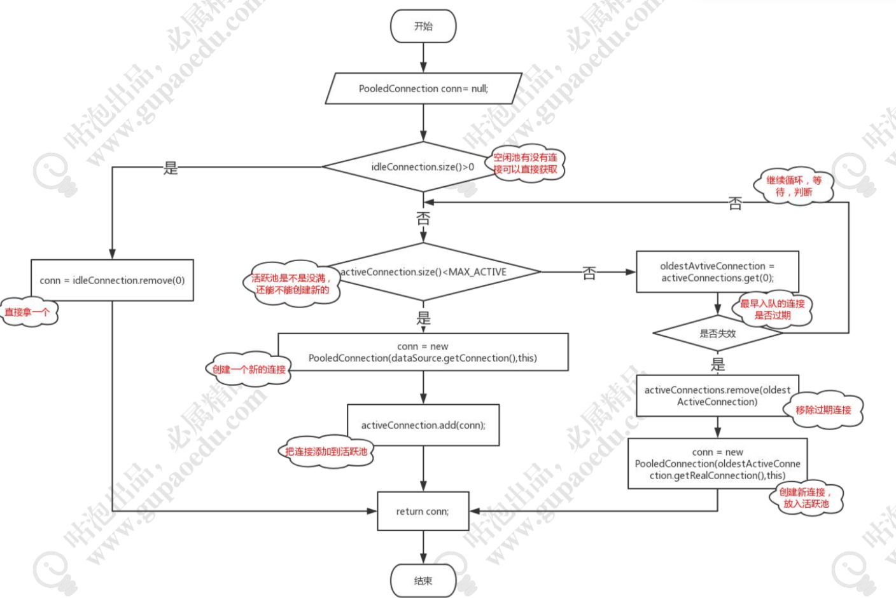
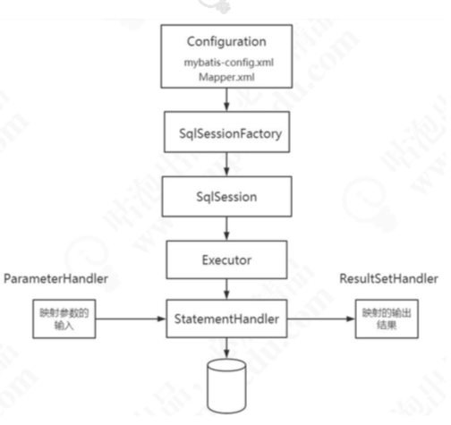

# Q&A

#### Mybatis 解决了什么问题?核心特性?为什么要用

- 资源管理,例如封装 JDBC,管理数据源
- 结果集自动映射
- Sql与代码分离,集中管理 SQL
- 参数映射与动态 SQL
- 缓存与插件

#### Mybatis 编程方式开发的核心对象

- SqlSessionFactoryBuilder 创建SqlSession 的工厂类
- SqlSessionFactory 创建会话
- SqlSession 提供操作接口
- MapperProxy 代理 Mapper 接口后,用于找到 SQL 并执行

#### Java 类型和数据库类型是怎么实现互相映射的

- 通过 TypeHandler,例如 Java 类型中的 String 要保存成数据库中的varchar ,需要调用相应的 Handler,如果没有系统自带的 TypeHanler,可以自定义

#### SIMPLE/REUSE/BATCH 三种执行器的区别?

- SimpleExecutor 使用后直接关闭 `Statement:closeStatement(stmt);`

```java
// SimpleExecutor.java
public int doUpdate(MappedStatement ms, Object parameter) throws SQLException { Statement stmt = null;
//中间省略......
} finally {
    closeStatement(stmt);
  }
}
```

- ReuseExecutor 放在缓存中，可复用:`PrepareStatement——getStatement()`

```java
// ReuseExecutor.Java
public int doUpdate(MappedStatement ms, Object parameter) throws SQLException { //中间省略......
Statement stmt = prepareStatement(handler, ms.getStatementLog()); //中间省略......
}
private Statement prepareStatement(StatementHandler handler, Log statementLog) throws
SQLException {
  Statement stmt;
//中间省略......
  if (hasStatementFor(sql)) {
    stmt = getStatement(sql);
//中间省略......
}
private Statement getStatement(String s) { return statementMap.get(s);
}
```

- BatchExecutor 支持复用且可以批量执行 update()，通过 `ps.addBatch()`实现

```java
// BatchExecutor.Java
public int doUpdate(MappedStatement ms, Object parameterObject) throws SQLException { //中间省略......
final Statement stmt;
//中间省略......
stmt = statementList.get(last);
//中间省略......
statementList.add(stmt);
batchResultList.add(new BatchResult(ms, sql, parameterObject));
}
  handler.batch(stmt);
}
```

#### Mybatis 一级缓存和二级缓存的区别

- 一级缓存: 在同一个会话(SqlSession)中共享,默认开启.维护在 `BaseExecutor`中
- 二级缓存:在同一个 namespace 共享,需要在 Mapper.xml 中开启,维护在 `CachingExecutor`

#### Mybatis 支持哪些数据源类型

- UNPOOLED:不带连接池的数据源。
- POOLED:带连接池的数据源，在 PooledDataSource 中维护 PooledConnection。



#### 关联查询的延迟加载是怎么实现的?

动态代理(JAVASSIST、CGLIB)，在创建实体类对象时进行代理，在调用代理 对象的相关方法时触发二次查询。

#### Mybatis 翻页的几种方式与区别

- 逻辑翻页:通过 RowBounds 对象。
- 物理翻页:通过改写 SQL 语句，可用插件拦截 Executor 实现。

#### 怎么解决表字段变化引起的 MBG 文件变化的问题?

Mapper 继承:自动生成的部分不变，创建接口继承原接口，创建 MapperExt.xml。在继承接口和 MapperExt.xml 中修改。
通用 Mapper:提供支持泛型的通用 Mapper 接口，传入对象类型。

#### 解析全局配置文件的时候，做了什么?

- 创建 Configuration，设置 Configuration

-  解析 Mapper.xml，设置 MappedStatement

#### 没有实现类，MyBatis 的方法是怎么执行的?

MapperProxy 代理，代理类的 invoke()方法中调用了 `SqlSession.selectOne()`

#### 接口方法和映射器的 statement id 是怎么绑定起来的?

MappedStatement 对象中存储了 statement 和 SQL 的映射关系

#### 四大对象是什么时候创建的?

Executor:openSession() StatementHandler、ResultsetHandler、ParameterHandler: 执行 SQL 时，在 SimpleExecutor 的 doQuery()中创建

#### MyBatis 哪些地方用到了代理模式?

- 接口查找 SQL:MapperProxy 日志输出:ConnectionLogger StatementLogger 
- 连接池:PooledDataSource 管理的 PooledConnection 延迟加载:ProxyFactory(JAVASSIST、CGLIB) 
- 插件:Plugin
  Spring 集成:SqlSessionTemplate 的内部类 SqlSessionInterceptor

#### myBatis 主要的执行流程?涉及到哪些对象?



#### MyBatis 集成到 Spring 的原理是什么?

- SqlSessionTemplate 中有内部类 SqlSessionInterceptor 对 DefaultSqlSession 进行代理;
- MapperFactoryBean 继 承 了 SqlSessionDaoSupport 获 取 SqlSessionTemplate;
- 接口注册到 IOC 容器中的 beanClass 是 MapperFactoryBean。

#### DefaulSqlSession 和 SqlSessionTemplate 的区别是什么

1)为什么 SqlSessionTemplate 是线程安全的?

其内部类 SqlSessionInterceptor 的 invoke()方法中的 getSqlSession()方法:
如果当前线程已经有存在的 SqlSession 对象，会在 ThreadLocal 的容器中拿到 SqlSessionHolder，获取 DefaultSqlSession。
如果没有，则会 new 一个 SqlSession，并且绑定到 SqlSessionHolder，放到 ThreadLocal 中。
SqlSessionTemplate 中在同一个事务中使用同一个 SqlSession。
调用 closeSqlSession()关闭会话时，如果存在事务，减少 holder 的引用计数。否 则直接关闭 SqlSession。

#### 在编程式的开发中，有什么方法保证 SqlSession 的线程安全?

SqlSessionManager 同时实现了 SqlSessionFactory、SqlSession 接口，通过 ThreadLocal 容器维护 SqlSession。