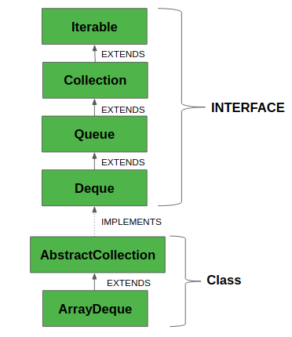
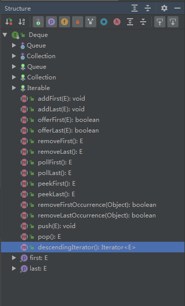

# Deque 双向队列

发音‘’迪克“,双向队列、支持从数据结构的任一端添加或删除元素的双端队列相关，它可以用作[队列（先进先出/ FIFO）](https://www.breakyizhan.com/java/5348.html)或[堆栈（LIFO）](https://www.breakyizhan.com/java/4898.html)。这些比`Stack`和`LinkedList`更快。 这是Java中`Deque`接口的层次结构：




除了拓展了父接口的方法，它自己拥有的方法有：



`Deque`常用操作包括，删除和遍历如：

```
add（element）：向尾部添加元素。
addFirst（element）：向头部添加元素。
addLast（element）：向尾部添加元素。
offer（element）：向尾部添加一个元素并返回一个布尔值来解释插入是否成功。
offerFirst（element）：向头部添加一个元素并返回一个布尔值来解释插入是否成功。
offerLast（element）：向尾部添加一个元素并返回一个布尔值来解释插入是否成功。
iterator（）：返回此双端队列的迭代器。
descendingIterator（）：返回一个迭代器，该迭代器具有此双端队列的相反顺序。
push（element）：向头部添加元素。
pop（element）：从头部移除一个元素并返回它。
removeFirst（）：删除头部的元素。
removeLast（）：删除尾部的元素。
poll（）：检索并删除此双端队列表示的队列的头部（换句话说，此双端队列的第一个元素），如果此双端队列为空，则返回null。
pollFirst（）：检索并删除此双端队列的第一个元素，如果此双端队列为空，则返回null。
pollLast（）：检索并删除此双端队列的最后一个元素，如果此双端队列为空，则返回null。
peek（）：检索但不删除此双端队列表示的队列的头部（换句话说，此双端队列的第一个元素），如果此双端队列为空，则返回null。
peekFirst（）：检索但不删除此双端队列的第一个元素，如果此双端队列为空，则返回null。
peekLast（）：检索但不删除此双端队列的最后一个元素，如果此双端队列为空，则返回null。
```


## 常用双向队列实现类

`Deque`接口支持双向插入，双向删除和双向遍历

- `LinkedList`：一个`List`实现类，线程不同步、
- `ArrayDeque`：是一个实现`Deque`接口的、`array `可以调整大小的实现类，线程不同步
- `LinkBlockingDeque`：线程安全，当队列是空的时候，一些方法会等待（`takeFirst`和`takeLast`）等待队列有元素，然后检索删除该元素

在效率方面，`ArrayDeque`从两端的添加和删除操作，效率比`LinkedList`效率要高，而`LinkedList`在迭代过程中删除当前元素效率较高，`LinkedList`的实现类不是理想的迭代结构。

`LinkedList`实现类比`ArrayDeque`实现类消耗更多的内存。`ArrayDque`实例用一下方式迭代：

### foreach.

```
ArrayDeque<String> aDeque = new ArrayDeque<String>();

. . .
for (String str : aDeque) {
    System.out.println(str);
}
```

### Iterator

```
ArrayDeque<String> aDeque = new ArrayDeque<String>();
. . .
for (Iterator<String> iter = aDeque.iterator(); iter.hasNext();  ) {
    System.out.println(iter.next());
}
```