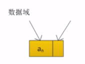
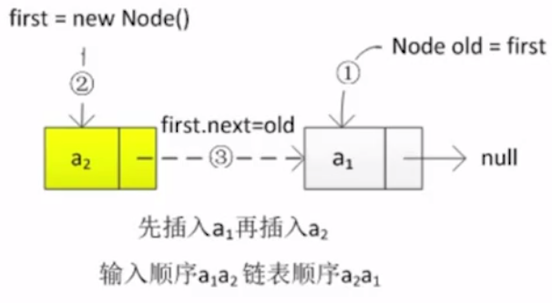
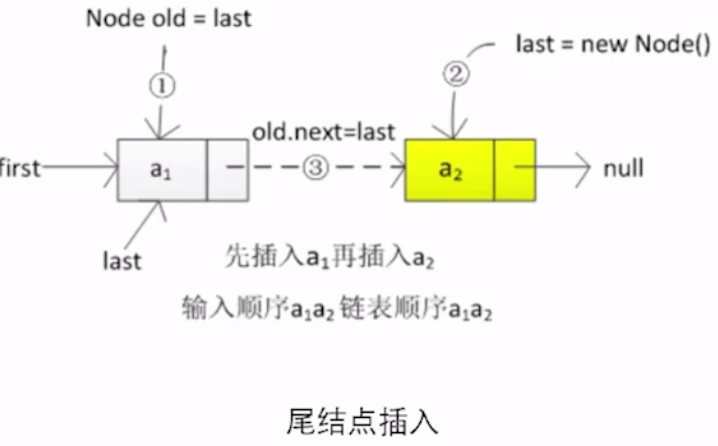
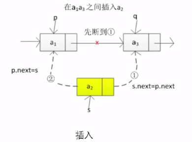
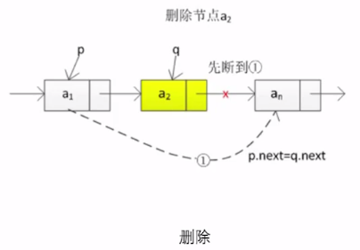

# 单链表

- [插入节点](#插入节点)
  - [插入头节点](#插入头节点)
  - [插入尾节点](#插入尾节点)
- [遍历](#遍历)
- [查找](#查找)
- [删除](#删除)

## 单链表实例代码

```java
//链表节点的嵌套类
private class Node{
	T item;	   //节点
    Node next;//后继节点
}
```

## 单链表图示



## 基本操作

#### 插入节点

```java
/**
 * 插入节点
 */
public static void insert(Node p, Node s) {
    Node next = p.next;
    p.next = s;
    s.next = next;
}
```

#### 插入头节点

- 头结点的指针指向 a2
- 将a2 的指针指向 a1
- 将 a1 的指针指向 null



```java
/**
 * 插入头节点
 */
public static void insertHead(Node head, Node newNode){
    //记录下原来节点的引用
    Node old = head;
    //头结点设置为新插入的及诶单
    head = newNode;
    //头结点的后续节点设置为老的元素
    head.next = old;
}
```


#### 插入尾节点

- 尾节点的指针指向 a2
- 并且a1 的 next 指针指向 a2



```java

    /**
     * 插入尾节点
     */
    public static void insertTail(Node tail, Node newTail){
        Node old = tail;
        tail = newTail;
        tail.next = null;
        old.next = tail;
    }

```


#### 插入




#### 删除



当需要删除a2 的时候,我们不方便拿到 a2 的前驱

- 所以我们把 an 赋值给 a2

- 再把 an 删除,即可

#### 遍历

```java
/**
 * 遍历
 */
public static void traverse(Node head){
    while (head !=null){
        System.out.println(head.value + "");
        head = head.next;
    }
    System.out.println();
}
```

#### 查找

```java
    /**
     * 遍历查找
     */
    public static int find(Node head, int value) {
        int index = -1;
        int count = 0;
        while (head != null) {
            if (head.value == value) {
                return index;
            }
            count++;
            head = head.next;
        }
        return index;
    }
```

#### 删除

```java
    public static void delete(Node head, Node q) {
        if (q != null && q.next != null) {
            Node p = q.next;
            q.value = p.value;
            q.next = p.next;
            p = null;
        }
        //删除最后一个元素
        if (q != null && q.next == null) {
            while (head != null) {
                if (head.next !=null && head.next == q){
                    head.next = null;
                    break;
                }
                head = head.next;
            }
        }

    }
```

