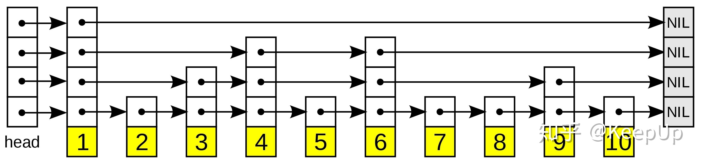
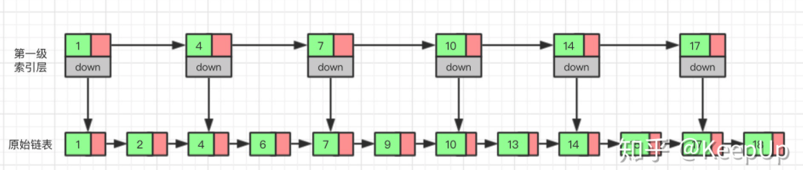
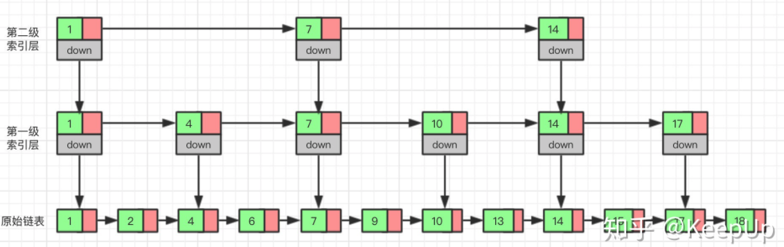
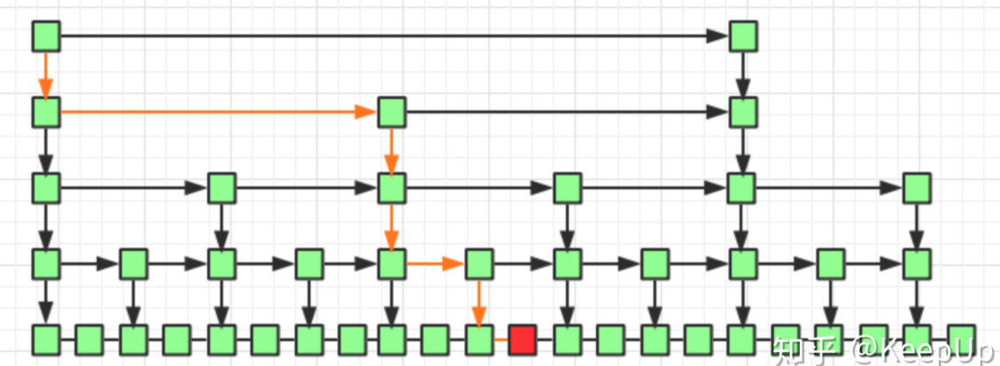
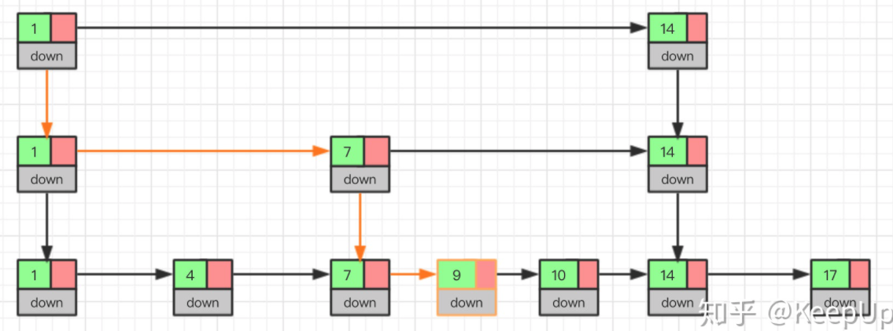

# 051-跳表

[TOC]

## 1. 什么是跳表

| 时间复杂度 |         |
| ---------- | ------- |
| 插入       | O(logn) |
| 平均查找   | O(logn) |

跳表全称为跳跃列表，它允许快速查询，插入和删除一个有序连续元素的数据链表。跳跃列表的平均查找和插入时间复杂度都是O(logn)。

快速查询是通过维护一个多层次的链表，且每一层链表中的元素是前一层链表元素的子集（见右边的示意图）。一开始时，算法在最稀疏的层次进行搜索，直至需要查找的元素在该层两个相邻的元素中间。这时，算法将跳转到下一个层次，重复刚才的搜索，直到找到需要查找的元素为止。



一张跳跃列表的示意图。

- 每个带有箭头的框表示一个指针, 而每行是一个稀疏子序列的链表；

- 底部的编号框（黄色）表示有序的数据序列。
- 查找从顶部最稀疏的子序列向下进行, 直至需要查找的元素在该层两个相邻的元素中间。

## 2.跳表的演化过程

#### 2.1 单链表的局限性

对于单链表来说，即使数据是已经排好序的，想要查询其中的一个数据，只能从头开始遍历链表，这样效率很低，时间复杂度很高，是 O(n)。

那我们有没有什么办法来提高查询的效率呢？我们可以为链表建立一个“索引”，这样查找起来就会更快，如下图所示，我们在原始链表的基础上，每两个结点提取一个结点建立索引，我们把抽取出来的结点叫做**索引层**或者**索引**，down 表示指向原始链表结点的指针。



#### 2.2 搜索

现在如果我们想查找一个数据，比如说 15，

- 我们首先在索引层遍历，当我们遍历到索引层中值为 14 的结点时，我们发现下一个结点的值为 17，所以我们要找的 15 肯定在这两个结点之间。
- 这时我们就通过 14 结点的 down 指针，回到原始链表，然后继续遍历，这个时候我们只需要再遍历两个结点，就能找到我们想要的数据。

好我们从头看一下，整个过程我们一共遍历了 7 个结点就找到我们想要的值，如果没有建立索引层，而是用原始链表的话，我们需要遍历 10 个结点。

通过这个例子我们可以看出来，通过建立一个索引层，我们查找一个基点需要遍历的次数变少了，也就是查询的效率提高了。

那么如果我们给索引层再加一层索引呢？遍历的结点会不会更少呢，效率会不会更高呢？我们试试就知道了。



现在我们再来查找 15，我们从第二级索引开始，最后找到 15，一共遍历了 6 个结点，果然效率更高。

当然，因为我们举的这个例子数据量很小，所以效率提升的不是特别明显，如果数据量非常大的时候，我们多建立几层索引，效率提升的将会非常的明显，感兴趣的可以自己试一下，这里我们就不举例子了。

这种通过对链表加多级索引的机构，就是跳表了。

## 3.跳表具体有多快

通过上边的例子我们知道，跳表的查询效率比链表高，那具体高多少呢？下面我们一起来看一下。

衡量一个算法的效率我们可以用时间复杂度，这里我们也用时间复杂度来比较一下链表和跳表。前面我们已经讲过了，链表的查询的时间复杂度为 O(n)，那跳表的呢？

如果一个链表有 n 个结点，如果每两个结点抽取出一个结点建立索引的话，那么第一级索引的结点数大约就是 n/2，第二级索引的结点数大约为 n/4，以此类推第 m 级索引的节点数大约为 n/(2^m)。

假如一共有 m 级索引，第 m 级的结点数为两个，通过上边我们找到的规律，那么得出 n/(2^m)=2，从而求得 m=log(n)-1。如果加上原始链表，那么整个跳表的高度就是 log(n)。我们在查询跳表的时候，如果每一层都需要遍历 k 个结点，那么最终的时间复杂度就为 O(k*log(n))。

那这个 k 值为多少呢，按照我们每两个结点提取一个基点建立索引的情况，我们每一级最多需要遍历两个个结点，所以 k=2。为什么每一层最多遍历两个结点呢？

因为我们是每两个结点提取一个结点建立索引，最高一级索引只有两个结点，然后下一层索引比上一层索引两个结点之间增加了一个结点，也就是上一层索引两结点的中值，看到这里是不是想起来我们前边讲过的二分查找，每次我们只需要判断要找的值在不在当前结点和下一个结点之间即可。



如上图所示，我们要查询红色结点，我们查询的路线即黄线表示出的路径查询，每一级最多遍历两个结点即可。

所以跳表的查询任意数据的时间复杂度为 O(2*log(n))，前边的常数 2 可以忽略，为 O(log(n))。

### 3.1 跳表是用空间来换时间

跳表的效率比链表高了，但是跳表需要额外存储多级索引，所以需要的更多的内存空间。

跳表的空间复杂度分析并不难，如果一个链表有 n 个结点，如果每两个结点抽取出一个结点建立索引的话，那么第一级索引的结点数大约就是 n/2，第二级索引的结点数大约为 n/4，以此类推第 m 级索引的节点数大约为 n/(2^m)，我们可以看出来这是一个等比数列。

这几级索引的结点总和就是 n/2+n/4+n/8…+8+4+2=n-2，所以跳表的空间复杂度为 o(n)。

那么我们有没有办法减少索引所占的内存空间呢？可以的，我们可以每三个结点抽取一个索引，或者没五个结点抽取一个索引。这样索引结点的数量减少了，所占的空间也就少了。

### 3.2 **跳表的插入和删除**

我们想要为跳表插入或者删除数据，我们首先需要找到插入或者删除的位置，然后执行插入或删除操作，前边我们已经知道了，跳表的查询的时间复杂度为 O(logn），因为找到位置之后插入和删除的时间复杂度很低，为 O(1)，所以最终插入和删除的时间复杂度也为 O(longn)。

我么通过图看一下插入的过程。



删除操作的话，如果这个结点在索引中也有出现，我们除了要删除原始链表中的结点，还要删除索引中的。因为单链表中的删除操作需要拿到要删除结点的前驱结点，然后通过指针操作完成删除。所以在查找要删除的结点的时候，一定要获取前驱结点。当然，如果我们用的是双向链表，就不需要考虑这个问题了。

如果我们不停的向跳表中插入元素，就可能会造成两个索引点之间的结点过多的情况。结点过多的话，我们建立索引的优势也就没有了。

所以我们需要维护索引与原始链表的大小平衡，也就是结点增多了，索引也相应增加，避免出现两个索引之间结点过多的情况，查找效率降低。

**跳表是通过一个随机函数来维护这个平衡的，当我们向跳表中插入数据的的时候，我们可以选择同时把这个数据插入到索引里，那我们插入到哪一级的索引呢，这就需要随机函数，来决定我们插入到哪一级的索引中。**

这样可以很有效的防止跳表退化，而造成效率变低。

## 3.跳表的代码实现

最后我们来看一下跳变用代码怎么实现。

```java
package skiplist;

import java.util.Random;

/**
 * 跳表的一种实现方法。
 * 跳表中存储的是正整数，并且存储的是不重复的。
 */
public class SkipList {

  private static final int MAX_LEVEL = 16;

  private static final float SKIPLIST_P = 0.5f;

  private int levelCount = 1;

  private Node head = new Node();  // 带头链表

  private Random r = new Random();

  public Node find(int value) {
    Node p = head;
    for (int i = levelCount - 1; i >= 0; --i) {
      while (p.forwards[i] != null && p.forwards[i].data < value) {
        p = p.forwards[i];
      }
    }

    if (p.forwards[0] != null && p.forwards[0].data == value) {
      return p.forwards[0];
    } else {
      return null;
    }
  }

  public void insert(int value) {
    int level = randomLevel();
    Node newNode = new Node();
    newNode.data = value;
    newNode.maxLevel = level;
    Node update[] = new Node[level];
    for (int i = 0; i < level; ++i) {
      update[i] = head;
    }

    // record every level largest value which smaller than insert value in update[]
    Node p = head;
    for (int i = level - 1; i >= 0; --i) {
      while (p.forwards[i] != null && p.forwards[i].data < value) {
        p = p.forwards[i];
      }
      update[i] = p;// use update save node in search path
    }

    // in search path node next node become new node forwords(next)
    for (int i = 0; i < level; ++i) {
      newNode.forwards[i] = update[i].forwards[i];
      update[i].forwards[i] = newNode;
    }

    // update node hight
    if (levelCount < level) levelCount = level;
  }

  public void delete(int value) {
    Node[] update = new Node[levelCount];
    Node p = head;
    for (int i = levelCount - 1; i >= 0; --i) {
      while (p.forwards[i] != null && p.forwards[i].data < value) {
        p = p.forwards[i];
      }
      update[i] = p;
    }

    if (p.forwards[0] != null && p.forwards[0].data == value) {
      for (int i = levelCount - 1; i >= 0; --i) {
        if (update[i].forwards[i] != null && update[i].forwards[i].data == value) {
          update[i].forwards[i] = update[i].forwards[i].forwards[i];
        }
      }
    }
  }

 // 理论来讲，一级索引中元素个数应该占原始数据的 50%，二级索引中元素个数占 25%，三级索引12.5% ，一直到最顶层。
  // 因为这里每一层的晋升概率是 50%。对于每一个新插入的节点，都需要调用 randomLevel 生成一个合理的层数。
  // 该 randomLevel 方法会随机生成 1~MAX_LEVEL 之间的数，且 ：
  //        50%的概率返回 1
  //        25%的概率返回 2
  //      12.5%的概率返回 3 ...
  private int randomLevel() {
    int level = 1;

    while (Math.random() < SKIPLIST_P && level < MAX_LEVEL)
      level += 1;
    return level;
  }

  public void printAll() {
    Node p = head;
    while (p.forwards[0] != null) {
      System.out.print(p.forwards[0] + " ");
      p = p.forwards[0];
    }
    System.out.println();
  }

  public class Node {
    private int data = -1;
    private Node forwards[] = new Node[MAX_LEVEL];
    private int maxLevel = 0;

    @Override
    public String toString() {
      StringBuilder builder = new StringBuilder();
      builder.append("{ data: ");
      builder.append(data);
      builder.append("; levels: ");
      builder.append(maxLevel);
      builder.append(" }");

      return builder.toString();
    }
  }

}
```