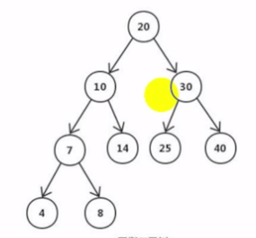
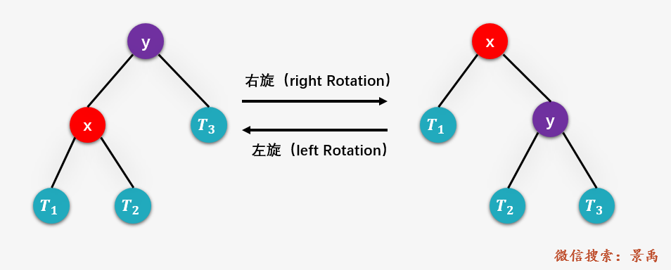

# 平衡二叉树 -AVL树

> https://www.cs.usfca.edu/~galles/visualization/Algorithms.html

## **什么是平衡二叉树？**

平衡二叉树（Balanced Binary Tree 或 Height-Balanced Tree）又称为 **AVL** 树，其实就是一颗 **平衡的二叉排序树** ，解决了昨天讲的二叉排序树的不平衡问题，即斜树。AVL树或者是一颗空树，或者是具有下列性质的二叉排序树：

> - 它是一颗空树或者左右两个子树的高度差的绝对值不超过1，并且左右两个子树都是一颗平衡二叉树
> - 非叶子节点值大于左边子节点，小于右边子节点
> - 没有值相等重复的节点

## **什么是平衡因子？**

## **什么是平衡因子？**

> 平衡二叉树上结点的 **平衡因子** BF(Balanced Factor) 定义为该结点的左子树深度减去它的右子树的深度，平衡二叉树上所有结点的平衡因子只可能是 -1，0，1。

## 为什么要有平衡二叉树,它解决什么问题

平衡二叉树是在二叉树的基础上的提高,二叉树随着节点的深度加大时,查询的均分复杂度就会上升,为了提供更快的查询速度,平衡树出现了

## 维持平衡

平衡二叉树和二叉树最大的区别在于, 随时要保证插入后的二叉树 **是平衡的**, 为了维持这一点, 会通过 

- [左旋](#左旋)
- [右旋](#右旋)

来将不平衡的树边成平衡树

## 左旋和右旋

