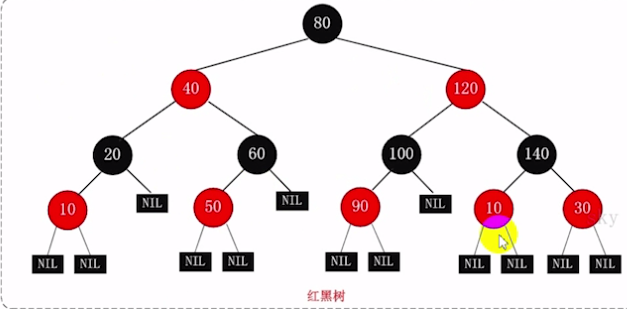

# 050-红黑树

[TOC]

> 红黑树最终能够保证从根节点到叶子节点的最长路径不大于最短路径的 2 倍

因为平衡二叉树查询性能和树的层级（h）的高度成反比，h值越小查询越快，为了保证树的结构左右两端的数据大致平衡，从而降低查询难度，一般采用一种算法实现数据结构的平衡

- 主要用来存储有序的数据
- 时间复杂度是O(logn)
- Java中的TreeSet 和TreeMap 都是使用红黑树

## 红黑树图示

## 红黑树特点

- 每个节点非黑即红
- 根节点是黑色的
- 每个叶子节点（nIL)是黑色， （NIL是指为空的叶子节点）
- 如果一个节点是红色的，则它的子节点必须是黑色的
- 从一个节点到该节点的子孙节点的所有路径包含相同数量的黑节点

## quick

1. 非黑即红
2. 根黑
3. 页黑
4. 红节点的子节点必须是黑
5. 一个节点到子节点包含相同数量的黑