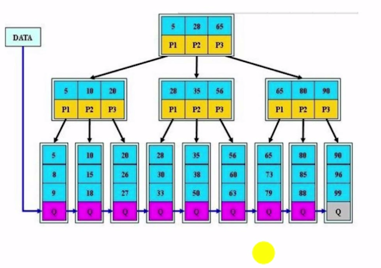
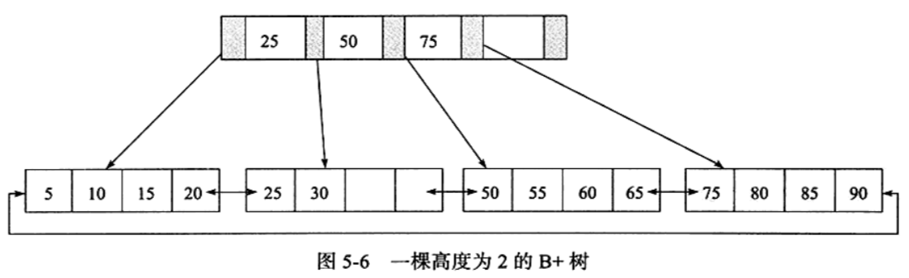
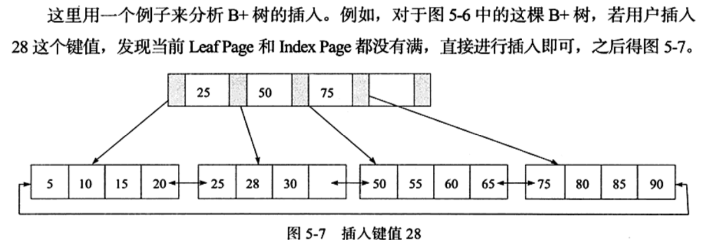
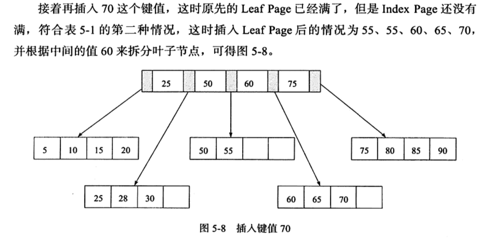
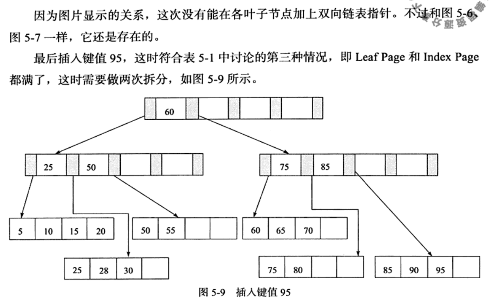

# B+树

B+树充分利用了节点的空间。让查询速度更加稳定，其速度完全接近于二分查找，例如MySQL 的InnoDB 索引

- B+树的非叶子节点不保存关键字记录的指针，这样使得B+树每个节点能保存的关键字大大增加
- B+树叶子节点保存了父节点的所有关键字和关键字指针，每个叶子节点的关键字从小到大链接
- B+树的根节点关键字数量和其子节点个数相等
- B+树的非叶子节点只进行数据索引，不会保存实际关键字记录的指针，所有数据地址必须要到叶子节点才能获取到，所以每次数据查询的数据都一样

B+ 树是 Btree 的一种变体,也是一种多路搜索树,定义基本和 B-tree相同,但是它

- 所有关键字的信息都出现在叶子节点中
- 叶子节点包含关键字记录的指针
- 叶子节点可以按照关键字的大小顺序连接
- 所有的数据都保存在叶子节点中,这是区别于 B-tree 结构最主要的特点

## 一个典型的 B+树

从图中可以看出,所有的记录都在叶子节点上,并且是顺序存放的,如果用户从最左边的叶子节点开始遍历,可以得到所有的键值的顺序排序

## B+树的插入操作

B+树的插入必须保证插入后叶子节点的记录依然排序,同时需要考虑插入到 B+树的三种情况,每种情况都可能会导致不同的插入算法

| Leaf Page 满 | Index Page 满 | 操作                                                         |
| ------------ | ------------- | ------------------------------------------------------------ |
| No           | No            | 直接将记录插入到叶子节点上                                   |
| Yes          | No            | 1. 拆分 LeafPage  2. 将中间的节点放入到 Index Page 中 3. 小于中间节点的记录放在左边 4. 大于或者等于中间节点的记录放在右边 |
| Yes          | Yes           | 1. 拆分 Leaf Page  2. 小于中间节点的记录放在左边 3. 大于或者等于中间节点的记录放在右边 4. 拆分 Index Page 5. 小于中间节点的记录放在左边 6. 大于中间节点的记录放在右边 7. 中间节点放入上一层的 IndexPage |

### 维持平衡的代价

- 做了大量的拆分页操作(split)操作, 因为 B+ 树结构主要用于磁盘,页的拆分意味着 磁盘 IO 操作,所以应该尽量减少也的拆分

- 删除操作有大量合并操作,同样道理,我们应该避免合并

所以

- 我们应该尽量使用递增的数据作为主键
- 不应该使用 UUID 作为主键