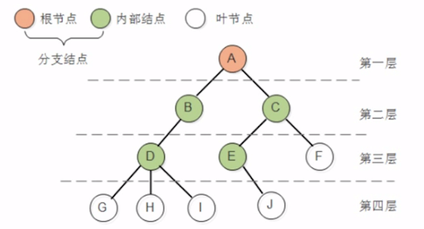

# 树

链表，栈，队列 都是一对一的线性结构 ， 而树使一对多的线性结构

**一对多指的是一个元素只能有一个前驱，但是可以有多个后继**

## 核心概念

### 度

- 节点拥有的子树个数成为这个节点的度（Degree)

  - 度为0的节点称为**叶节点（Leaf）** 或者**终端节点**
  - 度不为0的节点称为**分支节点**

  树的度是树中各个节点度的最大值

### 内部节点(Child)

除了根节点外，分支节点也被称为内部节点

- 节点的子树的根称为该节点的**孩子（Child）**

- 该节点称为孩子的双亲或者父节点
- 同一个双亲的孩子之间互相称为兄弟

### 节点的层次（Level)

- 从根的第一层，根的孩子为第二层
- 双亲在同一层的节点互为 **堂兄弟**
- 树中的节点的最大层次称为树**的深度**（Depth)或者 **高度**

### 有序树和无序树

如果将树中节点的各个子树看成为从左到右是有次序的，不能互换的，则称该树为有序树，否则为无序树

### 森林

m（m>0）课互不相交的树的集合

## 树的分类

-  [010-斜树.md](010-斜树.md) 
-  [020-满二叉树.md](020-满二叉树.md) 
-  [030-完全二叉树.md](030-完全二叉树.md) 
-  [040-平衡二叉树.md](040-平衡二叉树.md) 
-  [050-红黑树.md](050-红黑树.md) 
-  [060-B+树.md](060-B+树.md) 