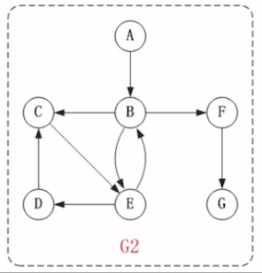
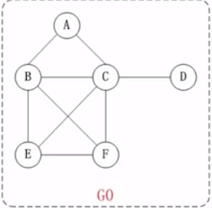

# 图

## 图的定义

定义: 图 (graph) 是由一些点 (vertex) 和这些点之间的连线 (edge) 所组成, 其中,点通常被称为 **顶点 vertex**,而点与点之间的连线则被称为 **边或弧**(edege) , 通常记为 G = (V,E)

## 图的种类

根据边是否有方向,将图可以划分为

- [无向图](#无向图)
- [有向图](#有向图)

无向图是一种特殊的有向图

## 基本概念

- [邻接点](#邻接点)
- [度](#度)

## 有向图

## 无向图

## 邻接点

> 一条边上的两个顶点叫做邻接点

例如上面无向图 G0 中的顶点 A 和定点 C 就是邻接点,在有向图中,除了邻接点之外,还有 **入边** 和**出边**的概念

顶点的入边指的是该顶点为终点的边,而顶点的出边,则是指该顶点为起点的边

例如,上面有向图 G2 中的 B 和 E 是邻接点 <B,E> 是 B 的出边,还是 E 的入边

## 度

在无向图中,某个顶点的度是临接到该顶点边的数目

> 例如 G0 中 A 的度是 2

在有向图中,度还有 **出度** 和 **入度** 之分

某个顶点的入度,是指以该顶点为重点的边的数目,而顶点的出度,则是指以该顶点为起点的边的数目

**顶点的读 = 入度 + 出度**

> 例如 G2 中 , 顶点 B 的入度为 2, 出度是 3, 顶点的度 = 2+3  = 5

