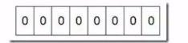
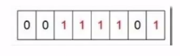

# 位图数据结构

## 什么是位图

32 位的机器上,对于一个整数, 比如 int a = 1  的内存中占了 32 位,这是为了方便计算机的运算,

但是对于某些应用场景而言,这属于一种巨大的浪费,

因为我们可以用对应的 32bit 位对应存储十进制 0 -31 个数字,这就是 bitmap 的基础思想

## 位图的应用

- 空间压缩
- [快速排序](#快速排序)
- [去重](#去重)
- [快速查询](#快速查询)

- 交集并集运算

## 快速排序

假设我们要对 0-7 内的 5 个元素 (4, 7, 2, 5, 3) 排序,这里假设这些元素没有重复,我们就可以采用 位图 的方法达到目的

- 由于是 0-7 , 我们需要一个 8 位的位图 也就是 一个字节的空间

- 将这些空间的所有 bit 位都置为空

  > 

- 将对应位置为 1 ,例如 4 ,就把 4 置为 1

  > 

遍历一遍 bit 区域.将该位是 1 的位的编号输出(2,3,4,5,7)这样就达到了排序的目的 ,我们只要从高到低遍历一遍

#### 优点

- 运算效率高,不需要进行比较和移位
- 占用内存少,比如 N = 10 000 000 , 只需要占用内存为 N/8 = 125 0000 Byte  =1.25 M

#### 缺点

所有的数据不能重复,即不可对重复的数据进行排序和查找

## 去重

2.5 亿个证书中找出不重复的整数的个数,内存空间不足以容纳这 2.5 亿个整数

首先,根据内存空间不足以容纳这 2.5 亿个整数,我们可以快速联想到 bitmap 位图

- 一个数字只有三种状态
  - 不存在
  - 只有一个
  - 有重复

因此我们只需要 2bit 就可以对数据进行存储了

- 不存在 00
- 只有一个 01
- 存在 2 个以上 11

那么我们需要的大小大概是几十兆左右, 我们遍历一次这 2.5 亿个数字, 

- 如果对应的状态位是 00 , 则将其改为 01, 

- 如果对应的状态位为 01,则把他改为 11
- 如果是 11,对应的转态位保持不变

最后将状态位为 01 的进行统计, 就得到了不重复的数字个数, 时间复杂度为O(n)

## 快速查询

布隆过滤器的原理,如何判断一个数字是否存在