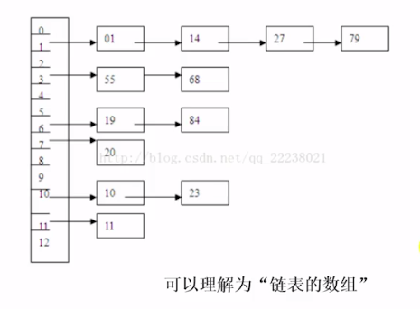

# 散列表

## 基本概念

散列表(Hash table ) 也叫哈希表, 是根据关键码值(key-value) 而直接进行访问的数据结构

也就是说,它通过把关键字映射到表中的一个位置来访问记录,以加快查找的速度

这个映射函数叫做 **散列函数**,存放记录的数组叫 **散列表**

## 散列表的特点

- 数组的特点是:寻址容易 [O(1)] ,插入和删除困难 [O(n)]

- 链表的特点是,寻址困难 [O(n)] ,插入和删除容易  [O(1)]

散列表结合了两者优势,寻址容易,插入删除也容易

## 散列的过程

- 把 key 通过固定的算法函数(散列函数) 转化成一个整型数字
- 使用这个数字对数组长度进行取余,取余结果就当做数组的下标
- 将 value 存储数组中对应的下标内

通过散列算法,变化成固定长度的输出,该输出就是一个散列值

这种转换是一种压缩映射,简单来说就是一种任意长度的消息压缩到某一固定长度的消息摘要的函数

## 获取值的过程

- 再次使用哈希函数将 key 转换 成对应的数组下标
- 定位到该数组下标获取 value

就可以充分利用数组定位性能进行数据定位

## 应用

hash 主要用于信息安全领域中的加密算法,它把一些不同长度的信息转化为杂乱的 128 位编码, 这些编码叫 hash 值,也可以说,Hash就是找到一种数据内容和数据存放地址之间的映射关系

#### 查找

哈希表是一种更加快捷的查找技术,当我们知道 key 时就可以计算出元素在集合中的位置,根本不需要再一次查找,时间复杂度是 O(1)