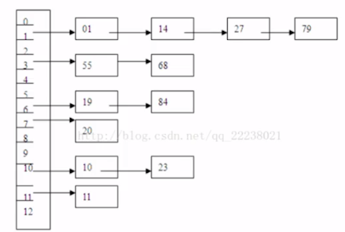

# 哈希碰撞的处理办法

- [再哈希](#再哈希)
- [缓冲区](#缓冲区)
- [开放定址法](#开放定址法)
- [拉链法](#拉链法)

## 再哈希

## 缓冲区

建立一个缓冲区,把 hash(key) 重复的元素 放入缓冲区,当我们通过 key 查找时,发现找的不对,就取缓冲区里找

## 开放定址法

从发生冲突位置的下一个位置开始寻找空的散列地址

发生冲突时, 线性探测下一个散列地址

例如 

```
Hi = (H(key) + di) % m 
di = 1,2,3,4,..m-1
```

## 拉链法

当产生 hash 碰撞时,使用拉链法形成一个链表

