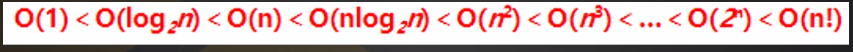
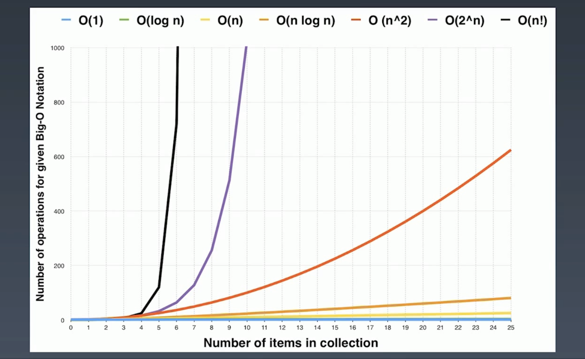

# 时间复杂度

## 7种最常用的时间复杂度



#### Big O notion 

- [O(1)](#O(1)) 

  > Constant Complexity  常数复杂度

- [O(log n)](#O(log n) ) 

  >  Logarithmic Complexity 对数复杂度

- O (n)

  > Linear Complexity 线性复杂度

- O (n ^2) 

  > N square Complexity  平方

- O (n ^3 )

  > N square Complexity  立方

- O(2 ^ n)

  > Exponential Growth 指数

- O(n!)

  > Factorial 阶乘



## O(1)

常数复杂度

```
int n = 1000;
System.out.println("your input is " + n);
```

只执行一次或者常数次 ，  如下面的代码执行了三次

```java
int n = 1000;
System.out.println("your input is " + n);
System.out.println("your input is " + n);
System.out.println("your input is " + n);
```

依然是 O(1)的时间复杂度

## O(N) 

线性复杂度

```
for(int i = 1;i <= n; i++){
	System.out.println("I'm busy loking at" + n);
}

```

如果是并列的

```java
for(int i = 1;i <= n; i++){
	System.out.println("I'm busy loking at" + i);
}
for(int j = 1;j <= n; j++){
    System.out.println("I'm busy loking at" + j);
}
```

执行了 2n 次， 去除掉前面的常数 ，也就是 O（n）

## O(N^2)

 平方

```
for(int i = 1;i <= n; i++){
        for(int j = 1;j <= n; j++){
        System.out.println("I'm busy loking at" + n);
    }
}
```

## O(log(n))

Logarithmic Complexity 对数复杂度

> 如果 
>
> 
>
> ，即*a*的*x*次方等于*N*（*a*>0，且*a*≠1），那么数*x*叫做以*a*为底*N*的对数（logarithm），记作
>
> 
>
> 。其中，*a*叫做对数的[底数](https://baike.baidu.com/item/底数)，*N*叫做[真数](https://baike.baidu.com/item/真数/20402544)，*x*叫做“以*a*为底*N*的**对数**”。

若算法的*T*(*n*) =**O(logn)**，则称其具有**对数时间**。由于计算机使用[二进制](https://baike.baidu.com/item/二进制)的记数系统，[对数](https://baike.baidu.com/item/对数)常常以2为底（即log2^*n*，有时写作lg*n*）。然而，由对数的[换底公式](https://baike.baidu.com/item/换底公式)，loga^*n*和logb^*n*只有一个常数因子不同，这个因子在大O记法中被丢弃。因此记作O（log*n*），而不论对数的底是多少，是对数时间算法的标准记法。

```java
for(int i = 1; i < n; i = i * 2) {
    System.out.println(count++ +"and n =" +i);
}

// n=2 执行 1
// n=3 执行 2
// n=4 执行 
// i = 4	= 2^2
// i = 8	= 2^3
// i = 16	= 2^4
// 循环 n 次 就是  
```

上面的代码的时间复杂度是 O(log2n) 我们去掉常数，就是 logn


