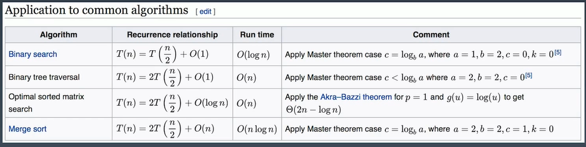

# 主定理

- 二分查找(Binary *Search*) 时间复杂度是O(logn)
- 二叉树查找(Binary Tree Traversal)  时间复杂度是O(n)
- 最优有序矩阵查找(*Optimal* *Sorted* *Matrix* *Search*) 时间复杂度是 O(n)
- 归并排序(Merge Sort) 时间复杂度是O (nlogn)

#### 二叉树遍历

前序

中序

后序

时间复杂度是多少 O (n)  n 代表二叉树的节点总数

不管前序中序后序，每个二叉树的节点会访问一次且仅访问一次 。所以它的时间复杂度就是线性与它的节点总数 也就是 O(n) 的事件复杂度

## 图的遍历

每个图的节点访问一次且仅访问一次，所以时间复杂度为 O(n) 。n为 图里面的节点总数

## 搜索算法

bfs 广度优先

dfs 深度优先

不管是深度优先还是广度优先，时间复杂度都是 O(n)   N 指的是搜索空间里的节点总数

### 二分查找的时间复杂度

logn 