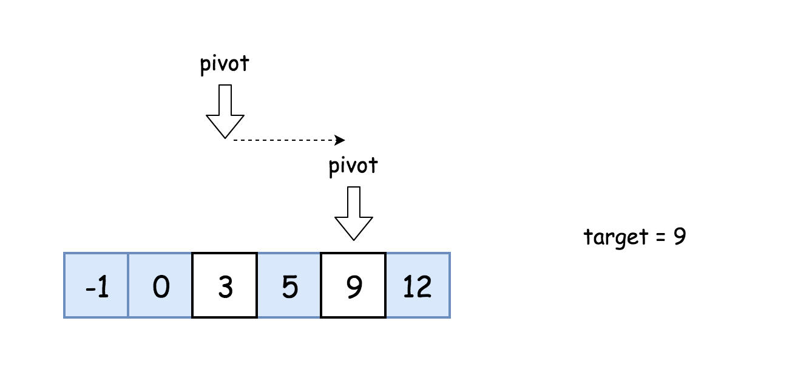
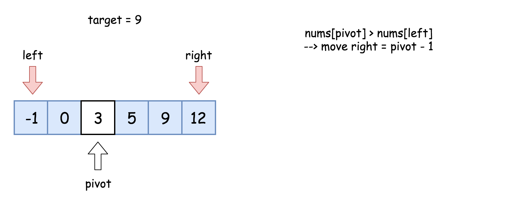
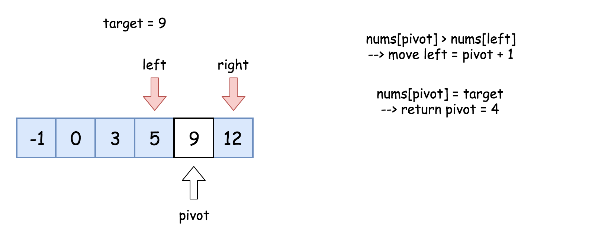

# 二分查找算法

-  [0704-二分查找.md](../04-leetcode/0704-二分查找.md) 
-  [0724-寻找数组的中心索引.md](../04-leetcode/0724-寻找数组的中心索引.md) 

## 定义

二分查找是一种基于比较目标值和数组中间元素的教科书式算法。

- 如果目标值等于中间元素，则找到目标值。
- 如果目标值较小，继续在左侧搜索。
- 如果目标值较大，则继续在右侧搜索。



## 算法：

- 初始化指针 left = 0, right = n - 1。
- 当 left <= right：
  - 比较中间元素 nums[pivot] 和目标值 target 。
    - 如果 target = nums[pivot]，返回 pivot。
    - 如果 target < nums[pivot]，则在左侧继续搜索 right = pivot - 1。
    - 如果 target > nums[pivot]，则在右侧继续搜索 left = pivot + 1。






```java
class Solution {
  public int search(int[] nums, int target) {
    int pivot, left = 0, right = nums.length - 1;
    while (left <= right) {
      pivot = left + (right - left) / 2;
      if (nums[pivot] == target) return pivot;
      if (target < nums[pivot]) right = pivot - 1;
      else left = pivot + 1;
    }
    return -1;
  }
}
```

