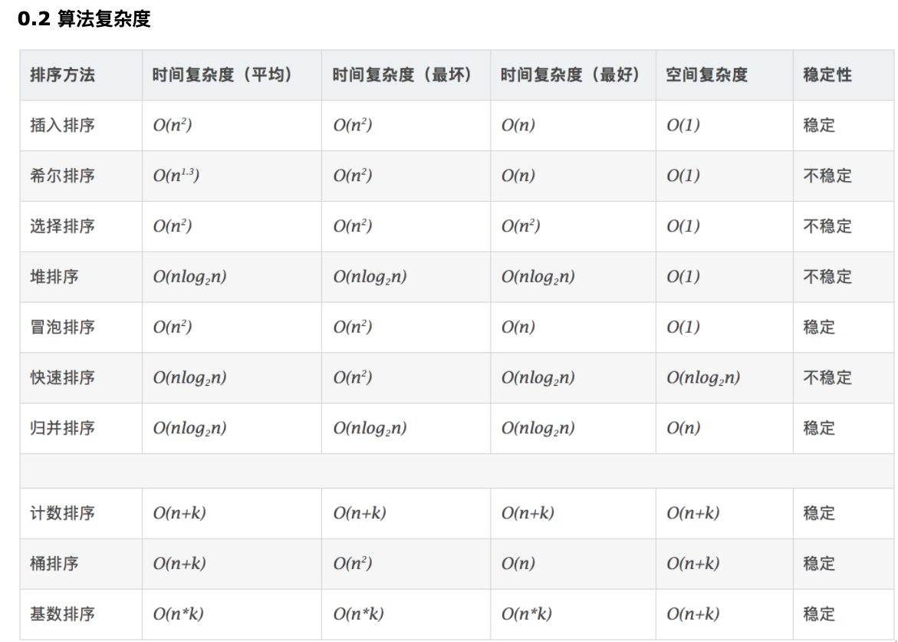

# 020-冒泡排序算法（Bubble Sort）

[TOC]

## 常用算法复杂度一览



## 什么是冒泡

嵌套循环, 每次查看相邻的元素如果逆序,则交换

### 冒泡排序（Bubble Sort）

冒泡排序是一种简单的排序算法。它重复地走访过要排序的数列，一次比较两个元素，如果它们的顺序错误就把它们交换过来。走访数列的工作是重复地进行直到没有再需要交换，也就是说该数列已经排序完成。这个算法的名字由来是因为越小的元素会经由交换慢慢“浮”到数列的顶端。 

#### 1.1 算法描述

- 比较相邻的元素。如果第一个比第二个大，就交换它们两个；
- 对每一对相邻元素作同样的工作，从开始第一对到结尾的最后一对，这样在最后的元素应该会是最大的数；
- 针对所有的元素重复以上的步骤，除了最后一个；
- 重复步骤1~3，直到排序完成。

**1.2 动图演示**


## 典型实现

```java
public static void bubbleSort(int[] a, int n) {
  if (n <= 1) {
    return;
  }
  for (int i = 0; i < n; ++i) {
    // 提前退出冒泡循环的标志位
    boolean flag = false;
    for (int j = 0; j < n - i - 1; ++j) {
      // 交换
      if (a[j] > a[j + 1]) {
        int tmp = a[j];
        a[j] = a[j + 1];
        a[j + 1] = tmp;
        // 表示有数据交换
        flag = true;
      }
    }
    // 没有数据交换，提前退出
    if (!flag) {
      break;
    }
  }
}

```

