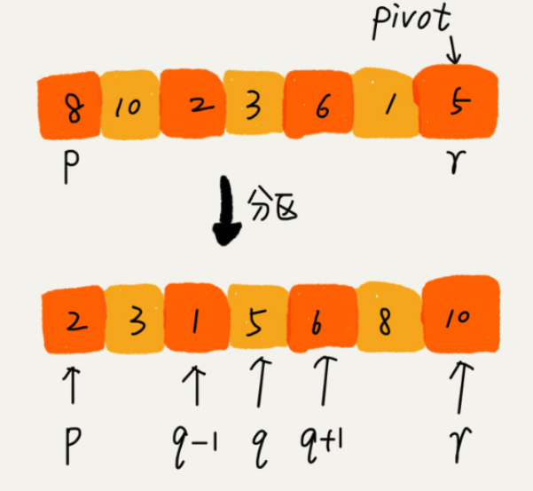

# 040-快速排序算法

[TOC]

## 特点


## 核心思想

快排的思想是这样的：如果要排序数组中下标从 p 到 r 之间的一组数据，我们选择 p 到 r 之间的任意一个数据作为 pivot（分区点）。

## 基本步骤

数组取标杆pivot , 

- 将小元素放 pivot左边,
- 大元素放右边
- 然后依次对左边和右边的子数组继续快排




我们遍历 p 到 r 之间的数据，将小于 pivot 的放到左边，将大于 pivot 的放到右边，将 pivot 放到中间。

经过这一步骤之后，数组 p 到 r 之间的数据就被分成了三个部分，

- 前面 p 到 q-1 之间都是小于 pivot 的，
- 中间是 pivot，
- 后面的 q+1 到 r 之间是大于 pivot 的。

## 时空间复杂度

```java
public class QuickSort {
    public static void main(String[] args) {
        int[] array = {7, 4, 9, 8, 2, 9, 9, 8, 7};
        quickSort(array, 0, array.length - 1);
        for (int i : array) {
            System.out.println(i);
        }
    }

    public static void quickSort(int[] array, int begin, int end) {
        if (end <= begin) {
            return;
        }
        int pivot = partition(array, begin, end);
        quickSort(array, begin, pivot - 1);
        quickSort(array, pivot + 1, end);
    }
	// 返回一个 pivot 的位置, 且保证 pivot左边的元素都是小于pivot , pivot 右边的元素都是大于pivot
    private static int partition(int[] array, int begin, int end) {
        //pivot标杆位置 , counter 小于 pivot 的元素的个数
      	//pivot选最后一个
        int pivot = end;
      	//小于pivot的元素的个数
      	int counter = begin;
        for (int i = begin; i < end; i++) {
            if (array[i] < array[pivot]) {
                int temp = array[counter];
                array[counter] = array[i];
                array[i] = temp;
                counter++;
            }
        }
        int temp = array[pivot];
        array[pivot] = array[counter];
        array[counter] = temp;
        return counter;
    }

}
```