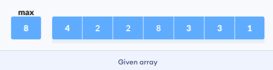
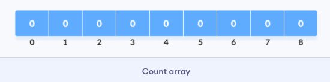
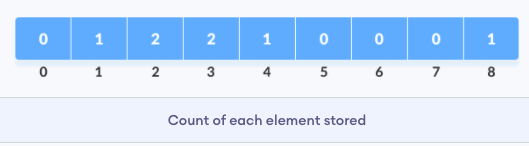
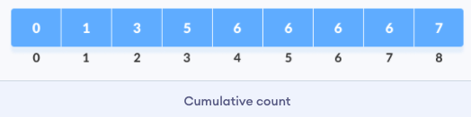
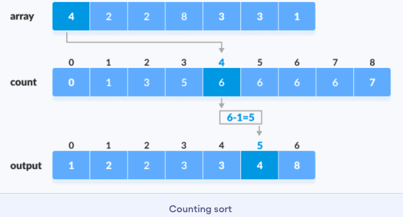

# 060-计数排序

[TOC]

## 什么是计数排序（Counting Sort）

- 计数排序不是基于比较的排序算法，其核心在于将输入的数据值转化为键存储在额外开辟的数组空间中。 

- 作为一种线性时间复杂度的排序，计数排序要求输入的数据必须是有确定范围的整数。

## 算法描述

- 找出待排序的数组中最大和最小的元素；
- 统计数组中每个值为i的元素出现的次数，存入数组C的第i项；
- 对所有的计数累加（从C中的第一个元素开始，每一项和前一项相加）；
- 反向填充目标数组：将每个元素i放在新数组的第C(i)项，每放一个元素就将C(i)减去1。


## 实现步骤

#### 1. 找出给定数组中的最大元素(设为maxValue)




#### 2.初始化长度为max+1的数组，所有元素为0。此数组用于存储数组中元素的计数。



#### 3.将每个元素的计数存储在计数数组中它们各自的索引处

例如:如果元素3的计数是2，那么2被存储在计数数组的第三个位置。如果元素“5”不在数组中，则0被存储在第5位。



#### 4.存储count数组中元素的累积和。它有助于将元素放入已排序数组的正确索引中。



#### 5.在count数组中查找原始数组中每个元素的索引。这给出了累积计数。将元素放置在下面的图中所示的索引处。



#### 6.将每个元素放到正确的位置后，将其计数减少1

## 代码实现

```java
public void doSort(int[] array, int length) {
  int maxValue = array[0];
  // 找出给定数组中的最大元素(设为maxValue)
  for (int a : array) {
    maxValue = Math.max(a, maxValue);
  }
  // 2.初始化长度为max+1的数组，所有元素为0。此数组用于存储数组中元素的计数。
  int[] count = new int[maxValue + 1];
  // 3.将每个元素的计数存储在计数数组中它们各自的索引处
  for (int i = 0; i < length; i++) {
    count[array[i]]++;
  }
  //4.存储count数组中元素的累积和。它有助于将元素放入已排序数组的正确索引中。
  for (int i = 1; i <= maxValue; i++) {
    count[i] += count[i - 1];
  }
  // 
  int[] output = new int[length];
  for (int i = 0; i < length; i++) {
    //5.在count数组中查找原始数组中每个元素的索引。这给出了累积计数。将元素放置在下面的图中所示的索引处。
    output[count[array[i]] - 1] = array[i];
    //6.将每个元素放到正确的位置后，将其计数减少1
    count[array[i]]--;
  }
  // Copy the sorted elements into original array
  System.arraycopy(output, 0, array, 0, length);
}
```

## 算法分析

- 计数排序是一个稳定的排序算法。
- 当输入的元素是 n 个 0到 k 之间的整数时，时间复杂度是O(n+k)，空间复杂度也是O(n+k)，其排序速度快于任何比较排序算法。

- 当k不是很大并且序列比较集中时，计数排序是一个很有效的排序算法。