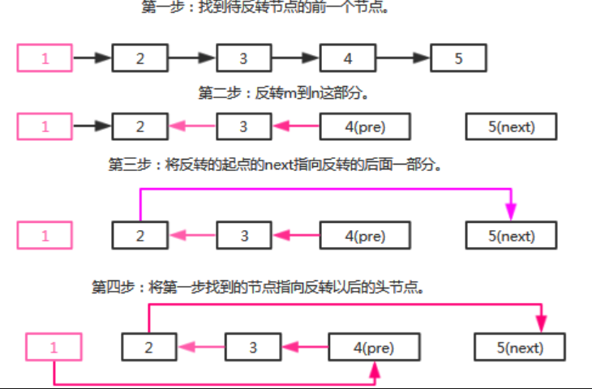

# 0092-反转链表II

反转从位置 *m* 到 *n* 的链表。请使用一趟扫描完成反转。

https://leetcode-cn.com/problems/reverse-linked-list-ii/

```java
/**
 * Definition for singly-linked list.
 * public class ListNode {
 *     int val;
 *     ListNode next;
 *     ListNode(int x) { val = x; }
 * }
 */
class Solution {
    public ListNode reverseBetween(ListNode head, int m, int n) {
        if(head == null || m >= n){
            return null;
        }
        ListNode dummy = new ListNode(-1);
        dummy.next = head;
        head = dummy;
        ListNode prevM = head;
        //找到m的前一个的位置,后续用这个位置的next指向翻转后的头
        for(int i = 0; i < m-1; i++){
            prevM = prevM.next;
        }
        ListNode mNode = prevM.next;
        //相当于双指针中的 prev
        ListNode nNode = mNode;
        //相当于双指针中的 curr
        ListNode postN = nNode.next;
        //循环,从m ->n
        for(int i = m; i < n; i++){
            ListNode next = postN.next;
            postN.next = nNode;
            nNode = postN;
            postN = next;
        }
        mNode.next = postN;
        prevM.next = nNode;
        return dummy.next;
    }
}
```

## 分析

第一步：找到待反转节点的前一个节点。
第二步：反转m到n这部分。
第三步：将反转的起点的next指向反转的后面一部分。
第四步：将第一步找到的节点指向反转以后的头节点。

> 作者：reedfan
> 链接：https://leetcode-cn.com/problems/reverse-linked-list-ii/solution/ji-bai-liao-100de-javayong-hu-by-reedfan-6/
> 来源：力扣（LeetCode）
> 著作权归作者所有。商业转载请联系作者获得授权，非商业转载请注明出处。




