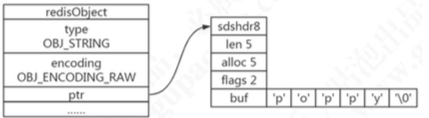
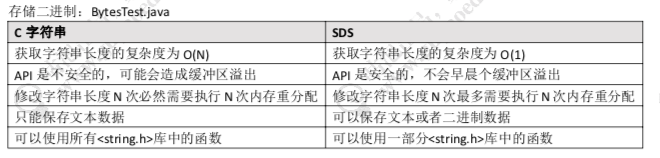

# String 字符串

## 存储类型

  可以用来存储字符串、整数、浮点数。

## 操作命令

### 操作

#### MSET

设置多个值(批量操作，原子性)

```
127.0.0.1:6379> mset firstname max nextname Chen
```

#### SETNX

> 只在键 `key` 不存在的情况下， 将键 `key` 的值设置为 `value` 。
>
> 若键 `key` 已经存在， 则 `SETNX` 命令不做任何动作。
>
> `SETNX` 是『SET if Not eXists』(如果不存在，则 SET)的简写。

判断是否存在 key, 存在即跳过;不存在即设置

```
redis> EXISTS job                # job 不存在
(integer) 0

redis> SETNX job "programmer"    # job 设置成功
(integer) 1

redis> SETNX job "code-farmer"   # 尝试覆盖 job ，失败
(integer) 0

redis> GET job                   # 没有被覆盖
"programmer"
```

基于此方法可以实现分布式锁,使用 del key 释放锁

但是如果释放锁的操作失败了,导致其他节点永远获取不到锁怎么办?

加过期时间。单独用 expire 加过期, 也失败了,无法保证原子性,怎么办? 多参数

## SET

```
set key value [expiration EX seconds|PX milliseconds][NX|XX]
```

使用参数的方式

```
set lock1 1 EX 10 NX
```

- `EX seconds` ： 将键的过期时间设置为 `seconds` 秒。 执行 `SET key value EX seconds` 的效果等同于执行 `SETEX key seconds value` 。
- `PX milliseconds` ： 将键的过期时间设置为 `milliseconds` 毫秒。 执行 `SET key value PX milliseconds` 的效果等同于执行 `PSETEX key milliseconds value` 。
- `NX` ： 只在键不存在时， 才对键进行设置操作。 执行 `SET key value NX` 的效果等同于执行 `SETNX key value` 。
- `XX` ： 只在键已经存在时， 才对键进行设置操作。

## SETEX 设置值并设置失效时间

将键 `key` 的值设置为 `value` ， 并将键 `key` 的生存时间设置为 `seconds` 秒钟。

如果键 `key` 已经存在， 那么 `SETEX` 命令将覆盖已有的值。

`SETEX` 命令的效果和以下两个命令的效果类似：

```
SET key value
EXPIRE key seconds  # 设置生存时间
```

`SETEX` 和这两个命令的不同之处在于 `SETEX` 是一个原子（atomic）操作， 它可以在同一时间内完成设置值和设置过期时间这两个操作， 因此 `SETEX` 命令在储存缓存的时候非常实用。

### 返回值

命令在设置成功时返回 `OK` 。 当 `seconds` 参数不合法时， 命令将返回一个错误。

### 代码示例

```java
在键 key 不存在的情况下执行 SETEX ：

redis> SETEX cache_user_id 60 10086
OK

redis> GET cache_user_id  # 值
"10086"

redis> TTL cache_user_id  # 剩余生存时间
(integer) 49
```

##### 键 key 已经存在， 使用 SETEX 覆盖旧值：

```
redis> SET cd "timeless"
OK

redis> SETEX cd 3000 "goodbye my love"
OK

redis> GET cd
"goodbye my love"

redis> TTL cd
(integer) 2997
```

## PSETEX 值 毫秒值

这个命令和 `SETEX` 命令相似， 但它以毫秒为单位设置 `key` 的生存时间， 而不是像 `SETEX` 命令那样以秒为单位进行设置。

#### 返回值

命令在设置成功时返回 `OK` 。

#### 代码示例

```
redis> PSETEX mykey 1000 "Hello"
OK

redis> PTTL mykey
(integer) 999

redis> GET mykey
"Hello"
```


## (整数)值递增

```
incr qingshan 
incrby qingshan 100
```

## (整数)值递减

```
decr qingshan 
decrby qingshan 100
```

## 浮点数增量

```
set f 2.6 
incrbyfloat f 7.3
```

## 获取多个值

```
mget qingshan jack
```

## 获取值长度

```
strlen qingshan
```

## 字符串追加内容

```
append qingshan good
```

## 获取指定范围的字符

```
getrange qingshan 0 8
```


## 存储(实现)原理

#### 数据模型

`set hello word `为例，因为 Redis 是 KV 的数据库，它是通过 hashtable 实现的(我 们把这个叫做外层的哈希)。所以每个键值对都会有一个 dictEntry(源码位置:dict.h)， 里面指向了 key 和 value 的指针。next 指向下一个 dictEntry。

```
typedef struct dictEntry {
void *key; /* key 关键字定义 */
union {
	void *val; uint64_t u64; /* value 定义 */ int64_t s64; double d;
} v;
struct dictEntry *next; /* 指向下一个键值对节点 */
} dictEntry;
```


key 是字符串，但是 Redis 没有直接使用 C 的字符数组，而是存储在自定义的 SDS 中。
value 既不是直接作为字符串存储，也不是直接存储在 SDS 中，而是存储在 redisObject 中。实际上五种常用的数据类型的任何一种，都是通过 redisObject 来存储 的。

#### redisObject

redisObject 定义在 src/server.h 文件中。

```
typedef struct redisObject {
	unsigned type:4; /* 对象的类型，包括:OBJ_STRING、OBJ_LIST、OBJ_HASH、OBJ_SET、OBJ_ZSET */ 		unsigned encoding:4; /* 具体的数据结构 */
	unsigned lru:LRU_BITS; /* 24 位，对象最后一次被命令程序访问的时间，与内存回收有关 */
	int refcount; /* 引用计数。当 refcount 为 0 的时候，表示该对象已经不被任何对象引用，则可以进行垃圾回收了
*/
	void *ptr; /* 指向对象实际的数据结构 */
} robj;
```

可以使用 type 命令来查看对外的类型。

```
127.0.0.1:6379> type qs 
string
```

## 内部编码



```
127.0.0.1:6379> set number 1
OK
127.0.0.1:6379> set qs "is a good teacher in gupao, have crossed mountains and sea " OK
127.0.0.1:6379> set jack bighead
OK
127.0.0.1:6379> object encoding number
"int"
127.0.0.1:6379> object encoding jack
"embstr"
127.0.0.1:6379> object encoding qs
"raw"
```

字符串类型的内部编码有三种:

- int，存储 8 个字节的长整型(long，2^63-1)。
- embstr, 代表 embstr 格式的 SDS(Simple Dynamic String 简单动态字符串)，存储小于 44 个字节的字符串。
- raw，存储大于 44 个字节的字符串(3.2 版本之前是 39 字节)。为什么是 39?

```
/* object.c */
#define OBJ_ENCODING_EMBSTR_SIZE_LIMIT 44
```

#### 问题 1、什么是 SDS?

Redis 中字符串的实现。

在 3.2 以后的版本中，SDS 又有多种结构(sds.h):sdshdr5、sdshdr8、sdshdr16、sdshdr32、sdshdr64，用于存储不同的长度的字符串，分别代表 2^5=32byte， 2^8=256byte，2^16=65536byte=64KB，2^32byte=4GB。

```
/* sds.h */
struct __attribute__ ((__packed__)) sdshdr8 {
uint8_t len; /* 当前字符数组的长度 */
uint8_t alloc; /*当前字符数组总共分配的内存大小 */
unsigned char flags; /* 当前字符数组的属性、用来标识到底是 sdshdr8 还是 sdshdr16 等 */ char buf[]; /* 字符串真正的值 */
};
```

#### 问题 2、为什么 Redis 要用 SDS 实现字符串?

我们知道，C 语言本身没有字符串类型(只能用字符数组 char[]实现)。 

- 1、使用字符数组必须先给目标变量分配足够的空间，否则可能会溢出。 
- 2、如果要获取字符长度，必须遍历字符数组，时间复杂度是 O(n)。
- 3、C 字符串长度的变更会对字符数组做内存重分配。 
- 4、通过从字符串开始到结尾碰到的第一个'\0'来标记字符串的结束，因此不能保存图片、音频、视频、压缩文件等二进制(bytes)保存的内容，二进制不安全。

SDS 的特点:

- 1、不用担心内存溢出问题，如果需要会对 SDS 进行扩容。
-  2、获取字符串长度时间复杂度为 O(1)，因为定义了 len 属性。 
- 3、通过“空间预分配”( sdsMakeRoomFor)和“惰性空间释放”，防止多次重分配内存。
- 4、判断是否结束的标志是 len 属性(它同样以'\0'结尾是因为这样就可以使用 C语言中函数库操作字符串的函数了)，可以包含'\0'。



#### 问题 3、embstr 和 raw 的区别?

embstr 的使用只分配一次内存空间(因为 RedisObject 和 SDS 是连续的)，而 raw 需要分配两次内存空间(分别为 RedisObject 和 SDS 分配空间)。
因此与 raw 相比，embstr 的好处在于创建时少分配一次空间，删除时少释放一次 空间，以及对象的所有数据连在一起，寻找方便。
而 embstr 的坏处也很明显，如果字符串的长度增加需要重新分配内存时，整个 RedisObject 和 SDS 都需要重新分配空间，因此 Redis 中的 embstr 实现为只读。

#### 问题 4:int 和 embstr 什么时候转化为 raw?

当 int 数据不再是整数，或大小超过了 long 的范围 (2^63-1=9223372036854775807)时，自动转化为 embstr。

```
127.0.0.1:6379> set k1 1
OK
127.0.0.1:6379> append k1 a (integer) 2
127.0.0.1:6379> object encoding k1 "raw"

```

#### 问题 5:明明没有超过阈值，为什么变成 raw 了?

```
127.0.0.1:6379> set k2 a
OK
127.0.0.1:6379> object encoding k2
```

#### 问题 6:当长度小于阈值时，会还原吗?

关于 Redis 内部编码的转换，都符合以下规律:编码转换在 Redis 写入数据时完 成，且转换过程不可逆，只能从小内存编码向大内存编码转换(但是不包括重新 set)。

#### 问题 7:为什么要对底层的数据结构进行一层包装呢?

通过封装，可以根据对象的类型动态地选择存储结构和可以使用的命令，实现节省 空间和优化查询速度。

## 应用场景

#### 缓存

String 类型 例如:热点数据缓存(例如报表，明星出轨)，对象缓存，全页缓存。 可以提升热点数据的访问速度。

#### 数据共享分布式

STRING 类型，因为 Redis 是分布式的独立服务，可以在多个应用之间共享 例如:分布式 Session

```
<dependency> 
	<groupId>org.springframework.session</groupId>
	<artifactId>spring-session-data-redis</artifactId>
</dependency>
```

#### 分布式锁

STRING 类型 setnx 方法，只有不存在时才能添加成功，返回 true。

http://redisdoc.com/string/set.html 建议用参数的形式

```
public Boolean getLock(Object lockObject){ 
	jedisUtil = getJedisConnetion();
	boolean flag = jedisUtil.setNX(lockObj, 1);
  if(flag){
				expire(locakObj,10); 
			}
			return flag; 
	}
​
public void releaseLock(Object lockObject){
	del(lockObj); 
}
```

#### 全局 ID

#### INT 类型，INCRBY，利用原子性

```
incrby userid 1000
```

(分库分表的场景，一次性拿一段)

#### 计数器

INT 类型，INCR 方法
例如:文章的阅读量，微博点赞数，允许一定的延迟，先写入 Redis 再定时同步到 数据库。

#### 限流

INT 类型，INCR 方法
以访问者的 IP 和其他信息作为 key，访问一次增加一次计数，超过次数则返回 false。

#### 位统计

String 类型的 BITCOUNT(1.6.6 的 bitmap 数据结构介绍)。 字符是以 8 位二进制存储的。

```
set k1 a 
setbit k1 6 1 
setbit k1 7 0 
get k1
```

a 对应的 ASCII 码是 97，转换为二进制数据是 01100001

b 对应的 ASCII 码是 98，转换为二进制数据是 01100010

因为 bit 非常节省空间(1 MB=8388608 bit)，可以用来做大数据量的统计。 例如:在线用户统计，留存用户统计

```
setbit onlineusers 0 1 
setbit onlineusers 1 1 
setbit onlineusers 2 0
```

支持按位与、按位或等等操作。

```
BITOP AND destkey key [key ...] ，对一个或多个 key 求逻辑并，并将结果保存到 destkey 。 BITOP OR destkey key [key ...] ，对一个或多个 key 求逻辑或，并将结果保存到 destkey 。 BITOP XOR destkey key [key ...] ，对一个或多个 key 求逻辑异或，并将结果保存到 destkey 。 BITOP NOT destkey key ，对给定 key 求逻辑非，并将结果保存到 destkey 。
```

####  计算出 7 天都在线的用户

```
BITOP "AND" "7_days_both_online_users" "day_1_online_users" "day_2_online_users" ... "day_7_online_users"
```

如果一个对象的 value 有多个值的时候，怎么存储? 例如用一个 key 存储一张表的数据。


序列化?例如 JSON/Protobuf/XML，会增加序列化和反序列化的开销，并且不能 单独获取、修改一个值。

可以通过 key 分层的方式来实现，例如:

```
mset student:1:sno GP16666 student:1:sname 沐风 student:1:company 腾讯
```

获取值的时候一次获取多个值:

```
mget student:1:sno student:1:sname student:1:company
```

缺点:key 太长，占用的空间太多。有没有更好的方式? hash  [06-Redis的基本数据结构-Hash.md](06-Redis的基本数据结构-Hash.md) 