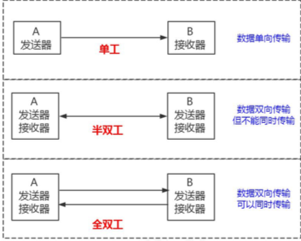

# 01-通讯协议

[TOC]

## 查询过程图示


官方手册 : https://dev.mysql.com/doc/refman/5.7/en/what-is-mysql.html

MySQL 必须要运行一个服务，监听默认的 3306 端口。

MySQL 是支持多种通信协议的，可以使用同步/异步的方式，支持长连接/短连接。 这里我们拆分来看。第一个是通信类型。

## 通信类型:同步或者异步

> MySQL支持同步和异步

同步通信的特点:

- 同步通信依赖于被调用方，受限于被调用方的性能。也就是说，应用操作数据库， 线程会阻塞，等待数据库的返回。
- 一般只能做到一对一，很难做到一对多的通信。

异步跟同步相反:

- 异步可以避免应用阻塞等待，但是不能节省 SQL 执行的时间。
- 如果异步存在并发，每一个 SQL 的执行都要单独建立一个连接，避免数据混乱。 但是这样会给服务端带来巨大的压力(一个连接就会创建一个线程，线程间切换会占用 大量 CPU 资源)。另外异步通信还带来了编码的复杂度，所以一般不建议使用。如果要 异步，必须使用连接池，排队从连接池获取连接而不是创建新连接。

 一般来说我们连接数据库都是**同步连接**。

## 连接方式:长连接或者短连接

MySQL 既支持**短连接，也支持长连接**。短连接就是操作完毕以后，马上 close 掉。 长连接可以保持打开，减少服务端创建和释放连接的消耗，后面的程序访问的时候还可 以使用这个连接。一般我们会在连接池中使用长连接。

保持长连接会消耗内存。长时间不活动的连接，MySQL 服务器会断开。

```sql
show global variables like 'wait_timeout'; -- 非交互式超时时间，如 JDBC 程序 
show global variables like 'interactive_timeout'; -- 交互式超时时间，如数据库工具
```

默认都是 28800 秒，**8 小时。**

#### 当前有多少个连接?

可以用 show status 命令:

```java
show global status like 'Thread%';
```

- `Threads_cached`:  缓存中的线程连接数。
- `Threads_connected`: 当前打开的连接数
- `Threads_created`: 为处理连接创建的线程数。
- `Threads_running`: 非睡眠状态的连接数，通常指并发连接数。

每产生一个连接或者一个会话，在服务端就会创建一个线程来处理。反过来，如果要杀死会话，就是 Kill 线程。

#### 当前连接的状态

```
SHOW PROCESSLIST;
```


- Sleep
  线程正在等待客户端，以向它发送一个新语句
- Query
  线程正在执行查询或往客户端发送数据
- Locked
  该查询被其它查询锁定
- Copying to tmp table on disk
  临时结果集合大于 tmp_table_size。线程把临时表从存储器内部格式改 变为磁盘模式，以节约存储
- Sending data
  线程正在为 SELECT 语句处理行，同时正在向客户端发送数据
- Sorting for group
  线程正在进行分类，以满足 GROUP BY 要求
- Sorting for order
  线程正在进行分类，以满足 ORDER BY 要求

#### 按客户端 IP 分组，看哪个客户端的链接数最多

```sql
select client_ip,count(client_ip) as client_num from (select substring_index(host,':' ,1) as client_ip from information_schema.processlist ) as connect_info group by client_ip order by client_num desc;
```


#### 查看正在执行的线程，并按 Time 倒排序，看看有没有执行时间特别长的线程

```sql
select * from information_schema.processlist where Command != 'Sleep' order by Time desc;
```

### MySQL 服务允许的最大连接数

在 5.7 版本中默认是 151 个，最大可以设置成 16384(2^14)。

```sql
show variables like 'max_connections';
```

show 的参数说明:

- 级别:会话 session 级别(默认);全局 global 级别 

- 动态修改:set，重启后失效;永久生效，修改配置文件`/etc/my.cnf`

```sql
set global max_connections = 1000;
```

## 通信协议

- Unix Socket
- TCP/IP
- Named Pipes 这种 通信方式只能在 Windows 上面使用，一般用得比较少。
- Share Memory 这种 通信方式只能在 Windows 上面使用，一般用得比较少。

#### Unix Socket

比如我们在 Linux 服务器上，如果没有指定-h 参数，它就用 socket 方式登录(省略
了-S /var/lib/mysql/mysql.sock)。

它不用通过网络协议，也可以连接到 MySQL 的服务器，它需要用到服务器上的一个 物理文件(/var/lib/mysql/mysql.sock)。

```
select @@socket;
```

#### TCP/IP 协议

```sql
mysql -h192.168.8.211 -uroot -p123456
```

我们的编程语言的连接模块都是用 TCP 协议连接到 MySQL 服务器的，比如 mysql-connector-java-x.x.xx.jar。

## 通信方式



- **单工:**
  

在两台计算机通信 的时候，数据的传输是单向的。生活中的类比:遥控器。

- **半双工:** (MySQL)
  

在两台计算机之间，数据传输是双向的，你可以给我发送，我也可以给你发送，
但是在这个通讯连接里面，同一时间只能有一台服务器在发送数据，也就是你要给我发 的话，也必须等我发给你完了之后才能给我发。生活中的类比:对讲机。

- **全双工:**
  
  数据的传输是双向的，并且可以同时传输。生活中的类比:打电话。

#### MySQL使用了半双工的通信方式

要么是客户端向服务端发送数据，要么是服务端向客户端发送数据，这两个动作不能同时发生。

所以客户端发送 SQL 语句给服务端的时候，(在一次连接里面)数据是不能分成小块发送的，不管你的 SQL 语句有多大，都是一次性发送。

比如我们用 MyBatis 动态 SQL 生成了一个批量插入的语句，插入 10 万条数据，values 后面跟了一长串的内容，或者 where 条件 in 里面的值太多，会出现问题。
这个时候我们必须要调整 MySQL 服务器配置 `max_allowed_packet` 参数的值**(默认 是 4M)**，把它调大，否则就会报错。

```sql
//用于控制发送包的大小
show global variables like 'max_allowed_packet';  -- 1073741824
```

另一方面，对于服务端来说，也是一次性发送所有的数据，不能因为你已经取到了想 要的数据就中断操作，这个时候会对网络和内存产生大量消耗。

所以，我们一定要在程序里面避免不带 limit 的这种操作，比如一次把所有满足条件 的数据全部查出来，一定要先 count 一下。如果数据量的话，可以分批查询。