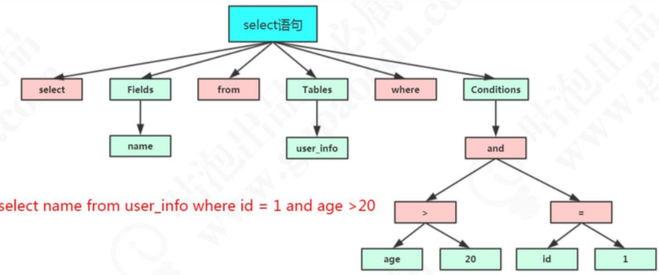

#  03-语法解析和预处理

[TOC]

##  语法解析和预处理(Parser & Preprocessor)


## 一句话概括

- **解析器主要是词法解析, 词法解析实际上就是判断 SQL 语句的语法格式是否合法**
- **预处理器实际上是判断SQL语句所涉及的表或者字段是否存在,检查别名等**

这里我会有一个疑问，为什么我的一条 SQL 语句能够被识别呢 ? 假如我随便执行一个字符串 penyuyan，服务器报了一个 1064 的错:

```java
[Err] 1064 - You have an error in your SQL syntax; check the manual that corresponds to your MySQL server version for the right syntax to use near 'penyuyan' at line 1
```

#### 它是怎么知道我输入的内容是错误的?

 MySQL 的 Parser 解析器和 `Preprocessor` 预处理模块。

这一步主要做的事情是对语句基于 SQL 语法进行词法和语法分析和语义的解析。

## 词法解析

词法分析就是把一个完整的 SQL 语句打碎成一个个的单词。 比如一个简单的 SQL 语句:

```sql
select name from user where id = 1;
```

它会打碎成 8 个符号，每个符号是什么类型，从哪里开始到哪里结束。

## 语法解析

第二步就是语法分析，语法分析会对 SQL 做一些语法检查，比如单引号有没有闭合， 然后根据 MySQL 定义的语法规则，根据 SQL 语句生成一个数据结构。这个数据结构我 们把它叫做解析树(`select_lex`)。



任何数据库的中间件，比如 Mycat，Sharding-JDBC (用到了 Druid Parser)，都必须要有词法和语法分析功能，在市面上也有很多的开源的词法解析的工具(比如 LEX，Yacc)。

## 预处理器

如果我写了一个词法和语法都正确的 SQL，但是表名或者字段不存在，会在哪里报错?是在数据库的执行层还是解析器?

```sql
select * from penyuyan;
```

解析器可以分析语法，但是它怎么知道数据库里面有什么表，表里面有什么字段呢? 

实际上还是在解析的时候报错，解析 SQL 的环节里面有个预处理器。 

**它会检查生成的解析树，解决解析器无法解析的语义。比如，它会检查表和列名是否存在，检查名字和别名，保证没有歧义。**

预处理之后得到一个新的解析树。
