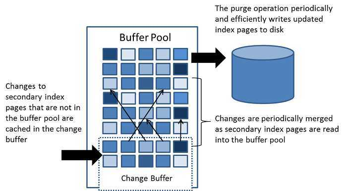

# 缓冲池ChangeBuffer

InnnoDB 的数据都是放在磁盘上的，InnoDB 操作数据有一个最小的逻辑单 位，叫做**页**(索引页和数据页)。


我们对于数据的操作，不是每次都直接操作磁盘因 为磁盘的速度太慢了。

InnoDB 使用了一种缓冲池的技术，也就是把磁盘读到的页放到一 块内存区域里面。这个内存区域就叫 **Buffer Pool**。

- 查询:当后续查询访问能够从 buffer pool中进行数据读取,不用再次访问磁盘
- 修改: 先修改缓冲池中的页

当缓冲池中的数据页和磁盘中的数据不一致的时候,我们叫它 **脏页**

InnoDB 会有专门的后台线程把缓冲池中的数据刷新到磁盘,这个动作叫做**刷脏**

## InnoDB内存结构和磁盘结构


#### Buffer Pool 的组成

buffer pool 主要分为 3 个部分: 

内存内的Buffer Pool:

- Change buffer :  
- Adaptive Hash Index 
- Log buffer

#### BufferPool

Buffer Pool 缓冲池缓存的是页面信息,包括数据页和索引页

Buffer Pool 默认大小是 128M(134217728 字节)，可以调整。

内存的缓冲池写满了怎么办?(Redis 设置的内存满了怎么办?)InnoDB 用 LRU 算法来管理缓冲池(链表实现，不是传统的 LRU，分成了 young 和 old)，经过淘汰的 数据就是热点数据。

## ChangeBuffer 写缓冲

如果数据页不是唯一索引,不存在数据重复的情况(不需要重磁盘查索引页判断数据是不是重复),这种情况先对缓冲池进行修改,从而提高了 Insert , Delete , Update 的执行速度

Change Buffer 是 Buffer Pool 中的一部分，虽然 Change Buffer 名字叫 Buffer ，但是它也是可以持久化的，在右边的 System Tablespace 中可以看到持久化 Change Buffer 的空间。触发写缓存（Change Buffer）持久化操作有以下几种情况：

- **1、数据库空闲时，后台有线程定时持久化**
- **2、数据库缓冲池不够用时**
- **3、数据库正常关闭时**
- **4、redo log 写满时**



图中详细的描述了 Change Buffer 的功能，Change Buffer 中的数据最终还是会刷回到数据所在的原始数据页中，Change Buffer 数据应用到原始数据页，得到新的数据页的过程称之为 merge。merge 过程中只会将 Change Buffer 中与原始数据页有关的数据应用到原始数据页，以下三种情况会发生 merge 操作：

- **1、原始数据页加载到 Buffer Pool 时。**
- **2、系统后台定时触发 merge 操作。**
- **3、MySQL 数据库正常关闭时。**

#### Change Buffer 的相关设置

**innodb_change_buffer_max_size**

innodb_change_buffer_max_size 表示 Change Buffer 最大大小占 Buffer Pool 的百分比，默认为 25%。最大可以设置为 50%。

**innodb_change_buffering**

innodb_change_buffering 参数用来控制对哪些操作启用 Change Buffer 功能，默认是：all。innodb_change_buffering 参数有以下几种选择：

```
--all：      默认值。开启buffer inserts、delete-marking operations、purges
--none： 不开启change buffer
--inserts：  只是开启buffer insert操作
--deletes:  只是开delete-marking操作
--changes：  开启buffer insert操作和delete-marking操作
--purges：   对只是在后台执行的物理删除操作开启buffer功能
```

### Change Buffer 适用场景

Change Buffer 并不是适用于所有场景，以下两种情况不适合开启 Change Buffer ：

- **1、数据库都是唯一索引**

如果数据库都是唯一索引，**那么在每次操作的时候都需要判断索引是否有冲突**，势必要将数据加载到缓存中对比，因此也用不到 **Change Buffer。**

- **2、写入一个数据后，会立刻读取它**

写入一个数据后，会立刻读取它，那么即使满足了条件，将更新先记录在 change buffer，但之后由于马上要访问这个数据页，会立即触发 merge 过程。这样随机访问 IO 的次数不会减少，反而增加了 change buffer 的维护代价。所以，对于这种业务模式来说，change buffer 反而起到了副作用。

**以下几种情况开启 Change Buffer，会使得 MySQL 数据库明显提升**：

- **1、数据库大部分是非唯一索引**
- **2、业务是写多读少**
- **3、写入数据之后并不会立即读取它**

总体来说 InnoDB 的写缓存（Change Buffer）应用得当，会极大提高 MySQL 数据库的性能，使用不恰当的话，可能会适得其反。

## Adaptive Hash Index

## Log buffer

如果 Buffer Pool里面的脏页还没有刷入磁盘时,数据库宕机或者重启,那么这些数据会丢失

为了避免这个问题:

#### redoLog 重做日志

redoLog 记录数据页更新之后的状态，而是记录这个页做了什么改动，属于物理日志

redolog 又称重做日志, 用于记录事务操作的变化,InnoDB 把所有对页的**修改**操作专门写入一个日志文件，并且 在数据库启动时从这个文件进行**恢复操作**(实现 crash-safe)——用它来实现事务的持 久性。


存在 /var/lib/mysql 目录下的 ib_logfile0 和 ib_logfile1 每个 48M

这种日志和磁盘配合的整个过程，其实就是 MySQL 里的 WAL 技术 (Write-Ahead Logging)，它的关键点就是先写日志，再写磁盘。

```
show variables like 'innodb_log%';
```

#### redolog 减少了随机 IO

为什么要写在 redolog 中,而不是直接写到 db file 中呢?

- 写日志的操作是顺序 IO
- 直接写磁盘文件的操作是随机 IO

#### 随机 IO 和顺序 IO

磁盘的最小组成单位是扇区,通常是 512 个字节

- 操作系统和内存打交道,最小的单位是页 Page
- 操作系统和磁盘打交道,读写磁盘,最小的单位是块(Block)

如果我们所需要的数据是随机分散在不同页的不同扇区中，那么找到相应的数据需 要等到磁臂旋转到指定的页，然后盘片寻找到对应的扇区，才能找到我们所需要的一块 数据，一次进行此过程直到找完所有数据，这个就是随机 IO，读取数据速度较慢。


假设我们已经找到了第一块数据，并且其他所需的数据就在这一块数据后边，那么就不需要重新寻址，可以依次拿到我们所需的数据，这个就叫顺序 IO。

刷盘是随机 I/O，而记录日志是顺序 I/O，顺序 I/O 效率更高。因此先把修改写入日志，可以延迟刷盘时机，进而**提升系统吞吐**

#### Log Buffer 什么时候写入 log file?

log buffer 写入磁盘的时机，由一个参数控制，默认是 1。

```
SHOW VARIABLES LIKE 'innodb_flush_log_at_trx_commit';
```

- 0(延迟写)
  log buffer 将每秒一次地写入 log file 中，并且 log file 的 flush 操作同时进行。 该模式下，在事务提交的时候，不会主动触发写入磁盘的操作。
- 1(默认，实时写，实时刷)
  每次事务提交时 MySQL 都会把 log buffer 的数据写入 log file，并且刷到磁盘 中去。
- 2(实时写，延 迟刷)
  每次事务提交时 MySQL 都会把 log buffer 的数据写入 log file。但是 flush 操 作并不会同时进行。该模式下，MySQL 会每秒执行一次 flush 操作。

flush 就是把操作系统缓 冲区写入到磁盘。


## 