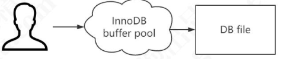

# 缓冲池ChangeBuffer

InnnoDB 的数据都是放在磁盘上的，InnoDB 操作数据有一个最小的逻辑单 位，叫做**页**(索引页和数据页)。默认 128M

我们对于数据的操作，不是每次都直接操作磁盘因为磁盘的速度太慢了。

InnoDB 使用了一种缓冲池的技术，也就是把磁盘读到的页放到一 块内存区域里面。这个内存区域就叫 **Buffer Pool**。

- 查询:当后续查询访问能够从 buffer pool中进行数据读取,不用再次访问磁盘
- 修改: 先修改缓冲池中的页

当缓冲池中的数据页和磁盘中的数据不一致的时候,我们叫它 **脏页**

InnoDB 会有专门的后台线程把缓冲池中的数据刷新到磁盘,这个动作叫做**刷脏**

## InnoDB内存结构和磁盘结构

#### Buffer Pool 的组成

- 内存内结构
  - [Buffer-Pool ](08-缓冲池-buffer-pool.md) 
    - [Adaptive-Hash-Index](../07-存储引擎/010-InnoDB/04-自适应哈希.md) 
    - [Change-Buffer](11-写缓冲-ChangeBuffer.md) 
    -  [Log-Buffer](12-Redolog-LogBuffer.md) 
- 磁盘上结构
  - 表空间 
    - [系统表空间 (ibdata1) ](../06-磁盘结构/020-系统表空间.md) 
    - [独立表空间 ](../06-磁盘结构/030-独占表空间.md) 
    -  [通用表空间](../06-磁盘结构/040-通用表空间.md) 
    -  [Undo表空间](../06-磁盘结构/060-UndoLog.md) 
    -  [临时表空间](../06-磁盘结构/050-临时表空间.md) 
  -  [RedoLog](12-Redolog-LogBuffer.md) 

> LogBuffer 在内存中, Redo Log 在磁盘中

#### BufferPool

Buffer Pool 缓冲池缓存的是页面信息,包括数据页和索引页

Buffer Pool 默认大小是 128M(134217728 字节)，可以调整。

##### 内存的缓冲池写满了怎么办?(Redis 设置的内存满了怎么办?)

InnoDB 用 LRU 算法来管理缓冲池(链表实现，不是传统的 LRU，分成了 young 和 old)，经过淘汰的 数据就是热点数据。

