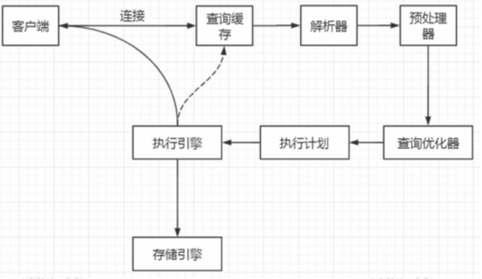

# 一条SQL是如何执行的

- 建立连接

  首先要明确的是通讯协议 :  [01-通讯协议.md](01-通讯协议.md) 

- [查询缓存](02-查询缓存.md) 
- 解析器 对 SQL 语句进行 词法解析和语法解析 生成解析树
  -  [语法解析和预处理](03-语法解析和预处理.md) 
- 预处理器 对 SQL 语句进行,检查生成的解析树，解决解析器无法解析的语义
  -  [语法解析和预处理](03-语法解析和预处理.md) 

- 查询优化器 ,查询优化器 ,对 SQL 语句进行优化,获取执行计划
  - [查询优化与查询执行计划](04-查询优化与查询执行计划.md) 
- 执行引擎 , 由执行引擎根据 执行计划查询存储引擎内的数据
  - [存储引擎](05-存储引擎.md) 
- 查询到数据放入缓存

