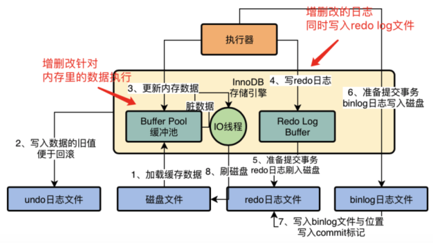

# InnoDB Change Buffer 写缓冲

写缓冲是 buffer-pool 的一部分 

> https://dev.mysql.com/doc/refman/5.7/en/innodb-change-buffer.html

- [缓冲池-buff  er-pool.md](08-缓冲池-buffer-pool.md) 

## 目录

- [使用ChangeBuffer的两个同时满足的条件](#使用ChangeBuffer的两个同时满足的条件)

- [为什么要有写缓冲](#为什么要有写缓冲)
- [为什么主键修改不需要ChangeBuffer](#为什么主键修改不需要ChangeBuffer)
- [为什么辅助索引修改时需要ChangeBuffer](#为什么辅助索引修改时需要ChangeBuffer)
- [使用ChangeBuffer的两个同时满足的条件](#使用ChangeBuffer的两个同时满足的条件)


## 使用ChangeBuffer的两个同时满足的条件

- 索引是辅助索引 (Secondary index)
- 索引不是唯一的 (Unique)

当满足这两个条件的时候 , InnoDb 会使用 ChangeBuffer , 从而减少随机 IO

**辅助索引不能是唯一的, 因为在插入缓冲时,数据库并不去查找索引页来判断插入的记录的唯一性,如果去查找肯定又会有离散读取的情况发生,从而导致 ChangeBuffer 失去意义**

## 为什么要有写缓冲

主键如果是递增的,那么一般插入数据是顺序 IO, 不需要磁盘的随机读取 但是, **如果是非主键索引且不是唯一索引**,进行插入操作时,会有大量的随机 IO,因为要**合并页 和拆分页**

为了解决这个问题,InnoDB 推出了 ChangeBuffer 

插入的时候先判断非聚集索引页是否在缓冲池中

- 如果存在,则直接插入
- 如果不存在放到一个缓存中去

这样对于上层来说,好像这个非聚集的索引已经插到叶子节点了,实际上没有,只是存放到了缓存中,然后再以一定的频率和情况对 Buffer 和辅助索引页子节点进行 merge 合并操作. 而这个过程实际上是顺序 IO,通常可以将多个插入合并到一个操作中(因为在一个索引中),

这样就大大提高了对于非聚集索引的插入性能

## 为什么主键修改不需要ChangeBuffer

在 InnoDB 存储引擎中, 主键是唯一的标识符, 通常插入顺序是按照主键递增的顺序插入的,因此插入聚集索引(Primary key)  一般是顺序读取,不需要磁盘的随机读取

```sql
CREATE TABLE t{
	a INT AUTO_INCREMENT,
	b VARCHAR(30),
	PRIMARY KEY(a)		
}
```

a 是自增长的 , 同时页中的行记录 按照 a 的值的顺序存放,在一般情况下,不需要随机读取另一个页中的记录,因此这类插入操作,速度是非常快的

## 为什么辅助索引修改时需要ChangeBuffer

并不是每个表上只有一个聚集索引,更多情况下 , 一张表上有多个辅助索引 , 在进行插入操作时, 数据页的存放还是按照主键 a 进行顺序存放的, 但是对于非聚集索引叶子节点的插入不再是顺序的了

> 辅助索引在插入操作时, 不是顺序 IO, 需要离散地访问非聚集索引页,由于随机读取的存在而导致了插入操作

## 原理

工作原理非常简单，就是先判断插入的普通索引页是否在缓冲池中，

- 如果在就直接插入
- 如果不在就先放到 changebuffer 中，然后进行 **change buffer 和 普通索引 **的合并操作，可以将多个插入合并到一个操作中，一下子提高了 普通索引 的插入性能

如果数据页**不是唯一索引** , 不存在数据重复的情况(不需要重磁盘查索引页判断数据是不是重复),这种情况先对缓冲池进行修改,从而提高了 Insert , Delete , Update 的执行速度

虽然 Change Buffer 名字叫 Buffer ，但是它也是可以持久化的，在右边的 System Tablespace 中可以看到持久化 Change Buffer 的空间。触发写缓存（Change Buffer）持久化操作有以下几种情况：

- **数据库空闲时，后台有线程定时持久化**
- **数据库缓冲池不够用时**(1/2)
- **数据库正常关闭时**
- **redo log 写满时**


图中详细的描述了 Change Buffer 的功能，Change Buffer 中的数据最终还是会刷回到数据所在的原始数据页中，Change Buffer 数据应用到原始数据页，得到新的数据页的过程称之为 merge。merge 过程中只会将 Change Buffer 中与原始数据页有关的数据应用到原始数据页，以下三种情况会发生 merge 操作：

- **原始数据页加载到 Buffer Pool 时**
- **系统后台定时触发 merge 操作**
- **MySQL 数据库正常关闭时**



## 相关设置

>  innodb_change_buffer_max_size

innodb_change_buffer_max_size 表示 Change Buffer 最大大小占 Buffer Pool 的百分比，默认为 25%。最大可以设置为 50%。建议设置为50

>  innodb_change_buffering

innodb_change_buffering 参数用来控制对哪些操作启用 Change Buffer 功能，默认是：all。innodb_change_buffering 参数有以下几种选择：

```
--all：      默认值。开启buffer inserts、delete-marking operations、purges
--none： 不开启change buffer
--inserts：  只是开启buffer insert操作
--deletes:  只是开delete-marking操作
--changes：  开启buffer insert操作和delete-marking操作
--purges：   对只是在后台执行的物理删除操作开启buffer功能
```

## 适用场景

Change Buffer 并不是适用于所有场景，以下两种情况不适合开启 Change Buffer ：

- **数据库都是唯一索引**

如果数据库都是唯一索引，**那么在每次操作的时候都需要判断索引是否有冲突**，势必要将数据加载到缓存中对比，因此也用不到 **Change Buffer。**

- **写入一个数据后，会立刻读取它**

写入一个数据后，会立刻读取它，那么即使满足了条件，将更新先记录在 change buffer，但之后由于马上要访问这个数据页，会立即触发 merge 过程。这样随机访问 IO 的次数不会减少，反而增加了 change buffer 的维护代价。所以，对于这种业务模式来说，change buffer 反而起到了副作用。

**以下几种情况开启 Change Buffer，会使得 MySQL 数据库明显提升**：

- **数据库大部分是非唯一索引**
- **业务是写多读少**
- **写入数据之后并不会立即读取它**

总体来说 InnoDB 的写缓存（Change Buffer）应用得当，会极大提高 MySQL 数据库的性能，使用不恰当的话，可能会适得其反。

## 常见问题

| **A.16.1.**  | What types of operations modify secondary indexes and result in change buffering? |
| ------------ | ------------------------------------------------------------ |
|              | 什么类型的操作二级索引会导致修改change buffer?               |
|              | `INSERT`, `UPDATE`, and `DELETE` operations can modify secondary indexes. If an affected index page is not in the buffer pool, the changes can be buffered in the change buffer. |
|              | `INSERT`, `UPDATE`, and `DELETE`操作有可能会修改二级索引.如果页在 buffer pool 不存在,那么结果会被保存在 change buffer中 |
| **A.16.2.**  | What is the benefit of the `InnoDB` change buffer?           |
|              | InnoDB 的 change buffer 有什么好处                           |
|              | Buffering secondary index changes when secondary index pages are not in the buffer pool avoids expensive random access I/O operations that would be required to immediately read in affected index pages from disk. Buffered changes can be applied later, in batches, as pages are read into the buffer pool by other read operations. |
|              | 当 辅助索引页 不在buffer pool 中时 , 缓冲 辅助索引的相关更改，可以避免进行昂贵的随机访问I/O操作，这些操作需要立即从磁盘读取受影响的索引页。当页面被其他读操作读入缓冲池时，缓冲的更改可以在以后分批应用。 |
| **A.16.3.**  | Does the change buffer support other types of indexes?       |
|              | change buffer 是否支持其他类型的索引                         |
|              | No. The change buffer only supports secondary indexes. Clustered indexes, full-text indexes, and spatial indexes are not supported. Full-text indexes have their own caching mechanism. |
|              | 不支持 ,change buffer 只支持辅助索引, 其他的索引例如 聚集索引, 全文索引和空间索引 都不支持 |
| **A.16.4.**  | How much space does `InnoDB` use for the change buffer?      |
|              | 如何设置change buffer的容量                                  |
|              | Prior to the introduction of the [`innodb_change_buffer_max_size`](https://dev.mysql.com/doc/refman/5.7/en/innodb-parameters.html#sysvar_innodb_change_buffer_max_size) configuration option in MySQL 5.6, the maximum size of the on-disk change buffer in the system tablespace was 1/3 of the `InnoDB` buffer pool size.In MySQL 5.6 and later, the [`innodb_change_buffer_max_size`](https://dev.mysql.com/doc/refman/5.7/en/innodb-parameters.html#sysvar_innodb_change_buffer_max_size) configuration option defines the maximum size of the change buffer as a percentage of the total buffer pool size. By default, [`innodb_change_buffer_max_size`](https://dev.mysql.com/doc/refman/5.7/en/innodb-parameters.html#sysvar_innodb_change_buffer_max_size) is set to 25. The maximum setting is 50.`InnoDB` does not buffer an operation if it would cause the on-disk change buffer to exceed the defined limit.Change buffer pages are not required to persist in the buffer pool and may be evicted by LRU operations. |
|              | 默认情况是 25%, 最大可以设置为 50%                           |
| **A.16.5.**  | How do I determine the current size of the change buffer?    |
|              | 如何确定更改缓冲区的当前大小                                 |
|              | The current size of the change buffer is reported by `SHOW ENGINE INNODB STATUS \G`, under the `INSERT BUFFER AND ADAPTIVE HASH INDEX` heading. For example:`------------------------------------- INSERT BUFFER AND ADAPTIVE HASH INDEX ------------------------------------- Ibuf: size 1, free list len 0, seg size 2, 0 merges`Relevant data points include:`size`: The number of pages used within the change buffer. Change buffer size is equal to `seg size - (1 + free list len)`. The `1 +` value represents the change buffer header page.`seg size`: The size of the change buffer, in pages.For information about monitoring change buffer status, see [Section 14.5.2, “Change Buffer”](https://dev.mysql.com/doc/refman/5.7/en/innodb-change-buffer.html). |
|              |                                                              |
| **A.16.6.**  | When does change buffer merging occur?                       |
|              | When a page is read into the buffer pool, buffered changes are merged upon completion of the read, before the page is made available.Change buffer merging is performed as a background task. The [`innodb_io_capacity`](https://dev.mysql.com/doc/refman/5.7/en/innodb-parameters.html#sysvar_innodb_io_capacity) parameter sets an upper limit on the I/O activity performed by `InnoDB` background tasks such as merging data from the change buffer.A change buffer merge is performed during crash recovery. Changes are applied from the change buffer (in the system tablespace) to leaf pages of secondary indexes as index pages are read into the buffer pool.The change buffer is fully durable and will survive a system crash. Upon restart, change buffer merge operations resume as part of normal operations.A full merge of the change buffer can be forced as part of a slow server shutdown using [`--innodb-fast-shutdown=0`](https://dev.mysql.com/doc/refman/5.7/en/innodb-parameters.html#sysvar_innodb_fast_shutdown). |
| **A.16.7.**  | When is the change buffer flushed?                           |
|              | Updated pages are flushed by the same flushing mechanism that flushes the other pages that occupy the buffer pool. |
| **A.16.8.**  | When should the change buffer be used?                       |
|              | The change buffer is a feature designed to reduce random I/O to secondary indexes as indexes grow larger and no longer fit in the `InnoDB` buffer pool. Generally, the change buffer should be used when the entire data set does not fit into the buffer pool, when there is substantial DML activity that modifies secondary index pages, or when there are lots of secondary indexes that are regularly changed by DML activity. |
| **A.16.9.**  | When should the change buffer not be used?                   |
|              | You might consider disabling the change buffer if the entire data set fits within the `InnoDB` buffer pool, if you have relatively few secondary indexes, or if you are using solid-state storage, where random reads are about as fast as sequential reads. Before making configuration changes, it is recommended that you run tests using a representative workload to determine if disabling the change buffer provides any benefit. |
| **A.16.10.** | Where can I find additional information about the change buffer? |