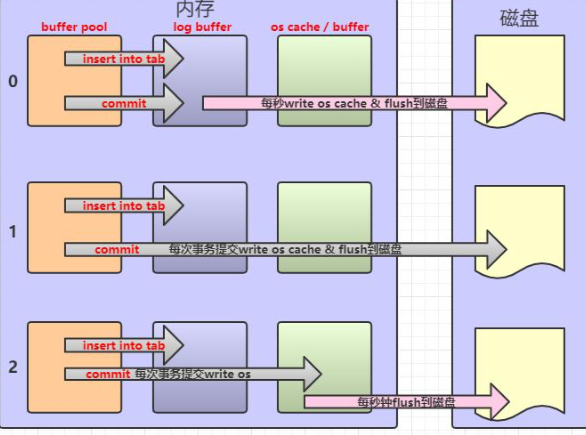
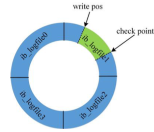

# RedoLog-LogBuffer-重做日志

所属位置:   

[TOC]

## 什么是RedoLog重做日志


> 实现持久性

如果 Buffer Pool里面的脏页还没有刷入磁盘时,数据库宕机或者重启,那么这些数据会丢失 ,使用 redo log 可以将未写入的数据写入

- InnoDB 存储引擎先将重做日志信息先写入到缓冲区(Log buffer)
- 按照一定的频率将缓冲刷新到重做日志文件

重做日志一般不需要设置很大,因为一般情况下每一秒会将重做日志缓冲刷新到日志文件,因此 ,用户只要保证每秒产生的事务量在缓冲之内即可

```java
show variables like '%innodb_log_buffer%'
```

| Variable\_name            | Value    |
| :------------------------ | :------- |
| innodb\_log\_buffer\_size | 16777216 |

## 什么时候刷新缓冲到日志文件



log buffer 写入 磁盘的时机，由一个参数控制，默认是 1。

```java
SHOW VARIABLES LIKE 'innodb_flush_log_at_trx_commit';
```

| 参数 | 含义                 | 具体操作                                                     | 弊端                                                  |
| ---- | -------------------- | ------------------------------------------------------------ | ----------------------------------------------------- |
| 0    | 延迟写               | MySQL 每秒 将log buffer一次地写入 log file 中，同样操作系统 每秒 flush到磁盘 | 性能最好的,但是不安全,MySQL 一旦崩溃,会丢失 1秒的数据 |
| 1    | 实时写，实时刷(默认) | 每次事务提交时 MySQL 都会把 log buffer 的数据写入 log file，并且flush到磁盘中去 | 安全性最高, 但是性能差,因为每次都要刷新到磁盘         |
| 2    | 实时写，延迟刷       | 每次事务提交时 MySQL 都会把 log buffer 的数据写入 log file。但是 操作系统的flush 操作一秒进行一次 | 介于两者之间                                          |

*flush 就是把操作系统缓冲区写入到磁盘。当重做日志缓冲池的剩余空间小于 1/2 时, 重做日志缓冲刷新到重做日志文件

## 重做日志具体在哪里

在默认情况下,在 InnoDB 存储引擎的数据目录下会有两个名为

- ib_logfile0
- ib_logfile1

重做日志文件对于 InnoDB存储引擎至关重要, 他们记录了 InnoDB 存储引擎的事务日志

这种日志和磁盘配合的整个过程，其实就是 MySQL 里的 WAL 技术 (Write-Ahead Logging)，它的关键点就是先写日志，再写磁盘。

```java
show variables like 'innodb_log%';
```

| 值                        | 含义                                                         |
| ------------------------- | ------------------------------------------------------------ |
| innodb_log_file_size      | 指定每个文件的大小，默认 48M                                 |
| innodb_log_files_in_group | 指定文件的数量，默认为 2                                     |
| innodb_log_group_home_dir | 指定文件所在路径，相对或绝对。如果不指定，则为 datadir 路径。 |

## 记录的是什么

redoLog 记录数据页更新之后的状态，而是记录这个页做了什么改动，属于物理日志

**同样是写磁盘，为什么不直接写到 db file 里面去?为什么先写日志再写磁盘?**

## logbuffer减少了写入redo-log的随机IO

为什么要写在 redolog 中,而不是直接写到 db file 中呢?

- 写日志的操作是顺序 IO
- 直接写磁盘文件的操作是随机 IO

#### 随机 IO 和顺序 IO

磁盘的最小组成单位是扇区,通常是 512 个字节

- 操作系统和内存打交道,最小的单位是页 Page
- 操作系统和磁盘打交道,读写磁盘,最小的单位是块 (Block)

如果我们所需要的数据是随机分散在不同页的不同扇区中，那么找到相应的数据需 要等到磁臂旋转到指定的页，然后盘片寻找到对应的扇区，才能找到我们所需要的一块 数据，一次进行此过程直到找完所有数据，这个就是随机 IO，读取数据速度较慢。


假设我们已经找到了第一块数据，并且其他所需的数据就在这一块数据后边，那么就不需要重新寻址，可以依次拿到我们所需的数据，这个就叫顺序 IO。

刷盘是随机 I/O，而记录日志是顺序 I/O，顺序 I/O 效率更高。因此先把修改写入日志，可以延迟刷盘时机，进而**提升系统吞吐**

#### Log Buffer什么时候写入redolog 的磁盘文件 logFile 中?

这是内存结构的第 4 块内容，redo log，它又分成内存和磁盘两部分。redo log 有 什么特点?

- redo log 是 InnoDB 存储引擎实现的，并不是所有存储引擎都有。
- 不是记录数据页更新之后的状态，而是记录这个页做了什么改动，属于物理日志。
- redo log 的大小是固定的，前面的内容会被覆盖。



check point 是当前要覆盖的位置。如果 write pos 跟 check point 重叠，说明 redolog 已经写满，这时候需要同步 redo log 到磁盘中。

