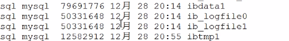

# Redo Log - Log buffer

> 
>
> - 内存内结构
>   - [Buffer-Pool ](08-缓冲池-buffer-pool.md) 
>     - [Adaptive-Hash-Index](../07-存储引擎/010-InnoDB/04-自适应哈希.md) 
>     - [Change-Buffer](11-写缓冲-ChangeBuffer.md) 
>     -  [Log-Buffer](12-Redolog-LogBuffer.md) 
> - 磁盘上结构
>   - 表空间 
>     - [系统表空间 (ibdata1) ](../06-磁盘结构/020-系统表空间.md) 
>     - [独立表空间 ](../06-磁盘结构/030-独占表空间.md) 
>     -  [通用表空间](../06-磁盘结构/040-通用表空间.md) 
>     -  [Undo表空间](../06-磁盘结构/060-UndoLog.md) 
>     -  [临时表空间](../06-磁盘结构/050-临时表空间.md) 
>   -  [RedoLog](12-Redolog-LogBuffer.md) 

> InnoDB ,物理日志

如果 Buffer Pool里面的脏页还没有刷入磁盘时,数据库宕机或者重启,那么这些数据会丢失 ,会写入 redoLog

为了避免这个问题:

#### redoLog 重做日志



redoLog 记录数据页更新之后的状态，而是记录这个页做了什么改动，属于物理日志

redolog 又称重做日志, 用于记录事务操作的变化,InnoDB 把所有对页的**修改**操作专门写入一个日志文件，并且 在数据库启动时从这个文件进行**恢复操作**(实现 crash-safe)——用它来实现事务的持久性。


存在 /var/lib/mysql 目录下的 ib_logfile0 和 ib_logfile1 每个 48M

这种日志和磁盘配合的整个过程，其实就是 MySQL 里的 WAL 技术 (Write-Ahead Logging)，它的关键点就是先写日志，再写磁盘。

```
show variables like 'innodb_log%';
```

| 值                        | 含义                                                         |
| ------------------------- | ------------------------------------------------------------ |
| innodb_log_file_size      | 指定每个文件的大小，默认 48M                                 |
| innodb_log_files_in_group | 指定文件的数量，默认为 2                                     |
| innodb_log_group_home_dir | 指定文件所在路径，相对或绝对。如果不指定，则为 datadir 路径。 |

**同样是写磁盘，为什么不直接写到 db file 里面去?为什么先写日志再写磁盘?**

#### redolog 减少了随机 IO

为什么要写在 redolog 中,而不是直接写到 db file 中呢?

- 写日志的操作是顺序 IO
- 直接写磁盘文件的操作是随机 IO

#### 随机 IO 和顺序 IO

磁盘的最小组成单位是扇区,通常是 512 个字节

- 操作系统和内存打交道,最小的单位是页 Page
- 操作系统和磁盘打交道,读写磁盘,最小的单位是块 (Block)

如果我们所需要的数据是随机分散在不同页的不同扇区中，那么找到相应的数据需 要等到磁臂旋转到指定的页，然后盘片寻找到对应的扇区，才能找到我们所需要的一块 数据，一次进行此过程直到找完所有数据，这个就是随机 IO，读取数据速度较慢。


假设我们已经找到了第一块数据，并且其他所需的数据就在这一块数据后边，那么就不需要重新寻址，可以依次拿到我们所需的数据，这个就叫顺序 IO。

刷盘是随机 I/O，而记录日志是顺序 I/O，顺序 I/O 效率更高。因此先把修改写入日志，可以延迟刷盘时机，进而**提升系统吞吐**

#### Log Buffer 什么时候写入 redolog 的磁盘文件 logFile 中?

log buffer 写入 磁盘的时机，由一个参数控制，默认是 1。

```
SHOW VARIABLES LIKE 'innodb_flush_log_at_trx_commit';
```

- 0 (延迟写)
  log buffer 将每秒一次地写入 log file 中，并且 log file 的 flush 操作同时进行。 该模式下，在事务提交的时候，不会主动触发写入磁盘的操作。
- 1 (默认，实时写，实时刷)
  每次事务提交时 MySQL 都会把 log buffer 的数据写入 log file，并且刷到磁盘 中去。
- 2 ( 实时写，延迟刷)
  每次事务提交时 MySQL 都会把 log buffer 的数据写入 log file。但是 flush 操 作并不会同时进行。该模式下，MySQL 会每秒执行一次 flush 操作。

flush 就是把操作系统缓冲区写入到磁盘。


## 

这是内存结构的第 4 块内容，redo log，它又分成内存和磁盘两部分。redo log 有 什么特点?

- redo log 是 InnoDB 存储引擎实现的，并不是所有存储引擎都有。
- 不是记录数据页更新之后的状态，而是记录这个页做了什么改动，属于物理日志。
- redo log 的大小是固定的，前面的内容会被覆盖。


check point 是当前要覆盖的位置。如果 write pos 跟 check point 重叠，说明 redolog 已经写满，这时候需要同步 redo log 到磁盘中。
这是 MySQL 的内存结构，总结一下，分为:

- Buffer pool
- change buffer
- Adaptive Hash Index
- log buffer